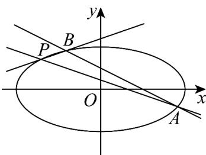

> [!faq]- 《专题3.1 椭圆（高效培优讲义）》官方解析
>
> > [!success]- **【答案】** (1) $\frac{x^2}{4} + y^2 = 1$ (2) ① $\frac{\sqrt{35}}{2}$ ; ② 0
>
> > [!note]- **【解析】**
> > （1）因为点 $P\left(-\sqrt{2}, \frac{\sqrt{2}}{2}\right)$ 在椭圆 $C$ 上，所以 $\frac{2}{a^2} + \frac{1}{2b^2} = 1$ 。又椭圆 $C$ 的离心率为 $\frac{c}{a} = \frac{\sqrt{3}}{2}$ ，且 $a^2 = b^2 + c^2$ ，解得 $a = 2, b = 1$ ，所以椭圆 $C$ 的方程为 $\frac{x^2}{4} + y^2 = 1$ 。
> >
> > (2)
> >
> > 
> > - **①**：设 $A(x_{1},y_{1}),B(x_{2},y_{2})$
> >
> > 联立 $\left\{ \begin{array}{l} y = -\frac{1}{2} x + \frac{1}{2}, \\ \frac{x^2}{4} + y^2 = 1, \quad \text{得} x^2 - x - \frac{3}{2} = 0, \quad x_1 + x_2 = 1, x_1x_2 = -\frac{3}{2}, \end{array} \right.$
> >
> > 故 $\left|AB\right|=\sqrt{1+k^{2}}\cdot\sqrt{\left(x_{1}+x_{2}\right)^{2}-4x_{1}x_{2}}=\frac{\sqrt{35}}{2}$
> > - **②**：$k_{1} = \frac{y_{1} - \frac{\sqrt{2}}{2}}{x_{1} + \sqrt{2}}, k_{2} = \frac{y_{2} - \frac{\sqrt{2}}{2}}{x_{2} + \sqrt{2}}$
> >
> > $$
> > k _ {1} + k _ {2} = \frac {y _ {1} - \frac {\sqrt {2}}{2}}{x _ {1} + \sqrt {2}} + \frac {y _ {2} - \frac {\sqrt {2}}{2}}{x _ {2} + \sqrt {2}} = \frac {\left(y _ {1} - \frac {\sqrt {2}}{2}\right) \left(x _ {2} + \sqrt {2}\right) + \left(y _ {2} - \frac {\sqrt {2}}{2}\right) \left(x _ {1} + \sqrt {2}\right)}{\left(x _ {1} + \sqrt {2}\right) \left(x _ {2} + \sqrt {2}\right)}.
> > $$
> >
> > $$
> > \left(y _ {1} - \frac {\sqrt {2}}{2}\right) \left(x _ {2} + \sqrt {2}\right) + \left(y _ {2} - \frac {\sqrt {2}}{2}\right) \left(x _ {1} + \sqrt {2}\right)
> > $$
> >
> > $$
> > = \left(- \frac {1}{2} x _ {1} + \frac {1}{2} - \frac {\sqrt {2}}{2}\right) \left(x _ {2} + \sqrt {2}\right) + \left(- \frac {1}{2} x _ {2} + \frac {1}{2} - \frac {\sqrt {2}}{2}\right) \left(x _ {1} + \sqrt {2}\right)
> > $$
> >
> > $$
> > = - x _ {1} x _ {2} + \left(\frac {1}{2} - \sqrt {2}\right) \left(x _ {1} + x _ {2}\right) + \sqrt {2} - 2 = \frac {3}{2} + \frac {1}{2} - \sqrt {2} + \sqrt {2} - 2 = 0
> > $$
> >
> > 所以 $k_{1} + k_{2} = 0$
