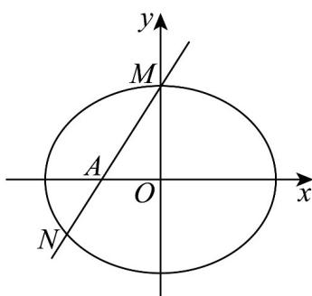
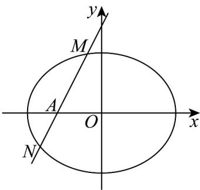
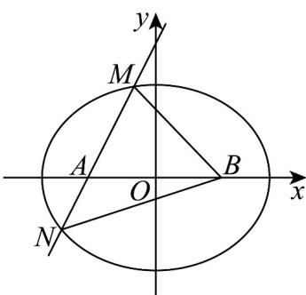

> [!faq]- 《专题3.1 椭圆（高效培优讲义）》官方解析
>
> > [!success]- **【答案】** (1) $\left(-\frac{3}{2},-\frac{\sqrt{2}}{2}\right)$ (2)证明见解析， $\lambda +\mu = 3$ (3) $l:y = \pm \frac{\sqrt{3}}{3} (x + 1)$
>
> > [!note]- **【解析】**
> > （1）（1）由题意有椭圆左焦点坐标为 $(-1,0)$ ，则直线 $l$ 方程为 $y = \sqrt{2} x + \sqrt{2}$
> >
> > 所以 $\left\{ \begin{array}{l} \frac{x^2}{3} + \frac{y^2}{2} = 1, \\ y = \sqrt{2} x + \sqrt{2}, \end{array} \right.$ 解得 $\left\{ \begin{array}{l} x = 0, \\ y = \sqrt{2} \end{array} \right.$ 或 $\left\{ \begin{array}{l} x = -\frac{3}{2}, \\ y = -\frac{\sqrt{2}}{2}, \end{array} \right.$
> >
> > 所以 $N$ 的坐标为 $\left(-\frac{3}{2}, -\frac{\sqrt{2}}{2}\right)$ .
> >
> > 
> >
> > (2) 由题意可知直线 l 的斜率存在且不为 0，且设为 k，设直线 l 的方程为： $y = k(x + 1)$
> >
> > 所以 $\left\{\begin{aligned}\frac{x^{2}}{3}+\frac{y^{2}}{2}&=1,\\ y=k(x+1),\end{aligned}\right.$ ，消去 $y^{\text{得}}(3k^{2}+2)x^{2}+6k^{2}x+3k^{2}-6=0$ ，
> >
> > 设 $M\left(x_{1},y_{1}\right)$ ， $N\left(x_{2},y_{2}\right)$ ，则 $\left\{ \begin{array}{l}x_{1} + x_{2} = -\frac{6k^{2}}{3k^{2} + 2},\\ x_{1}\cdot x_{2} = \frac{3k^{2} - 6}{3k^{2} + 2}, \end{array} \right.$
> >
> > 由 $\overset{\square\square\square}{EM}=\lambda\overset{\square\square\square}{AM},\quad\overset{\square\square\square}{EN}=\mu\overset{\square\square\square}{AN}$ ，且点E的横坐标为0，得 $x_{1}=\lambda(x_{1}+1),\quad x_{2}=\mu(x_{2}+1)$
> >
> > 从而 $\lambda +\mu = \frac{x_1}{x_1 + 1} +\frac{x_2}{x_2 + 1} = 2 - \left(\frac{1}{x_1 + 1} +\frac{1}{x_2 + 1}\right) = 2 - \frac{x_1 + x_2 + 2}{x_1x_2 + x_1 + x_2 + 1}$
> >
> > $= 2 - \frac{-\frac{6k^2}{3k^2 + 2} + 2}{\frac{3k^2 - 6}{3k^2 + 2} - \frac{6k^2}{3k^2 + 2} + 1} = 3$ ，为定值，且 $\therefore \lambda +\mu \quad \lambda +\mu = 3$
> >
> > 
> >
> > (3) 设直线 $l: y = k(x + 1)$ ，则 $\triangle MNB$ 的内切圆的半径为 $\frac{4}{9}$ ，又 $A(-1,0)$ ， $B(1,0)$ 为椭圆的焦点，
> >
> > 故 $\triangle MNB$ 的周长为 $4a = 4\sqrt{3}$ ，从而 $S_{\triangle MNB} = \frac{1}{2} \times 4\sqrt{3} \times \frac{4}{9} = \frac{8\sqrt{3}}{9}$
> >
> > 设 $M(x_{1},y_{1})$ ， $N(x_{2},y_{2})$ ，则 $S_{\triangle MNB} = \frac{1}{2}\left|AB\right|\left|y_1 - y_2\right| = \left|k(x_1 - x_2)\right| = \frac{8\sqrt{3}}{9}$
> >
> > 即 $\sqrt{k^2\left[\left(x_1 + x_2\right)^2 - 4x_1x_2\right]} = \frac{8\sqrt{3}}{9}$
> >
> > 由（2）两方程联立得 $\left(3k^2 + 2\right)x^2 + 6k^2x + 3k^2 - 6 = 0$
> >
> > 得 $k^2\left[\left(-\frac{6k^2}{3k^2 + 2}\right)^2 - 4 \times \frac{3k^2 - 6}{3k^2 + 2}\right] = \frac{64}{27}$ ，化简得 $45k^4 + 33k^2 - 16 = 0$ ，解得 $k^2 = \frac{1}{3}$ 或 $k^2 = -\frac{16}{15}$ （舍去），故 $k = \pm \frac{\sqrt{3}}{3}$ ，
> >
> > 即存在直线 $l: y = \pm \frac{\sqrt{3}}{3}(x + 1)$ 满足题意.
> >
> > 
