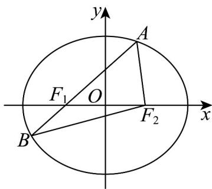

> [!faq]- 《专题3.1 椭圆（高效培优讲义）》官方解析
>
> > [!success]- **【答案】** (1) $\frac{x^{2}}{4}+\frac{y^{2}}{3}=1$ ; (2) $\frac{1}{2}$ .
>
> > [!note]- **【解析】**
> > （1）由 $\triangle F_{2}AB$ 的周长为8，得 $4a = 8$ ，解得 $a = 2$
> >
> > 由椭圆 $C$ 的离心率 $e = \frac{1}{2}$ ，得 $\frac{\sqrt{a^2 - b^2}}{a} = \frac{1}{2}$ ，得 $b = \sqrt{3}$
> >
> > 所以椭圆 C 的方程为 $\frac{x^{2}}{4} + \frac{y^{2}}{3} = 1$ .
> >
> > 
> >
> > (2) 由 (1) 知，椭圆 $C$ 的半焦距 $c = 1$ ， $|AF_1| + |AF_2| = 4, |F_1F_2| = 2$
> >
> > $$
> > \cos \angle F _ {1} A F _ {2} = \frac {\left| A F _ {1} \right| ^ {2} + \left| A F _ {2} \right| ^ {2} - \left| F _ {1} F _ {2} \right| ^ {2}}{2 \left| A F _ {1} \right| \left| A F _ {2} \right|} = \frac {\left(\left| A F _ {1} \right| + \left| A F _ {2} \right|\right) ^ {2} - \left| F _ {1} F _ {2} \right| ^ {2} - 2 \left| A F _ {1} \right| \left| A F _ {2} \right|}{2 \left| A F _ {1} \right| \left| A F _ {2} \right|}
> > $$
> >
> > 所以 $\cos\angle F_{1}AF_{2}$ 的最小值为 $\frac{1}{2}$ .
