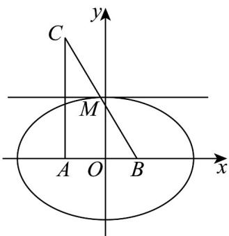

> [!faq]- 《专题3.1 椭圆（高效培优讲义）》官方解析
>
> > [!success]- **【答案】** 12
>
> > [!note]- **【解析】**
> > 设 $AC = 2a$ ，则 $AM = MC$ ·由 $BM + AM = BC = 10$ ，知点 $M$ 的轨迹是以A，B为焦点的
> >
> > 椭圆，长轴长为 10 ，焦距为 6 · 椭圆半长轴 $a' = 5$ ，半焦距 c = 3 ，
> >
> > 半短轴 $b=\sqrt{a^{2}-c^{2}}=4$
> >
> > 设 $A(-30), B(30)$ ，则 $M$ 的轨迹是椭圆 $\frac{x^2}{25} + \frac{y^2}{16} = 1$
> >
> > $\triangle ABM$ 面积 $S = \frac{1}{2}\times AB\times \left|y_{M}\right| = 3\left|y_{M}\right|$
> >
> > 当 $\left|y_{M}\right|$ 取最大值(即半短轴 b=4 )时，面积最大.
> >
> > 最大面积为 $3 \times 4 = 12$
> >
> > 故答案为：12.
> >
> > 
