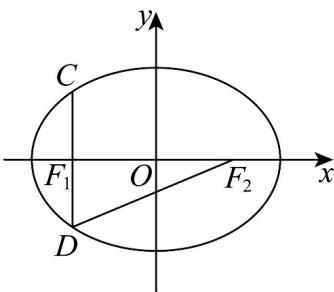

> [!faq]- 《专题3.1 椭圆（高效培优讲义）》官方解析
>
> > [!success]- **【答案】** $\frac{x^2}{81} +\frac{y^2}{45} = 1$
>
> > [!note]- **【解析】**
> > 由题意， $CD \perp x$ 轴，且 $|CD| = 10$ ，则 $|DF_{1}| = 5$ ，
> >
> > 由椭圆的定义知， $2a=|DF_{2}|+|DF_{1}|=13+5=18$ ，则 a=9，
> >
> > 在 $\mathrm{Rt}\triangle DF_1F_2$ 中， $2c = |F_1F_2| = \sqrt{|DF_2|^2 - |DF_1|^2} = \sqrt{13^2 - 5^2} = 12$
> >
> > 则 c=6 ，所以 $b^{2}=a^{2}-c^{2}=81-36=45$
> >
> > 所以椭圆 E 的方程为 $\frac{x^{2}}{81} + \frac{y^{2}}{45} = 1$
> >
> > 故答案为： $\frac{x^{2}}{81}+\frac{y^{2}}{45}=1$
> >
> > 
> >
> > ## 方法技巧
> >
> > 利用几何意义进行转化.
