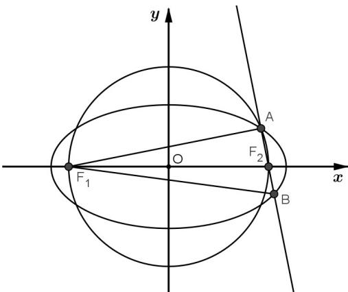

> [!faq]- 《专题3.1 椭圆（高效培优讲义）》官方解析
>
> > [!success]- **【答案】** B
>
> > [!note]- **【解析】**
> > 由 $a^2 - b^2 = c^2$ 知 $F_1F_2$ 为圆 $O$ 的直径，所以 $\angle F_1AF_2 = \frac{\pi}{2}$ ，
> >
> > 由题设，若 $|BF_{2}| = x$ ，则 $|AF_{1}| = 4x$ ，故 $|BF_{1}| = 2a - x, |AF_{2}| = 2a - 4x$
> >
> > 故 $\left|AB\right|=\left|AF_{2}\right|+\left|BF_{2}\right|=2a-3x$ ，而 $\left|AB\right|^{2}+\left|AF_{1}\right|^{2}=\left|BF_{1}\right|^{2}$
> >
> > 
> >
> > 故 $(2a-3x)^{2}+16x^{2}=(2a-x)^{2}$ ，解得 $x=\frac{a}{3}$
> >
> > 则 $\tan\angle AF_{1}F_{2}=\frac{\left|AF_{2}\right|}{\left|AF_{1}\right|}=\frac{1}{2}$ ，故直线 $AF_{1}$ 的斜率为 $\frac{1}{2}$ .
> >
> > 故选 **B**
