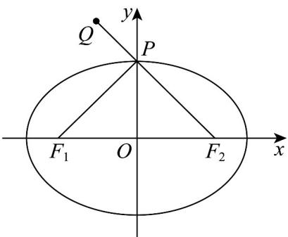

> [!faq]- 《专题3.1 椭圆（高效培优讲义）》官方解析
>
> > [!success]- **【答案】** $\sqrt{2}$
>
> > [!note]- **【解析】**
> > 由题可得 $a = 2\sqrt{2}$ ， $b = 2$ ，则 $c = 2$ ，故 $F_{1}(-2,0)$ ，设右焦点为 $F_{2}$ ，则 $F_{2}(2,0)$
> >
> > $\left|QF_{2}\right| = \sqrt{(2 + 1)^{2} + (-3)^{2}} = 3\sqrt{2}$ ，由椭圆的定义可得 $\left|PF_1\right| + \left|PF_2\right| = 4\sqrt{2}$ ，则 $\left|PF_1\right| = 4\sqrt{2} -\left|PF_2\right|$
> >
> > 易得点 $Q(-1,3)$ 在椭圆 $C$ 外，所以 $\left|PF_1\right| - \left|PQ\right| = 4\sqrt{2} -\left(\left|PF_2\right| + \left|PQ\right|\right)\leq 4\sqrt{2} -\left|QF_2\right| = 4\sqrt{2} -3\sqrt{2} = \sqrt{2}$
> >
> > 当且仅当 $Q, P, F_{2}$ 三点共线且点 $P$ 在线段 $QF_{2}$ 上时等号成立，所以 $\left|PF_{1}\right| - \left|PQ\right|$ 的最大值为 $\sqrt{2}$
> >
> > 故答案为： $\sqrt{2}$
> >
> > 
> >
> > ## 方法技巧
> >
> > 在解析几何中，我们会遇到最值问题，这种问题，往往是考察我们定义．求解最值问题的过程中，如果发现
> >
> > 动点 $P$ 在圆锥曲线上，要思考并用上圆锥曲线的定义，往往问题能迎刃而解。
