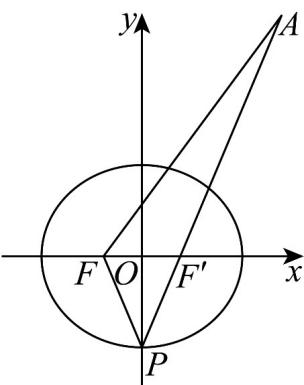

> [!faq]- 《专题3.1 椭圆（高效培优讲义）》官方解析
>
> > [!success]- **【答案】** 15 23
>
> > [!note]- **【解析】**
> > 椭圆 $C:\frac{x^{2}}{25}+\frac{y^{2}}{21}=1$ 长轴长为 10，左焦点 $F(-2,0)$ ，令右焦点为 $F'(2,0)$ ，点 $A(7,12)$ 在椭圆 C 外，
> >
> > 因此 $\left|PA\right|+\left|PF\right|\quad\left|FA\right|=\sqrt{9^{2}+12^{2}}=15$ ，当且仅当 P 为线段 AF 与椭圆交点时取等号；
> >
> > $$
> > \left| P A \right| + \left| P F \right| = \left| P A \right| + 1 0 - \left| P F ^ {\prime} \right| \leq 1 0 + \left| A F ^ {\prime} \right| = 1 0 + \sqrt {5 ^ {2} + 1 2 ^ {2}} = 2 3
> > $$
> >
> > 当且仅当 P 为线段 $AF'$ 的延长线与椭圆交点时取等号，
> >
> > 所以 $\left|PA\right|+\left|PF\right|$ 的最小值为 15，最大值为 23.
> >
> > 故答案为：15；23
> >
> > 
