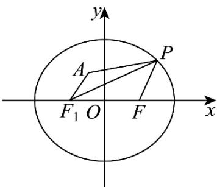

> [!faq]- 《专题3.1 椭圆（高效培优讲义）》官方解析
>
> > [!success]- **【答案】** B
>
> > [!note]- **【解析】**
> > 由题意，椭圆 $C$ 的左焦点为 $F_{1}(-1,0)$ ，由椭圆定义可得 $\left|PF_1\right| + \left|PF\right| = 4$
> >
> > 所以 $\left|PF\right|=4-\left|PF_{1}\right|$ ，因为 $\frac{\frac{4}{25}}{4}+\frac{\frac{16}{25}}{3}<1$ ，故 $A\left(-\frac{2}{5},\frac{4}{5}\right)$ 在椭圆内，
> >
> > 所以 $\left|PA\right| + \left|PF\right| = \left|PA\right| + 4 - \left|PF_1\right|\leq \left|AF_1\right| + 4 = \sqrt{\left(-\frac{2}{5} + 1\right)^2 + \left(\frac{4}{5}\right)^2} +4 = 5$
> >
> > 当 $F_{1}$ 在线段 $AP$ 上时，等号成立·
> >
> > 故选：B.
> >
> > 
