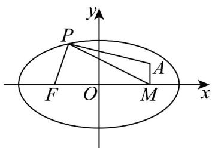

> [!faq]- 《专题3.1 椭圆（高效培优讲义）》官方解析
>
> > [!success]- **【答案】** B
>
> > [!note]- **【解析】**
> > 取椭圆的右焦点为 $M(2,0)$ ，故 $\left|PF\right|+\left|PA\right|=2a-\left|PM\right|+\left|PA\right|=6+\left|PA\right|-\left|PM\right|$
> >
> > 由于 $\left|\left|PA\right|-\left|PM\right|\right|\leq\left|AM\right|=1$ ，故 $-1\leq\left|PA\right|-\left|PM\right|\leq1$
> >
> > 因此 $\left|PF\right|+\left|PA\right|=6+\left|PA\right|-\left|PM\right|\in\left[5,7\right]$
> >
> > 故 $\left|PF\right|+\left|PA\right|$ 的最小值为5，当且仅当P,A,M三点共线，且P在上半椭圆时取到最小值，
> >
> > 故选：B
> >
> > 
