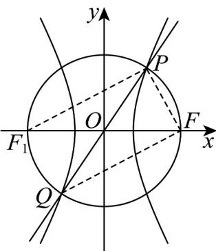

> [!faq]- 《专题3.1 椭圆（高效培优讲义）》官方解析
>
> > [!success]- **【答案】** B
>
> > [!note]- **【解析】**
> > 不妨设点 P 在第一象限，连接 FP, FQ, $PF_{l}$ ，如图．由题意可得 $\angle PFQ = 90^{\circ}$
> >
> > 
> >
> > 易知 $P$ ， $Q$ 两点关于坐标原点 $O$ 对称，所以 $O$ 为线段 $PQ$ 的中点，
> >
> > 所以 $\left|OF\right|=\left|OP\right|=\left|OQ\right|=\left|OF_{1}\right|$ ，故 $\triangle PF_{1}F$ 为直角三角形，由题意， $\tan\angle POF=\frac{4}{3}$ ，设 $\angle OF_{1}P=\angle OPF_{1}=\theta$ ，
> > 则 $\tan2\theta=\frac{4}{3}=\frac{2\tan\theta}{1-\tan^{2}\theta}$ ，解得 $\tan\theta=\frac{1}{2}$ 或 -2（舍），
> >
> > 所以 $\left|PF\right|\left|\left|PF_{1}\right|\left|\left|FF_{1}\right|\right|=1:2:\sqrt{5}\right.$ ， $e=\frac{2c}{2a}=\frac{\left|FF_{1}\right|}{\left|PF_{1}\right|-\left|PF\right|}=\frac{\sqrt{5}}{2-1}=\sqrt{5}$
> >
> > 故选：B
> >
> > ## 方法技巧
> >
> > 求离心率的本质就是探究 $a, c$ 之间的数量关系，知道 $a, b, c$ 中任意两者间的等式关系或不等关系便可求解出 $e$
> >
> > 的值或其范围.具体方法为方程法、不等式法、定义法和坐标法.
