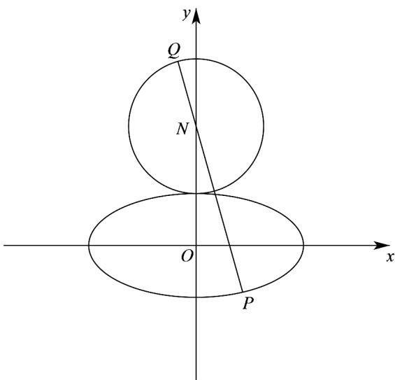

> [!faq]- 《专题3.1 椭圆（高效培优讲义）》官方解析
>
> > [!success]- **【答案】** AC
>
> > [!note]- **【解析】**
> > AB选项，由通径长 $\frac{2b^2}{a} = \frac{2}{a} = \frac{2}{3}$ ，得 $a = 3$ .所以 $c = \sqrt{a^2 - 1} = 2\sqrt{2}$
> >
> > 由椭圆的定义，可得 $\left|PF_{1}\right|+\left|PF_{2}\right|=2a=6$ ，所以A正确；
> >
> > 椭圆 M 离心率 $\frac{c}{a} = \frac{2\sqrt{2}}{3}$ ，所以 B 不正确；
> >
> > C 选项，圆 N 的圆心为 $N(0,2)$ ，半径 $r_{1}=1$ ，圆 $x^{2}+y^{2}=a^{2}$ 圆心为 $O(0,0)$ ， $r_{2}=a=3$
> >
> > 因为 $|ON| = 2 = r_2 - r_1$ ，所以两圆相内切；C 正确；
> >
> > D 选项，设点 $P(x, y)$ ，其中 $-1 \leq y \leq 1$ ，则满足 $\frac{x^2}{9} + y^2 = 1$ ，可得 $x^2 = 9(1 - y^2)$
> >
> > 则 $\left|PN\right|=\sqrt{x^{2}+\left(y-2\right)^{2}}=\sqrt{9\left(1-y^{2}\right)+\left(y-2\right)^{2}}=\sqrt{-8y^{2}-4y+13}$
> >
> > $$
> > = \sqrt {- 8 \left(y + \frac {1}{4}\right) ^ {2} + \frac {2 7}{2}}
> > $$
> >
> > 当 $y = -\frac{1}{4}$ 时， $\left|PN\right|$ 取得最大值， $\left|PN\right|_{\max} = \frac{3\sqrt{6}}{2}$
> >
> > 
> >
> > 故 $\left|PQ\right|_{\max}=\left|PN\right|_{\max}+r_{1}=\frac{3\sqrt{6}}{2}+1$ ，所以 D 不正确。
> >
> > 故选 **AC**
