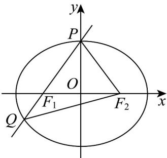

> [!faq]- 《专题3.1 椭圆（高效培优讲义）》官方解析
>
> > [!success]- **【答案】** B
>
> > [!note]- **【解析】**
> > 设 $\left|QF_{1}\right|=t$ ，则 $\left|PF_{1}\right|=2t$ ， $\left|QF_{2}\right|=2t+t=3t$
> >
> > 由 $\left|PF_1\right| + \left|PF_2\right| = \left|QF_1\right| + \left|QF_2\right| = 2a$ ，可得 $\left|PF_2\right| = 2t$
> >
> > $\because\left|PF_{1}\right|=\left|PF_{2}\right|$ ，所以点P为椭圆的上顶点或下顶点，在 $\triangle PQF_{2}$ 中，由余弦定理可得 $\cos \angle QPF_{2} = \frac{9t^{2} + 4t^{2} - 9t^{2}}{2\times 3t\times 2t} = \frac{1}{3}$ ，
> > 在 $\triangle PF_1F_2$ 中，由余弦定理可得 $(2c)^{2} = a^{2} + a^{2} - 2\times a\times a\times \frac{1}{3}$ ，即 $c^2 = \frac{a^2}{3}$ ， $e = \frac{\sqrt{3}}{3}$
> >
> > 故选：B.
> >
> > 
