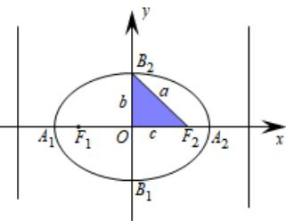
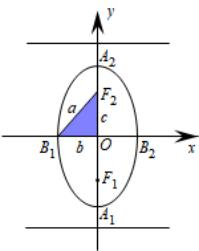

> [!faq]- 《专题3.1 椭圆（高效培优讲义）》官方解析
>
> > [!success]- **【答案】** BCD
>
> > [!note]- **【解析】**
> > 设椭圆的长轴长为 $2a$ ，短轴长为 $2b$ ，焦距为 $2c$ ，根据题意得到 $d_{1} = a - c, d_{2} = a + c$ ；故 $2a = d_{1} + d_{2}, 2c = d_{2} - d_{1}$
> >
> > 对于 A：焦距 $2c = d_{2} - d_{1}$ ，故选项 A 错误；
> >
> > 对于 B：因为离心率 $e=\frac{c}{a}=\frac{2c}{2a}=\frac{d_{2}-d_{1}}{d_{2}+d_{1}}$ ，故选项 B 正确；
> >
> > 对于 C：短轴长 $2b = 2\sqrt{a^{2} - c^{2}} = 2\sqrt{\left(\frac{d_{2} + d_{1}}{2}\right)^{2} - \left(\frac{d_{2} - d_{1}}{2}\right)^{2}} = 2\sqrt{d_{1}d_{2}}$ ，故选项 C 正确；
> >
> > 对于 D：离心率 $e=\frac{c}{a}=\frac{2c}{2a}=\frac{d_{2}-d_{1}}{d_{2}+d_{1}}=\frac{1-\frac{d_{1}}{d_{2}}}{1+\frac{d_{1}}{d_{2}}}=\frac{-1-\frac{d_{1}}{d_{2}}+2}{1+\frac{d_{1}}{d_{2}}}=-1+\frac{2}{1+\frac{d_{1}}{d_{2}}}$
> >
> > 当 $\frac{d_1}{d_2}$ 越大时，椭圆的离心率越小，即椭圆越圆，故D正确；
> >
> > 故选：BCD
> >
> > ## 方法技巧
> >
> > <table><tr><td colspan="2">标准方程</td><td> $\frac{x^2}{a^2} + \frac{y^2}{b^2} = 1 (a > b > 0)$ </td><td> $\frac{x^2}{b^2} + \frac{y^2}{a^2} = 1 (a > b > 0)$ </td></tr><tr><td colspan="2">图形</td><td>- </td><td></td></tr><tr><td rowspan="3">性质</td><td>焦点</td><td> $F_1(-c,0), F_2(c,0)$ </td><td> $F_1(0,-c), F_2(0,c)$ </td></tr><tr><td>焦距</td><td> $|F_1F_2|=2c (c=\sqrt{a^2-b^2})$ </td><td> $|F_1F_2|=2c (c=\sqrt{a^2-b^2})$ </td></tr><tr><td>范围</td><td> $|x|\leq a, |y|\leq b$ </td><td> $|x|\leq b, |y|\leq a$ </td></tr><tr><td rowspan="4"></td><td>对称性</td><td colspan="2">关于x轴、y轴和原点对称</td></tr><tr><td>顶点</td><td>(±a,0), (0,±b)</td><td>(0,±a), (±b,0)</td></tr><tr><td>轴</td><td colspan="2">长轴长=2a,短轴长=2b</td></tr><tr><td>离心率</td><td colspan="2"> $e=\frac{c}{a}$ (0&lt; e&lt;1)(注:离心率越小越圆,越大越扁)</td></tr></table>
