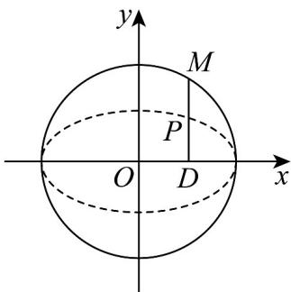

> [!faq]- 《专题3.1 椭圆（高效培优讲义）》官方解析
>
> > [!success]- **【答案】** (1) $\frac{x^{2}}{25}+\frac{y^{2}}{9}=1$ (2)轨迹方程为 $x^{2} + y^{2} = 25$ ，轨迹是：以 $(0,0)$ 为圆心， $^5$ 为半径的圆.
>
> > [!note]- **【解析】**
> > （1）设椭圆的标准方程为 $\frac{x^2}{a^2} +\frac{y^2}{b^2} = 1(a > b > 0)$
> >
> > 因为椭圆 E 的两个焦点坐标分别为 $(-4,0)$ , $(4,0)$ ，并且经过点 $\left(\frac{5}{2}, \frac{3\sqrt{3}}{2}\right)$
> >
> > 所以 $2a = \sqrt{\left(\frac{5}{2} + 4\right)^2 + \frac{27}{4}} + \sqrt{\left(\frac{5}{2} - 4\right)^2 + \frac{27}{4}} = 10$
> >
> > 所以 $a = 5$ ， $b^{2} = a^{2} - c^{2} = 25 - 16 = 9$
> >
> > 所以 E 的标准方程为： $\frac{x^{2}}{25}+\frac{y^{2}}{9}=1$
> >
> > (2)
> >
> > 
> >
> > 设 $M(x,y)$ ， $P(x_0,y_0)$ ，则 $D(x_0,0)$ ， $\overline{DM} = (x - x_0,y)$ ， $\overline{DP} = (0,y_0)$
> >
> > 因为 $\overline{DM} = \frac{5}{3}\overline{DP}$ ，所以 $\left\{\begin{aligned}x - x_{0} &= 0 \\ y &= \frac{5}{3}y_{0}\end{aligned}\right.$ ，则 $\left\{\begin{aligned}x_{0} &= x \\ y_{0} &= \frac{3}{5}y\end{aligned}\right.$
> >
> > 又因为 $\frac{x_0^2}{25} +\frac{y_0^2}{9} = 1$
> >
> > 把 $\left\{\begin{aligned}x_{0}&=x\\ y_{0}&=\frac{3}{5}y\end{aligned}\right.$ 代入上式得： $x^{2}+y^{2}=25$
> >
> > 所以点 $M$ 的轨迹方程为 $x^{2} + y^{2} = 25$ ，轨迹是：以 $(0,0)$ 为圆心， $^5$ 为半径的圆．
