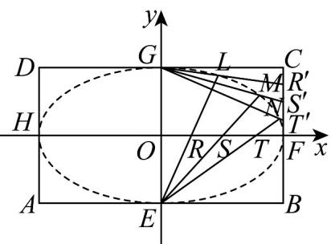

<!-- question-source:start -->
【典例1】如图，矩形ABCD中， $|AB|=4,|BC|=2\sqrt{3}$ ，E、F、G、H分别是矩形四条边的中点，R、S、T

是线段 $OF$ 的四等分点， $R', S', T'$ 是线段 $CF$ 的四等分点。

(1)证明直线 $ER$ 与 $GR'$ 、 $ES$ 与 $GS'$ 、 $ET$ 与 $GT'$ 的交点 $L$ 、 $M$ 、 $N$ 都在椭圆 $\frac{x^2}{4} +\frac{y^2}{3} = 1$ 上.

(2)若椭圆 $\frac{x^2}{4} +\frac{y^2}{3} = 1$ 与直线 $y = kx + m$ 交于不同的两点 $M^{\prime},N^{\prime}$ ，如果存在过点 $P(0, - \frac{1}{2})$ 的直线 $l$ ，使得点

$M^{\prime},N^{\prime}$ 关于 $l$ 对称，求实数 $m$ 的取值范围
<!-- question-source:end -->

![[高中/课堂同步/题库/人教A版高中数学同步讲义(2026)/03_选择性必修第一册/第三章 圆锥曲线的方程/专题3.1 椭圆（高效培优讲义）/题型09_直线与椭圆的位置关系/questions/answers/Q00080151A1.md]]
