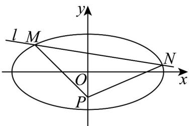

> [!faq]- 《专题3.1 椭圆（高效培优讲义）》官方解析
>
> > [!success]- **【答案】** (1) $\frac{x^2}{8} +\frac{y^2}{2} = 1$ (2) $l:y=1$ 或者 $l:y=-\frac{1}{6}x+\frac{2}{3}$ .
>
> > [!note]- **【解析】**
> > （1）由题意得 $\left\{ \begin{array}{l} \frac{4}{a^2} + \frac{1}{b^2} = 1 \\ \frac{c}{a} = \frac{\sqrt{3}}{2} \end{array} \right. \Rightarrow \left\{ \begin{array}{l} a = 2\sqrt{2} \\ b = \sqrt{2} \end{array} \right.$ ，则椭圆方程 $\frac{x^2}{8} + \frac{y^2}{2} = 1$ 。
> >
> > (2) $M(-2,1)$ ， $P(0,-1)$ ，则 $k_{MP} = -1$
> >
> > 则 $l_{MP}: y = -x - 1$ ， $\left|MP\right| = \sqrt{4 + 4} = 2\sqrt{2}$
> >
> > 则 $S_{\triangle PMN} = \frac{1}{2}\big|MP\big|\cdot d_{N - MP} = 4\Rightarrow d_{N - MP} = 2\sqrt{2}$
> >
> > 设 N 在直线 $l'$ : $y = -x + m$ 上，
> >
> > 则 $d_{N-MP}=\left|\frac{m+1}{\sqrt{1+1}}\right|=2\sqrt{2}\Rightarrow m=3$ 或 m=-5，
> >
> > 当 m = -5 时， $l'$ : y = -x - 5
> >
> > 联立有 $\left\{ \begin{array}{l} y = -x - 5 \\ \frac{x^2}{8} + \frac{y^2}{2} = 1 \end{array} \Rightarrow x^2 + 4(x^2 + 10x + 25) = 8 \right.$
> >
> > 即 $5x^{2} + 40x + 92 = 0$
> >
> > 因为 $\Delta = 1600 - 4\times 5\times 92 = -240 <   0$
> >
> > 故 l: y = -x - 5 与 C 相离.
> >
> > 当 m=3 时， $l^{\prime}:y=-x+3$
> >
> > 联立 $\left\{ \begin{array}{l} y = -x + 3 \\ \frac{x^2}{8} + \frac{y^2}{2} = 1 \end{array} \Rightarrow x^2 + 4(x^2 - 6x + 9) = 8 \right.$
> >
> > 化简得 $5x^{2} - 24x + 28 = 0$ ，即 $(5x - 14)(x - 2) = 0$ ，解得 $x_{1} = 2, x_{2} = \frac{14}{5}$
> >
> > 即 $N(2,1)$ 或者 $N\left(\frac{14}{5}, \frac{1}{5}\right)$ ，因为 $M(-2,1)$
> >
> > 故或者 $l:y - 1 = \frac{1 - \frac{1}{5}}{-2 - \frac{14}{5}} (x + 2)$
> >
> > 即 $l: y = 1$ 或者 $l: y = -\frac{1}{6}x + \frac{2}{3}$ .
> >
> > 
