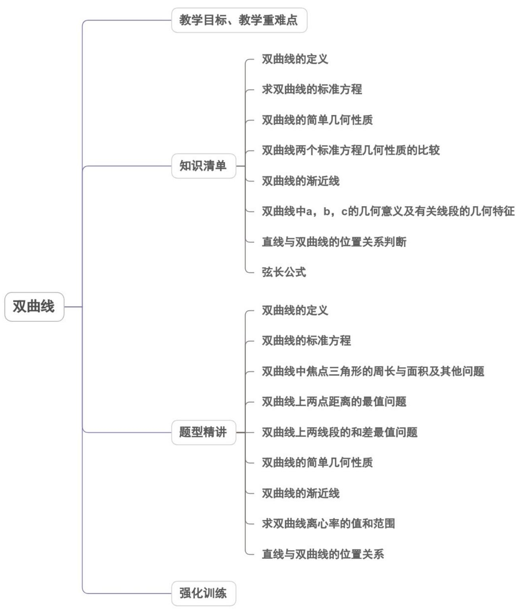
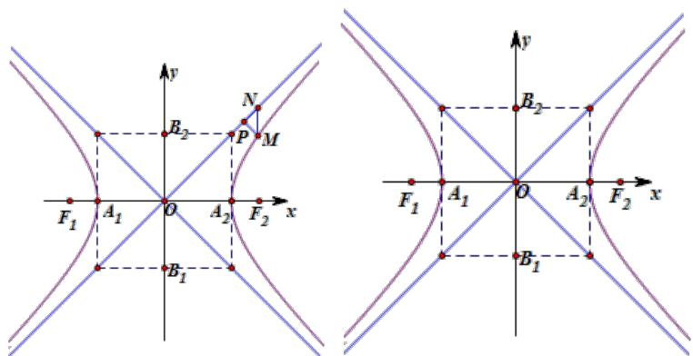
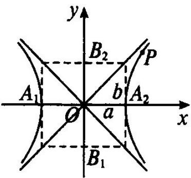
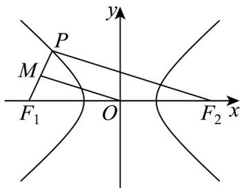
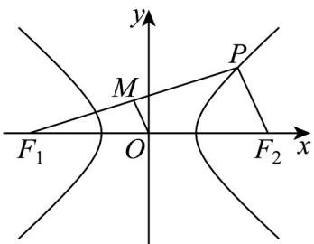
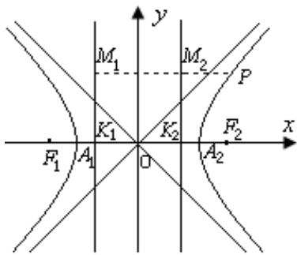
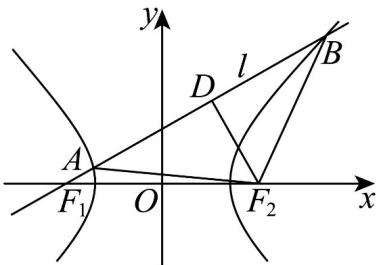
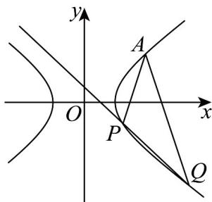

<!-- source-part:1 pages:1-50 -->

## 专题3.2 双曲线

## 教学目标、教学重难点

<table><tr><td>教学目标</td><td>1.了解双曲线的实际背景,感受双曲线在刻画现实世界和解决实际问题中的作用.2.了解双曲线的定义、几何图形和标准方程.3.了解双曲线的几何图形及简单几何性质.4.通过双曲线的方程的学习,进一步体会数形结合的思想,了解双曲线的简单应用.</td></tr><tr><td>教学重难点</td><td>1.重点掌握双曲线中焦点、焦距、顶点坐标、实轴、虚轴及离心率的内容.2.难点掌握双曲线中的定点、定值、最值等问题.</td></tr></table>

## 知识清单

## 知识点 01 双曲线的定义

在平面内，到两个定点 $F_{1}$ 、 $F_{2}$ 的距离之差的绝对值等于常数 $2a$ （ $a$ 大于0且 $2a < |F_{1}F_{2}|$ ）的动点 $P$ 的轨迹叫作双曲线．这两个定点 $F_{1}$ 、 $F_{2}$ 叫双曲线的焦点，两焦点的距离叫作双曲线的焦距．

## 【即学即练】

1. 一动圆过定点 $A(-4,0)$ ，且与圆 $B: (x - 4)^2 + y^2 = 16$ 相外切，则动圆圆心的轨迹方程为（）A. $\frac{x^2}{4} - \frac{y^2}{12} = 1(x \leq -2)$ B. $\frac{y^2}{4} - \frac{x^2}{12} = 1(y \leq -2)$ C. $\frac{x^2}{4} - \frac{y^2}{12} = 1$ D. $\frac{y^2}{4} - \frac{x^2}{12} = 1$

【答案】A

【详解】设动圆圆心为点 $P(x,y)$ ，连接 $PB,PA$ ，则 $\left|PB\right| = \left|PA\right| + 4$ ，则 $\left|PB\right| - \left|PA\right| = 4 <   \left|AB\right| = 8$

所以点 $P$ 的轨迹是以 $A(-4,0)$ ， $B(4,0)$ 为焦点，且实轴长为 $^4$ 的双曲线的左支。

设双曲线的实半轴长为 $a$ ，虚半轴长为 $b$ ，则 $a = 2$ ， $b^2 = 4^2 - a^2 = 12$

所以动圆圆心的轨迹方程为 $\frac{x^2}{4} -\frac{y^2}{12} = 1(x\leq -2)$

故选：A

2．已知以点 M 为圆心的动圆经过点 $F_{1}(-3,0)$ ，且与圆心为 $F_{2}$ 的圆 $(x-3)^{2}+y^{2}=12$ 相切，记点 M 的轨迹为曲

线 C，则曲线 C 的方程为 \_\_\_\_。

【答案】 $\frac{x^2}{3} -\frac{y^2}{6} = 1$

【详解】圆 $\left(x - 3\right)^2 +y^2 = 12$ 的圆心为 $F_{2}(3,0)$ ，半径 $r = 2\sqrt{3}$

动圆 $M$ 与圆 $F_{2}$ 相切有两种情况，即内切或外切，所以 $\left\| MF_1\right| - \left|MF_2\right| = 2\sqrt{3} < \left|F_1F_2\right| = 6$

所以点 M 在以 $F_{1}$ ， $F_{2}$ 为焦点的双曲线上，可设双曲线方程为 $\frac{x^{2}}{a^{2}} - \frac{y^{2}}{b^{2}} = 1 (a > 0, b > 0)$

则 $2a = 2\sqrt{3}$ ， $2c = 6$ ，所以 $b^{2} = c^{2} - a^{2} = 6$ ，所以曲线 $C$ 的方程是 $\frac{x^2}{3} -\frac{y^2}{6} = 1$

故答案为： $\frac{x^{2}}{3}-\frac{y^{2}}{6}=1$

## 知识点 02 求双曲线的标准方程

①待定系数法：由题目条件确定焦点的位置，从而确定方程的类型，设出标准方程，再由条件确定方程中的

参数 $a$ 、 $b$ 、 $c$ 的值．其主要步骤是“先定型，再定量”；

②定义法：由题目条件判断出动点的轨迹是什么图形，然后再根据定义确定方程.

## 【即学即练】

1. 已知双曲线 $C$ 的上，下焦点分别为点 $F_{1}$ ， $F_{2}$ ，若 $C$ 的实轴长为 1，且 $C$ 上点 $P$ 满足 $PF_{1} \perp PF_{2}$ ， $\left|PF_{1}\right| \cdot \left|PF_{2}\right| = 4$ ，则 $C$ 的方程为（）A. $y^{2} - \frac{x^{2}}{4} = 1$ B. $y^{2} - \frac{x^{2}}{2} = 1$ C. $4y^{2} - \frac{x^{2}}{4} = 1$ D. $4y^{2} - \frac{x^{2}}{2} = 1$

【答案】D

【详解】由题意设双曲线方程为 $\frac{y^2}{a^2} -\frac{x^2}{b^2} = 1$

由题意可知 $a=\frac{1}{2}$ ，

由于 $PF_{1} \perp PF_{2}$ ， $\left|PF_{1}\right|\cdot \left|PF_{2}\right| = 4$ ，故 $\left\{ \begin{array}{l} \left|PF_{1}\right| \cdot \left|PF_{2}\right| = 4 \\ \left\|PF_{1}\right| - \left|PF_{2}\right\| = 2a = 1 \\ \left|PF_{1}\right|^{2} + \left|PF_{2}\right|^{2} = 4c^{2} \end{array} \right.$ ，解得 $c = \frac{3}{2}$

故 $b = \sqrt{c^2 - a^2} = \sqrt{2}$

故双曲线方程为 $4y^{2} - \frac{x^{2}}{2} = 1$

故选：D

2．已知双曲线 $C:\frac{x^{2}}{a^{2}}-\frac{y^{2}}{b^{2}}=1(a>0,b>0)$ 的左、右焦点分别为 $F_{1}$ ， $F_{2}$ ，点 $A\left(2,\frac{\sqrt{3}}{3}\right)$ 在 C 上，且 $AF_{2} \perp F_{1}F_{2}$

(1)求 $C$ 的标准方程；

(2)过 $F_{2}$ 的直线交双曲线 $C$ 于 $M, N$ 两点（ $M, N$ 两点均位于 $x$ 轴下方， $M$ 在左， $N$ 在右），线段 $AM$ 与线段 $F_{1}N$ 交于点 $R$ ，若 $\triangle F_{1}RM$ 的面积等于 $\triangle ARN$ 的面积，求 $|MN|$ .

【答案】(1) $\frac{x^2}{3} - y^2 = 1$

(2) $\frac{98\sqrt{3}}{45}$

【详解】（1）因为 $AF_{2} \perp F_{1}F_{2}$ ，且 $A\left(2, \frac{\sqrt{3}}{3}\right)$ ，所以焦点 $F_{2}(2,0)$ ，即 $c = 2$ ，

又 $\frac{4}{a^2} -\frac{1}{3b^2} = 1$ ，由 $\left\{ \begin{array}{l}\frac{4}{a^2} -\frac{1}{3b^2} = 1\\ a^2 +b^2 = 4 \end{array} \right.$ ，解得 $\left\{ \begin{array}{l}a^2 = 3\\ b^2 = 1 \end{array} \right.$ ，所以双曲线 $C:\frac{x^2}{3} -y^2 = 1\cdot$

(2) 由题知直线斜率不为0，设过 $F_{2}(2,0)$ 的直线为 $x=my+2(m>0)$

由 $\left\{ \begin{array}{l} x = my + 2 \\ \frac{x^2}{3} - y^2 = 1 \end{array} \right.$ ，消 $x$ 得到 $\left(m^2 - 3\right)y^2 + 4my + 1 = 0$

则 $\Delta = (4m)^2 - 4 \times (m^2 - 3) = 12(m^2 + 1) > 0$ ，且 $m \neq \sqrt{3}$

设 $M\left(x_{1},y_{1}\right),N\left(x_{2},y_{2}\right)$ ，则由韦达定理有 $y_{1} + y_{2} = -\frac{4m}{m^{2} - 3},y_{1}y_{2} = \frac{1}{m^{2} - 3}$

因为 $S_{\triangle F_1RM} = S_{\triangle ARN}$ ，所以 $S_{\triangle F_1NM} = S_{\triangle ANM}$

即点 $F_{1}(-2,0)$ 和点 $A\left(2,\frac{\sqrt{3}}{3}\right)$ 到直线 $x=my+2$ 的距离相等，

则有 $d = \frac{|-4|}{\sqrt{1 + m^{2}}} = \frac{\left| -\frac{\sqrt{3}}{3} m \right|}{\sqrt{1 + m^{2}}}$ ，解得 $m = 4\sqrt{3}$ ，

所以 $\left|MN\right|=\sqrt{1+m^{2}}\left|y_{1}-y_{2}\right|=\sqrt{1+m^{2}}\sqrt{\left(y_{1}+y_{2}\right)^{2}-4y_{1}y_{2}}=\frac{2\sqrt{3}\left(m^{2}+1\right)}{\left|m^{2}-3\right|}=\frac{98\sqrt{3}}{45}$

$$
\left| M N \right| = \frac {9 8 \sqrt {3}}{4 5}
$$

## 知识点 03 双曲线的简单几何性质

对称性;对于双曲线标准方程 $\frac{x^{2}}{a^{2}} - \frac{y^{2}}{b^{2}} = 1$ （a > 0, b > 0），把 x 换成 -x，或把 y 换成 -y，或把 x、y 同时

换成 $-x$ 、 $-y$ ，方程都不变，所以双曲线 $\frac{x^2}{a^2} -\frac{y^2}{b^2} = 1$ （ $a > 0$ ， $b > 0$ ）是以 $x$ 轴、 $y$ 轴为对称轴的轴对称图形，

且是以原点为对称中心的中心对称图形，这个对称中心称为双曲线的中心。

顶点:①双曲线与它的对称轴的交点称为双曲线的顶点．②双曲线 $\frac{x^{2}}{a^{2}}-\frac{y^{2}}{b^{2}}=1$ （a>0, b>0）与坐标轴的两

个交点即为双曲线的两个顶点，坐标分别为 $A_{1}(-a,0)$ ， $A_{2}(a,0)$ ，顶点是双曲线两支上的点中距离最近的点.

③两个顶点间的线段 $A_{1}A_{2}$ 叫作双曲线的实轴；设 $B_{1}(0, -b)$ ， $B_{2}(0, b)$ 为 $y$ 轴上的两个点，则线段 $B_{1}B_{2}$ 叫做双曲线的虚轴。实轴和虚轴的长度分别为 $|A_{1}A_{2}| = 2a$ ， $|B_{1}B_{2}| = 2b$ 。 $a$ 叫做双曲线的实半轴长， $b$ 叫做双曲线的虚

半轴长.

离心率:①双曲线的焦距与实轴长的比叫做双曲线的离心率，用 e 表示，记作 $e=\frac{2c}{2a}=\frac{c}{a}$ 。②因为 c>a>0 ，

所以双曲线的离心率 $e = \frac{c}{a} > 1$ 。由 $c^2 = a^2 + b^2$ ，可得 $\frac{b}{a} = \sqrt{\frac{c^2 - a^2}{a^2}} = \sqrt{\left(\frac{c}{a}\right)^2 - 1} = \sqrt{e^2 - 1}$ ，所以 $\frac{b}{a}$ 决定双曲线的

$$
\frac {b}{a}
$$

等轴双曲线 $a = b$ ，所以离心率 $e = \sqrt{2}$

渐近线:经过点 $A_{2}$ 、 $A_{1}$ 作 y 轴的平行线 $x = \pm a$ ，经过点 $B_{1}$ 、 $B_{2}$ 作 x 轴的平行线 $y = \pm b$ ，四条直线围成一个矩

形（如图），矩形的两条对角线所在直线的方程是 $y = \pm \frac{b}{a} x$

我们把直线 $y = \pm \frac{b}{a} x$ 叫做双曲线的渐近线；双曲线与它的渐近线无限接近，但永不相交。

$$
| M N | = \left| \frac {b}{a} \sqrt {x ^ {2} - a ^ {2}} - \frac {b}{a} x \right| = \frac {b}{a} \left| \sqrt {x ^ {2} - a ^ {2}} - x \right| = \frac {a b}{\left| x + \sqrt {x ^ {2} - a ^ {2}} \right|} \rightarrow 0
$$

## 【即学即练】

1. 设 $O$ 为坐标原点，直线 $\mathrm{x} = \mathrm{b}$ 与双曲线 $C: \frac{y^2}{a^2} - \frac{x^2}{b^2} = 1 (a > 0, b > 0)$ 的两条渐近线分别交于 $A, B$ 两点，若

△ OAB 的面积为 $^{8}$ ，则双曲线 C 焦距的最小值为（）
A. 4 B. 8 C. 16 D. 32

【答案】B

【详解】联立 $\left\{\begin{aligned}x&=b\\ y&=\pm\frac{a}{b}x\end{aligned}\right.$ ，解得 $\left\{\begin{aligned}x&=b\\ y&=\pm a\end{aligned}\right.$ ，不妨令 $A(b,a)$ ， $B(b,-a)$ ，则 $\left|AB\right|=2a$ ，
AB 边上的高为 b，所以 $\frac{1}{2} \times 2a \times b = 8$ ，ab = 8，
故 C 的焦距 $2c = 2\sqrt{a^{2} + b^{2}}$ $2\sqrt{2ab} = 2\sqrt{2 \times 8} = 8$

故选：B

2. 已知双曲线 $C: x^{2} - \frac{y^{2}}{b^{2}} = 1 (b > 0)$ 的左、右焦点分别为 $F_{1}, F_{2}$ ，离心率为 $\mathbf{e}$ ， $C$ 的右支上存在点 $P$ ，满足$\sin \angle PF_{1}F_{2} = \frac{1}{\mathrm{e}}$ ，且 $S_{\triangle F_1PF_2} = 4$ ，则双曲线 $C$ 的离心率为（）A. $\frac{\sqrt{5}}{2}$ B. $\sqrt{5}$ C. $\frac{\sqrt{10}}{3}$ D. $\sqrt{10}$

【答案】B

【详解】设 $\left|PF_{1}\right|=m,\left|PF_{2}\right|=n$ ，由双曲线的定义，可得m-n=2a=2，
由 $\sin\angle PF_{1}F_{2}=\frac{1}{e}=\frac{a}{c}=\frac{1}{c}$ ，且 $S_{\triangle F_{1}PF_{2}}=4$ ，
可得 $\cos\angle PF_{1}F_{2}=\sqrt{1-\frac{a^{2}}{c^{2}}}=\frac{b}{c}$ ，且 $\frac{1}{2}m\cdot2c\cdot\frac{1}{c}=4$ ，解得m=4,n=2。
方法 $^{1}$ ：在 $\triangle PF_{1}F_{2}$ 中，由余弦定理得 $\cos\angle PF_{1}F_{2}=\frac{\left|PF_{1}\right|^{2}+\left|F_{1}F_{2}\right|^{2}-\left|PF_{2}\right|^{2}}{2\left|PF_{1}\right|\left|F_{1}F_{2}\right|}=\frac{m^{2}+4c^{2}-n^{2}}{2m\cdot2c}$ 即 $\frac{b}{c}=\frac{16+4c^{2}-4}{16c}$ ，整理得 $16b=16+4b^{2}$ ，解得b=2，所以 $c=\sqrt{a^{2}+b^{2}}=\sqrt{5}$ ，
所以双曲线C的离心率 $e=\frac{c}{a}=\sqrt{5}$ .
方法 $^{2}$ ：由 $S_{\triangle F_{1}PF_{2}}=4$ ，可得 $\frac{1}{2}mn\sin\angle F_{1}PF_{2}=4$ ，即 $\frac{1}{2}\times4\times2\cdot\sin\angle F_{1}PF_{2}=4$ ，
解得 $\sin\angle F_{1}PF_{2}=1$ ，所以 $\angle F_{1}PF_{2}=\frac{\pi}{2}$ ，可得 $\left|F_{1}F_{2}\right|=2c=\sqrt{m^{2}+n^{2}}=\sqrt{16+4}=2\sqrt{5}$ ，
所以 $c=\sqrt{5}$ ，双曲线C的离心率 $e=\frac{c}{a}=\sqrt{5}$

故选：B.

## 知识点 04 双曲线两个标准方程几何性质的比较

<table><tr><td colspan="2">标准方程</td><td> $\frac{x^2}{a^2} - \frac{y^2}{b^2} = 1 (a > 0, b > 0)$ </td><td> $\frac{y^2}{a^2} - \frac{x^2}{b^2} = 1 (a > 0, b > 0)$ </td></tr><tr><td colspan="2">图形</td><td></td><td></td></tr><tr><td rowspan="8">性质</td><td>焦点</td><td> $F_1(-c,0), F_2(c,0)$ </td><td> $F_1(0,-c), F_2(0,c)$ </td></tr><tr><td>焦距</td><td> $|F_1F_2|=2c (c=\sqrt{a^2+b^2})$ </td><td> $|F_1F_2|=2c (c=\sqrt{a^2+b^2})$ </td></tr><tr><td>范围</td><td> $\{x|x\leq-a或x a\}, y\in R$ </td><td> $\{y|y\leq-a或y a\}, x\in R$ </td></tr><tr><td>对称性</td><td colspan="2">关于x轴、y轴和原点对称</td></tr><tr><td>顶点</td><td> $(\pm a,0)$ </td><td> $(0,\pm a)$ </td></tr><tr><td>轴</td><td colspan="2">实轴长=2a,虚轴长=2b</td></tr><tr><td>离心率</td><td colspan="2"> $e=\frac{c}{a}(e>1)$ </td></tr><tr><td>渐近线方程</td><td> $y=\pm\frac{b}{a}x$ </td><td> $y=\pm\frac{a}{b}x$ </td></tr></table>

【即学即练】

1. 已知双曲线 $E: \frac{x^2}{9} - \frac{y^2}{7} = 1$ ， $F_1$ ， $F_2$ 分别为其左、右焦点， $O$ 为坐标原点， $P$ 为 $E$ 上一点，且 $\left|PF_1\right| = 8$ ， $M$

为 $PF_{1}$ 的中点，则 $\left|OM\right| =$ \_\_\_\_ .

【答案】 $^{1}$ 或 $^{7}$

【详解】因为双曲线 $E: \frac{x^2}{9} - \frac{y^2}{7} = 1$ ，所以 $a = 3, b = \sqrt{7}$ ， $c = \sqrt{a^2 + b^2} = 4$

故焦点坐标为 $F_{1}(-4,0)$ , $F_{2}(4,0)$ .

①若 P 在左支上，

$$
\left| P F _ {1} \right| _ {\min} = c - a = 1 \quad \left| P F _ {2} \right| _ {\min} = c + a = 7
$$

由双曲线的定义可知 $\left|PF_2\right| - \left|PF_1\right| = 2a = 6$

因为 $\left|PF_{1}\right|=8$ ，所以 $\left|PF_{2}\right|=14$ ，而 8>1,14>7，所以符合题意。

因为 M 为 $PF_{1}$ 的中点，所以在 $\Delta PF_{1}F_{2}$ 中，

由三角形中位线定理可知 $\left|OM\right|=\frac{1}{2}\left|PF_{2}\right|=7$ ；

②若 $P$ 在右支上，

$$
\left| P F _ {1} \right| _ {\min} = c + a = 7 \quad \left| P F _ {2} \right| _ {\min} = c - a = 1
$$

由双曲线的定义可知 $\left|PF_1\right| - \left|PF_2\right| = 2a = 6$

因为 $\left|PF_{1}\right|=8$ ，所以 $\left|PF_{2}\right|=2$ ，而 8>7,2>1，所以符合题意。

因为 M 为 $PF_{1}$ 的中点，所以在 $\triangle PF_{1}F_{2}$ 中，

由三角形中位线定理可知 $\left|OM\right|=\frac{1}{2}\left|PF_{2}\right|=1$ ；

故答案为： $^{1}$ 或 $^{7}$

2. 已知双曲线 $\frac{x^2}{4} - y^2 = 1$ 的左、右焦点分别为 $F_1$ 、 $F_2$ ，设点 $P\left(\sqrt{5}, \frac{1}{2}\right)$ ，则 $\left|PF_1\right| - \left|PF_2\right|$ 的值为 \_\_\_\_.

【答案】4

【详解】由双曲线的标准方程可得 a = 2 ，

由 $P\left(\sqrt{5},\frac{1}{2}\right)$ 满足方程 $\frac{x^{2}}{4}-y^{2}=1$ ，知点 P 在双曲线的右支上，

$$
\therefore \left| P F _ {1} \right| - \left| P F _ {2} \right| = 2 a = 4
$$

故答案为：4.

## 知识点 05 双曲线的渐近线

（1）已知双曲线方程求渐近线方程：若双曲线方程为 $\frac{x^2}{a^2} -\frac{y^2}{b^2} = 1$ ，则其渐近线方程为 $\frac{x^2}{a^2} -\frac{y^2}{b^2} = 0\Rightarrow$

$\frac{x}{a} \pm \frac{y}{b} = 0 \Rightarrow y = \pm \frac{b}{a} x$ 已知双曲线方程，将双曲线方程中的“常数”换成“0”，然后因式分解即得渐近线方程。

（2）已知渐近线方程求双曲线方程：若双曲线渐近线方程为 $mx \pm ny = 0$ ，则可设双曲线方程为

$m^2 x^2 - n^2 y^2 = \lambda$ ，根据已知条件，求出 $\lambda$ 即可.

(3) 与双曲线 $\frac{x^2}{a^2} - \frac{y^2}{b^2} = 1$ 有公共渐近线的双曲线: 与双曲线 $\frac{x^2}{a^2} - \frac{y^2}{b^2} = 1$ 有公共渐近线的双曲线方程可设为

$\frac{x^{2}}{a^{2}}-\frac{y^{2}}{b^{2}}=\lambda(\lambda\neq0)$ ( $\lambda>0$ ，焦点在x轴上， $\lambda<0$ ，焦点在y轴上)

（4）等轴双曲线的渐近线：等轴双曲线的两条渐近线互相垂直，为 $y = \pm x$ ，因此等轴双曲线可设为 $x^{2} - y^{2} = \lambda (\lambda \neq 0)$

## 【即学即练】

1. 关于双曲线 $4x^{2}-y^{2}+64=0$ 的以下论述中，正确的是（）

【答案】
A. 焦点在 y 轴上
B. 虚轴长为 16
C. 渐近线方程为 $y = \pm 2x$ D. 离心率为 $\frac{\sqrt{5}}{2}$

【答案】ACD

【详解】由 $4x^{2} - y^{2} + 64 = 0$ 有 $\frac{y^2}{64} -\frac{x^2}{16} = 1$ ，所以双曲线的焦点在 $y$ 轴上，故A正确；

由 $b = 4$ ，所以虚轴长为 $2b = 8$ ，故 $\mathbf{B}$ 错误；

由 $\frac{y^2}{64} -\frac{x^2}{16} = 0$ 得 $y = \pm 2x$ ，故C正确；由 $a^2 = 64,b^2 = 16$ ，所以 $c^2 = a^2 +b^2 = 80$ ，即 $a = 8,c = 4\sqrt{5}$

所以 $e=\frac{c}{a}=\frac{4\sqrt{5}}{8}=\frac{\sqrt{5}}{2}$ ，故 D 正确.

故选：ACD.

2. 已知反比例函数 $y = \frac{k}{x} (k \neq 0)$ 的图象是双曲线，其两条渐近线为 $x$ 轴和 $y$ 轴，两条渐近线的夹角为 $\frac{\pi}{2}$ ，将

双曲线绕其中心旋转，可使其渐近线变为直线 $y = \pm x$ ，由此可求得其离心率为 $\sqrt{2} \cdot$ 已知函数 $y = \frac{\sqrt{3}}{3} x - \frac{1}{x}$ 的图

象也是双曲线，直线 $y = \frac{\sqrt{3}}{3} x$ 是它的一条渐近线，则该双曲的离心率是（）A. $\sqrt{2}$ B. $\sqrt{3}$ C. 2 D. $\sqrt{5}$

【答案】C

【详解】函数 $y=\frac{\sqrt{3}}{3}x-\frac{1}{x}$ 图象的渐近线为直线 $y=\frac{\sqrt{3}}{3}x$ 和 y 轴，

设渐近线与实轴的夹角为 $\theta$ ，则 $\theta = \frac{\pi}{3}$ ，

所以该双曲线的离心率是 $\sqrt{1 + \tan^2\theta} = 2$

故选：C.

## 知识点 06 双曲线中 a, b, c 的几何意义及有关线段的几何特征

双曲线标准方程中， $a$ 、 $b$ 、 $c$ 三个量的大小与坐标系无关，是由双曲线本身的形状大小所确定的，分别表

示双曲线的实半轴长、虚半轴长和半焦距长，均为正数，且三个量的大小关系为： $c > b > 0$ ， $c > a > 0$ ，且

$$
c ^ {2} = b ^ {2} + a ^ {2}
$$

双曲线 $\frac{x^2}{a^2} -\frac{y^2}{b^2} = 1(a > 0,b > 0)$ ，如图：

(1) 实轴长 $\left|A_{1}A_{2}\right|=2a$ ，虚轴长 2b，焦距 $\left|F_{1}F_{2}\right|=2c$ ，

(2) 离心率： $e=\frac{|PF_{1}|}{|PM_{1}|}=\frac{|PF_{2}|}{|PM_{2}|}=\frac{|A_{1}F_{1}|}{|A_{1}K_{1}|}=\frac{|A_{2}F_{2}|}{|A_{2}K_{2}|}=\frac{c}{a}=\sqrt{1+\frac{b^{2}}{a^{2}}}\Rightarrow e>1$

(3) 顶点到焦点的距离： $\left|A_{1}F_{1}\right|=\left|A_{2}F_{2}\right|=c-a,\quad\left|A_{1}F_{2}\right|=\left|A_{2}F_{1}\right|=a+c$

(4) $\Delta PF_{1}F_{2}$ 中结合定义 $\left\|PF_1\right| - \left|PF_2\right| = 2a$ 与余弦定理，将有关线段 $\left|PF_1\right|$ 、 $\left|PF_2\right|$ 、 $\left|F_1F_2\right|$ 和角结合起来.

$\Delta PF_{1}F_{2}$ 有关的计算问题时，常考虑到用双曲线的定义及余弦定理（或勾股定理）、三角（5）与焦点三角形

形面积公式 $S_{\Delta PF_1F_2} = \frac{1}{2}\left|PF_1\right|\cdot \left|PF_2\right|\sin \angle F_1PF$ 相结合的方法进行计算与解题，将有关线段 $\left|PF_1\right|$ 、 $\left|PF_2\right|$ 、 $\left|F_1F_2\right|$

有关角 $\angle F_{1}PF_{2}$ 结合起来，建立 $\left|PF_1\right| - \left|PF_2\right|$ 、 $\left|PF_1\right|\cdot \left|PF_2\right|$ 之间的关系.

【即学即练】

1. 若双曲线 $\frac{x^2}{4} - \frac{y^2}{k} = 1$ 的一个焦点为 $(2\sqrt{2}, 0)$ ，则 $k =$ \_\_\_\_.

【答案】4

【详解】由题得， $4 + k = (2\sqrt{2})^2$ P k = 4

故答案为：4.

2. 已知双曲线 $\frac{x^2}{a^2} - \frac{y^2}{b^2} = 1 (a > 0, b > 0)$ 的左右焦点分别为 $F_1, F_2$ ，过点 $F_1$ 的直线 $l: x - \sqrt{3}y + 2\sqrt{3} = 0$ 与双曲线的左右两支分别交于点 $A, B$ ，且 $\left|AF_2\right| = \left|BF_2\right|$ ，则该双曲线的方程为（）A. $\frac{x^2}{6} - \frac{y^2}{6} = 1$ B. $\frac{x^2}{4} - \frac{y^2}{8} = 1$ C. $x^2 - \frac{y^2}{11} = 1$ D. $\frac{x^2}{3} - \frac{y^2}{9} = 1$

【答案】A

【详解】依题意， $F_{1}(-2\sqrt{3},0),F_{2}(2\sqrt{3},0)$ ，直线l的倾斜角为 $30^{\circ}$ ，即 $\angle AF_{1}F_{2}=30^{\circ}$ ，取AB的中点D，连接 $F_{2}D$ ，由 $\left|AF_{2}\right|=\left|BF_{2}\right|$ ，得 $DF_{2}\perp AB$ ， $|DF_{2}|=2\sqrt{3},|DF_{1}|=6$ ，

$$
\left| B F _ {2} \right| = \left| A F _ {2} \right| = 2 a + \left| A F _ {1} \right| \quad \left| B F _ {1} \right| = 2 a + \left| B F _ {2} \right| = 4 a + \left| A F _ {1} \right|
$$

则 $|AD| = \frac{1}{2} |AB| = \frac{1}{2} (|BF_1| - |AF_1|) = 2a$ ， $|AF_2| = |DF_1| = 6$ ，

在 $\mathrm{Rt}\triangle ADF_2$ 中， $2a = \sqrt{|AF_2|^2 - |DF_2|^2} = \sqrt{6^2 - (2\sqrt{3})^2} = 2\sqrt{6}$ ，解得 $a = \sqrt{6}, b = \sqrt{6}$

所以该双曲线的方程为 $\frac{x^{2}}{6}-\frac{y^{2}}{6}=1$

故选：A

## 知识点 07 直线与双曲线的位置关系判断

将双曲线方程 $\frac{x^2}{a^2} -\frac{y^2}{b^2} = 1$ 与直线方程 $l:y = kx + b$ 联立消去 $y$ ，得到关于 $_x$ 的一元二次方程 $\left(b^{2} - a^{2}k^{2}\right)x^{2} - 2a^{2}mkx - a^{2}m^{2} - a^{2}b^{2} = 0$

1、当 $b^{2} - a^{2}k^{2} = 0$ ，即 $k = \pm \frac{b}{a}$ 时，直线 $l$ 与双曲线的渐近线平行，直线 $l$ 与双曲线只有一个交点；

2、当 $b^{2} - a^{2}k^{2}\neq 0$ ，即 $k\neq \pm \frac{b}{a}$ 时，设该一元二次方程的判别式为 $\varDelta$ ，

若 $\Delta > 0$ ，直线与双曲线相交，有两个公共点；

若 $\Delta = 0$ ，直线与双曲线相切，有一个公共点；

若 $\Delta < 0$ ，直线与双曲线相离，没有公共点；

注意：直线与双曲线有一个公共点时，可能相交或相切。

【即学即练】

1. 已知双曲线 $C: \frac{x^2}{a^2} - \frac{y^2}{b^2} = 1 (a > 0, b > 0)$ 的左焦点为 $F$ ， $C$ 的一条渐近线方程为 $2x + y = 0$ ，其顶点到渐近线

的距离为 2.

(1)求 $C$ 的方程；

(2)过 $F$ 的直线 $l$ 与 $C$ 交于A， $B$ 两点， $O$ 为坐标原点·若 $\triangle OAB$ 的面积为 $\overline{3}$ ，求直线 $l$ 的方程·

$$
\frac {2 0 \sqrt {1 0}}{3}
$$

【答案】(1) $\frac{x^{2}}{5}-\frac{y^{2}}{20}=1$

(2) $x + y + 5 = 0$ 或 $x - y + 5 = 0$

【详解】（1）因为一条渐近线方程为 $2x + y = 0$ ，其顶点到渐近线的距离为2.

所以 $\left\{\begin{aligned}\frac{b}{a}&=2\\\frac{|2a|}{\sqrt{5}}&=2\end{aligned}\right.$ ，解得 $\left\{\begin{aligned}a&=\sqrt{5}\\ b&=2\sqrt{5}\end{aligned}\right.$

所以 C 的方程为 $\frac{x^{2}}{5}-\frac{y^{2}}{20}=1$

(2) 由题知 $F(-5,0)$ ，且直线 $l$ 的斜率不为 0，

设直线 $l$ 的方程为 $x = my - 5$ ， $A(x_1, y_1)$ ， $B(x_2, y_2)$

联立方程 $\left\{ \begin{array}{l} x = my - 5 \\ \frac{x^2}{5} - \frac{y^2}{20} = 1 \end{array} \right.$ ，消得 $x \left(4m^2 - 1\right)y^2 - 40my + 80 = 0 \left(4m^2 - 1 \neq 0\right)$

$$
\Delta = 1 6 0 0 m ^ {2} - 4 \times 8 0 \times (4 m ^ {2} - 1) = 3 2 0 (m ^ {2} + 1) > 0
$$

所以 $y_{1} + y_{2} = \frac{40m}{4m^{2} - 1}$ ， $y_{1}y_{2} = \frac{80}{4m^{2} - 1}$ ，

设 $O$ 到 $l$ 的距离为 $d$ ，则 $d = \frac{5}{\sqrt{m^2 + 1}}$

$$
\left| A B \right| = \sqrt {m ^ {2} + 1} \cdot \sqrt {\left(\frac {4 0 m}{4 m ^ {2} - 1}\right) ^ {2} - \frac {4 \times 8 0}{4 m ^ {2} - 1}} = \frac {8 \sqrt {5} (m ^ {2} + 1)}{\left| 4 m ^ {2} - 1 \right|},
$$

所以 $S_{\triangle OAB}=\frac{1}{2}|AB|\cdot d=\frac{1}{2}\times\frac{8\sqrt{5}(m^{2}+1)}{|4m^{2}-1|}\times\frac{5}{\sqrt{m^{2}+1}}=\frac{20\sqrt{10}}{3}$ ，解得 $m=\pm1$ ，

所以直线 l 的方程为 $x + y + 5 = 0$ 或 $x - y + 5 = 0$ .

2. 已知双曲线 $C: \frac{x^2}{a^2} - \frac{y^2}{b^2} = 1 (a > 0, b > 0)$ 经过 $M\left(-\frac{4\sqrt{3}}{3}, 1\right)$ ， $N(4, -3)$ 两点，

(1)求 $C$ 的方程；

(2)若直线 $l:y = kx + b$ 交 $C$ 于 $P$ ， $Q$ 两点，点 $A(4,3)$ （异于点 $P$ ， $Q$ ）， $\angle PAQ$ 的平分线与 $x$ 轴垂直，求证： $l$

的倾斜角为定值.

【答案】(1) $\frac{x^{2}}{4}-\frac{y^{2}}{3}=1$

(2)证明见解析

【详解】（1）（方法1）当双曲线焦点在 $x$ 轴上时，设双曲线方程为 $\frac{x^2}{a^2} -\frac{y^2}{b^2} = 1(a > 0,b > 0)$

由题意得， $\left\{\begin{aligned}\frac{16}{3a^{2}}-\frac{1}{b^{2}}=1\\\frac{16}{a^{2}}-\frac{9}{b^{2}}=1\end{aligned}\right.$ ，解得 $\left\{\begin{aligned}a^{2}=4\\b^{2}=3\end{aligned}\right.$ ，双曲线方程为 $\frac{x^{2}}{4}-\frac{y^{2}}{3}=1$

当双曲线焦点在 $y$ 轴上时，设双曲线方程为 $\frac{y^2}{a^2} -\frac{x^2}{b^2} = 1(a > 0,b > 0)$

由题意得， $\left\{ \begin{array}{l} \frac{1}{a^2} - \frac{16}{3b^2} = 1 \\ \frac{9}{a^2} - \frac{16}{b^2} = 1 \end{array} \right.$ ，方程组无解。

综上，双曲线方程为 $\frac{x^2}{4} -\frac{y^2}{3} = 1$

(方法 $^{2}$ ) 设双曲线方程为 $mx^{2}-ny^{2}=1(mn>0)$ ，则 $\left\{\begin{aligned}&\left(-\frac{4\sqrt{3}}{3}\right)^{2}m-n=1\\ &4^{2}m-\left(-3\right)^{2}n=1\end{aligned}\right.$

解得 $m = \frac{1}{4}$ ， $n = \frac{1}{3}$ 所求双曲线方程为 $\frac{x^2}{4} -\frac{y^2}{3} = 1$

(2) 由已知得直线 l 的斜率存在，设其方程为 $y = kx + b$ ，设 $P(x_{1}, y_{1})$ ， $Q(x_{2}, y_{2})$

所以 $\left\{ \begin{array}{l} y = kx + b \\ \frac{x^2}{4} - \frac{y^2}{3} = 1 \end{array} \right. \Rightarrow \left(3 - 4k^2\right)x^2 - 8kbx - 4b^2 - 12 = 0$

所以 $\Delta=(-8kb)^{2}-4(3-4k^{2})(-4b^{2}-12)=48(b^{2}-4k^{2}+3)>0$

由题意知 $3 - 4k^{2}\neq 0$ ， $\therefore x_{1} + x_{2} = \frac{8kb}{3 - 4k^{2}}$ ， $x_{1}x_{2} = -\frac{4b^{2} + 12}{3 - 4k^{2}}$

又因为 $\angle PAQ$ 的平分线与 $x$ 轴垂直，所以 $k_{AP} + k_{AQ} = 0$

即 $\frac{y_1 - 3}{x_1 - 4} +\frac{y_2 - 3}{x_2 - 4} = 0$ ，所以 $\left(y_{1} - 3\right)\left(x_{2} - 4\right) + \left(y_{2} - 3\right)\left(x_{1} - 4\right) = 0$

即 $2kx_{1}x_{2} + (b - 3 - 4k)(x_{1} + x_{2}) - 8(b - 3) = 0$

所以 $-2k\cdot \frac{4b^2 + 12}{3 - 4k^2} +(b - 3 - 4k)\cdot \frac{8kb}{3 - 4k^2} -8(b - 3) = 0$

即 $-24(k+1)(b+4k-3)=0$ ，所以 k=-1 或 b=3-4k，

当 $b = 3 - 4k$ 时，直线 $l$ 的方程为 $y = kx + 3 - 4k = k(x - 4) + 3$

即直线 $l$ 过点 $A(4,3)$ ，不符合题意，所以 $k = -1$ ，设倾斜角为 $\alpha (0\leq \alpha <  \pi)$

即 $k = \tan \alpha = -1$ ， $\alpha = \frac{3\pi}{4}$ ，即直线 $l$ 的倾斜角为定值 $\frac{3\pi}{4}$

知识点 08 弦长公式

若直线 $l:y = kx + m$ 与双曲线 $\frac{x^2}{a^2} -\frac{y^2}{b^2} = 1$ （ $a > 0$ ， $b > 0$ ）交于 $A(x_{1},y_{1})$ ， $B(x_{2},y_{2})$ 两点，则 $AB = \sqrt{1 + k^2}\left|x_1 - x_2\right|$ 或 $AB = \sqrt{1 + \frac{1}{k^2}}\left|y_1 - y_2\right|$ （ $k\neq 0$ ）.

【即学即练】

1. 已知双曲线 $C: \frac{x^2}{a^2} - \frac{y^2}{b^2} = 1 (a > 0, b > 0)$ 的右焦点为 $F$ ，一条渐近线被以点 $F$ 为圆心， $2a$ 为半径的圆截得的

弦长为 $2a$ ，则双曲线 $C$ 的离心率为

【答案】2

【详解】渐近线方程为 $bx \pm ay = 0$ ，

∵点 F 到渐近线的距离为 $\frac{bc}{\sqrt{a^{2}+b^{2}}}=b$ ，∴ $b^{2}+a^{2}=4a^{2}$ ，即 $b=\sqrt{3}a$ ，所以 $e=\sqrt{1+\left(\frac{b}{a}\right)^{2}}=2$ 。

故答案为：2·

2. 已知双曲线 $\Gamma: x^2 - \frac{y^2}{3} = 1$ ，设其左、右顶点分别为 $A, B$ ，中心为 $O \cdot$

(1)求双曲线 $\Gamma$ 的焦点；

$$
\sqrt {1 5}
$$

(2)斜率为 $\overline{5}$ 的直线 l 交双曲线 $\Gamma$ 于 C, D 两点，且 $OC \perp OD$ ，求弦长 $|CD|$ ;

(3)设双曲线 $F$ 右支上两点 $M, N$ 满足直线 $AM$ 与 $BN$ 在 $y$ 轴上的截距之比为 $1:3$ ，判断直线 $MN$ 是否过定点，

并说明理由·

【答案】(1)(-2,0),(2,0)

(2) 4

(3)过定点，理由见解析

【详解】（1）由双曲线 $\Gamma: x^{2} - \frac{y^{2}}{3} = 1$ ，易知 $a = 1, b = \sqrt{3}$ ，则 $c = \sqrt{a^{2} + b^{2}} = 2$ ，

所以双曲线 $\Gamma$ 的焦点为 $(-2,0),(2,0)$ .

(2) 由题意设直线 l 的方程为 $y = \frac{\sqrt{15}}{5}(x - k)$ ，且 $C(x_{1}, y_{1}), D(x_{2}, y_{2})$

联立直线 l 和双曲线方程得 $\left\{\begin{aligned}y&=\frac{\sqrt{15}}{5}(x-k)\\ x^{2}&-\frac{y^{2}}{3}=1\end{aligned}\right.$ ，消并整理得 $4x^{2}+2kx-(k^{2}+5)=0$ ，
所以 $\Delta=(2k)^{2}+16(k^{2}+5)>0$ ，且 $x_{1}+x_{2}=-\frac{k}{2},x_{1}x_{2}=-\frac{k^{2}+5}{4}$ ，
则 $y_{1}y_{2}=\frac{3}{5}(x_{1}-k)(x_{2}-k)=\frac{3}{5}\left[x_{1}x_{2}-k(x_{1}+x_{2})+k^{2}\right]$ ，
因为 OC⊥OD，则 OC⊥OD，即 OC·OD=0，
∴ $x_{1}x_{2} + y_{1}y_{2} = 0$ ，则 $8x_{1}x_{2} - 3k(x_{1} + x_{2}) + 3k^{2} = 0$ ，
∴ $-2(k^{2}+5)+\frac{3}{2}k^{2}+3k^{2}=0$ ，解得 $k=\pm2$ ，
弦长 $\left|CD\right|=\sqrt{\left(x_{1}-x_{2}\right)^{2}+\left(y_{1}-y_{2}\right)^{2}}=\sqrt{1+\left(\frac{\sqrt{15}}{5}\right)^{2}}\cdot\left|x_{1}-x_{2}\right|$ $\therefore \sqrt{1+\left(\frac{\sqrt{15}}{5}\right)^{2}}\cdot\sqrt{\left(x_{1}+x_{2}\right)^{2}-4x_{1}x_{2}}=\sqrt{\frac{8}{5}}\times\sqrt{\frac{k^{2}}{4}+k^{2}+5}=4.$

（3）由题意得 $A(-1,0), B(1,0)$ ，则设直线 $AM$ 的方程为 $y = t(x + 1)$ ，则直线 $BN$ 的方程为 $y = -3t(x - 1)$ ，联立直线 $AM$ 与双曲线的方程得 $\left\{ \begin{array}{l} y = t(x + 1) \\ x^2 - \frac{y^2}{3} = 1 \end{array} \right.$ ，整理得 $\left(3 - t^2\right)x^2 - 2t^2x - t^2 - 3 = 0$ ， $\therefore x_A x_M = \frac{-t^2 - 3}{3 - t^2}$ ，则 $x_M = \frac{t^2 + 3}{3 - t^2}$ ，联立直线 $BN$ 与双曲线的方程得 $\left\{ \begin{array}{l} y = -3t(x - 1) \\ x^2 - \frac{y^2}{3} = 1 \end{array} \right.$ ，整理得 $\left(3 - 9t^2\right)x^2 + 18t^2x - 9t^2 - 3 = 0$ ， $\therefore x_B x_N = \frac{-9t^2 - 3}{3 - 9t^2}$ ，则 $x_N = \frac{-9t^2 - 3}{3 - 9t^2}$ ，

$\therefore M\left(\frac{t^2 + 3}{3 - t^2}, \frac{6t}{3 - t^2}\right), N\left(\frac{-9t^2 - 3}{3 - 9t^2}, \frac{18t}{3 - 9t^2}\right)$ .

若直线 MN 过定点，由对称性得定点在 x 轴上，设定点为 $P(x,0)$ ，

则 $k_{PM} = k_{PN}$ ，即 $\frac{\frac{6t}{3 - t^2}}{\frac{t^2 + 3}{3 - t^2} - x} = \frac{\frac{18t}{3 - 9t^2}}{\frac{-9t^2 - 3}{3 - 9t^2} - x}$ ，化简得 $(6x - 12)(t^2 + 1) = 0$

$\therefore 6x - 12 = 0$ ，解得 $x = 2$

∴ 直线 MN 过定点 $(2,0)$ .

## 题型精讲

![[高中/课堂同步/题库/人教A版高中数学同步讲义(2026)/03_选择性必修第一册/第三章 圆锥曲线的方程/专题3.2 双曲线（高效培优讲义）/题型01_双曲线的定义/题型01_双曲线的定义.md]]
![[高中/课堂同步/题库/人教A版高中数学同步讲义(2026)/03_选择性必修第一册/第三章 圆锥曲线的方程/专题3.2 双曲线（高效培优讲义）/题型02_双曲线的标准方程/题型02_双曲线的标准方程.md]]
![[高中/课堂同步/题库/人教A版高中数学同步讲义(2026)/03_选择性必修第一册/第三章 圆锥曲线的方程/专题3.2 双曲线（高效培优讲义）/题型03_双曲线中焦点三角形的周长与面积及其他问题/题型03_双曲线中焦点三角形的周长与面积及其他问题.md]]
![[高中/课堂同步/题库/人教A版高中数学同步讲义(2026)/03_选择性必修第一册/第三章 圆锥曲线的方程/专题3.2 双曲线（高效培优讲义）/题型04_双曲线上两点距离的最值问题/题型04_双曲线上两点距离的最值问题.md]]
![[高中/课堂同步/题库/人教A版高中数学同步讲义(2026)/03_选择性必修第一册/第三章 圆锥曲线的方程/专题3.2 双曲线（高效培优讲义）/题型05_双曲线上两线段的和差最值问题/题型05_双曲线上两线段的和差最值问题.md]]
![[高中/课堂同步/题库/人教A版高中数学同步讲义(2026)/03_选择性必修第一册/第三章 圆锥曲线的方程/专题3.2 双曲线（高效培优讲义）/题型06_双曲线的简单几何性质/题型06_双曲线的简单几何性质.md]]
![[高中/课堂同步/题库/人教A版高中数学同步讲义(2026)/03_选择性必修第一册/第三章 圆锥曲线的方程/专题3.2 双曲线（高效培优讲义）/题型07_双曲线的渐近线/题型07_双曲线的渐近线.md]]
![[高中/课堂同步/题库/人教A版高中数学同步讲义(2026)/03_选择性必修第一册/第三章 圆锥曲线的方程/专题3.2 双曲线（高效培优讲义）/题型8_求双曲线离心率的值和范围/题型8_求双曲线离心率的值和范围.md]]
![[高中/课堂同步/题库/人教A版高中数学同步讲义(2026)/03_选择性必修第一册/第三章 圆锥曲线的方程/专题3.2 双曲线（高效培优讲义）/题型9_直线与双曲线的位置关系/题型9_直线与双曲线的位置关系.md]]
![[高中/课堂同步/题库/人教A版高中数学同步讲义(2026)/03_选择性必修第一册/第三章 圆锥曲线的方程/专题3.2 双曲线（高效培优讲义）/强化训练/强化训练.md]]
