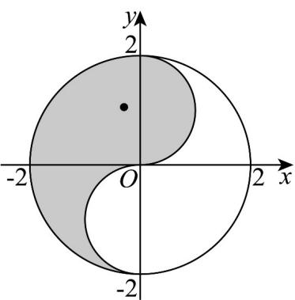

> [!faq]- 《专题3.2 双曲线（高效培优讲义）》官方解析
>
> > [!success]- **【答案】**  A. $-\frac{3}{4}$ B. $-\frac{4}{3}$ C. $-\frac{2}{3}$ D. $-\frac{\sqrt{3}}{2}$
>
> > [!note]- **【解析】**
> > ∵ 过双曲线的焦点并垂直于实轴的弦的长是 $2$ ，∴ $\frac{2b^{2}}{a}=2$
> >
> > ∵ 双曲线的方程为 $\frac{x^{2}}{a^{2}} - \frac{y^{2}}{3} = 1 (a > 0)$ ，∴ $b^{2} = 3$ ，∴ $\frac{2 \times 3}{a} = 2$ ，解得 a = 3，
> >
> > ∴ 双曲线的方程为 $\frac{x^{2}}{9}-\frac{y^{2}}{3}=1$ ，∴ $A(3,0)$
> >
> > $\because P(x,y), \therefore k = \frac{y}{x - 3}$ 为直线 $AP$ 的斜率，
> >
> > ∴当直线 AP 与半圆 $x^{2}+(y-1)^{2}=1(x>0)$ 相切时，k 最小，
> >
> > 此时设直线 $AP$ 的方程为 $y = k(x - 3)$ ，即 $kx - y - 3k = 0$ ， $\therefore \frac{|-1 - 3k|}{\sqrt{k^2 + 1}} = 1$
> >
> > 解得 $k = -\frac{3}{4}$ 或 k = 0 （舍去），∴ $k_{\min} = -\frac{3}{4}$ .
> >
> > 故选：A.
> >
> > 7. 过双曲线 $C: \frac{x^2}{a^2} - \frac{y^2}{b^2} = 1 (a > 0, b > 0)$ 的一个焦点的直线 $l: x - 2y - 5 = 0$ 与 $C$ 的一条渐近线平行，且与 $C$ 交于
> >
> > 点 $P$ ，则（ ）A. $C$ 的实轴长为 $2\sqrt{5}$ B. $C$ 的离心率为 $\frac{\sqrt{5}}{2}$
> >
> > C. $P$ 到 $C$ 的右焦点的距离为 $\frac{\sqrt{5}}{4}$ D. $C$ 的一个顶点坐标为 $(0, \sqrt{5})$
> >
> > 【答案】BC
> >
> > 【详解】直线 $l: x - 2y - 5 = 0$ 与坐标轴的交点分别为 $(5,0)$ 和 $\left(0, -\frac{5}{2}\right)$
> >
> > 因此双曲线的一个焦点为 $(5,0)$ ，即 $c = 5$
> >
> > 又双曲线的一条渐近线与直线 $l$ 平行，所以 $\frac{b}{a} = \frac{1}{2}$
> >
> > 由 $\left\{\begin{aligned}\frac{b}{a}&=\frac{1}{2}\\ a^{2}&+b^{2}=c^{2}=25\end{aligned}\right.$ ，解得 $\left\{\begin{aligned}a&=2\sqrt{5}\\ b&=\sqrt{5}\end{aligned}\right.$ ，
> >
> > 选项 A，实轴长为 $4\sqrt{5}$ ，A 错；
> >
> > 选项 B，离心率为 $e=\frac{c}{a}=\frac{5}{2\sqrt{5}}=\frac{\sqrt{5}}{2}$ ，B 正确；
> >
> > 选项C，双曲线方程为 $\frac{x^2}{20} -\frac{y^2}{5} = 1$ ，由 $\left\{ \begin{array}{l}\frac{x^2}{20} -\frac{y^2}{5} = 1\\ x - 2y - 5 = 0 \end{array} \right.$ 解得 $\left\{ \begin{array}{l}x = \frac{9}{2}\\ y = -\frac{1}{4} \end{array} \right.$ ，即 $P(\frac{9}{2}, - \frac{1}{4})$
> >
> > 右焦点为 $F_{2}(5,0)$ ，则 $\left|PF_{2}\right|=\sqrt{\left(\frac{9}{2}-5\right)^{2}+\left(-\frac{1}{4}-0\right)^{2}}=\frac{\sqrt{5}}{4}$ ，C 正确，
> >
> > 选项 D，曲线 C 的顶点坐标为 $(\pm2\sqrt{5},0)$ ，D 错误；
> >
> > 故选 **BC**.
