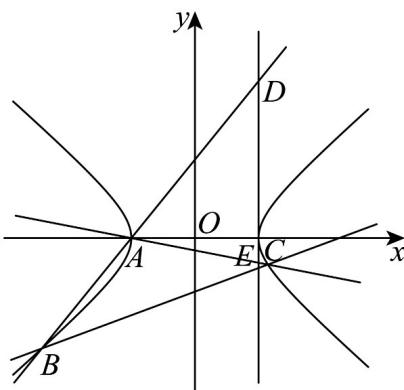

> [!faq]- 《专题3.2 双曲线（高效培优讲义）》官方解析
>
> > [!success]- **【答案】** (1) $\frac{x^{2}}{4}-y^{2}=1$ (2) $3x + 2y + 10 = 0$ (3)存在，定点 $P(2,1)$ ，定值为 $1$
>
> > [!note]- **【解析】**
> > （1）因为当直线 $l$ 的斜率为0时，VABC的面积为 $4\sqrt{5}$
> >
> > 所以VABC的面积为 $S = \frac{1}{2} |BC| \times |-2| = |BC| = 4\sqrt{5}$ ，
> >
> > 由对称性得 $B$ ， $C$ 点坐标为 $\left(\pm 2\sqrt{5}, - 2\right)$
> >
> > 则 $\frac{\left(\pm 2\sqrt{5}\right)^2}{a^2} -\frac{(-2)^2}{b^2} = 1$
> >
> > 结合 $e=\frac{\sqrt{5}}{2},c^{2}=a^{2}+b^{2}$ ，得 a=2，b=1，
> >
> > 所以双曲线 $\Gamma$ 的标准方程为 $\frac{x^2}{4} - y^2 = 1$
> >
> > (2) 因为双曲线 $\frac{x^{2}}{4}-y^{2}=1$ 的左顶点为 A，则 $A(-20)$
> >
> > 因为直线 $l$ 斜率不存在时不满足题意，
> >
> > 所以设直线 l，AB，AC 的斜率分别为 k， $k_{1}$ ， $k_{2}$ ，直线 l 的方程为 $y+2=k(x+2)$
> >
> > 则 $\frac{1}{2}\left[k(x + 2) - y\right] = 1$
> >
> > 双曲线 $\frac{x^2}{4} - y^2 = 1$ ，即 $x^2 - 4y^2 = 4$
> >
> > 所以 $\left(x + 2 - 2\right)^2 -4y^2 = 4$ ，则 $\left(x + 2\right)^2 -4y^2 -4(x + 2) = 0$
> >
> > 所以 $(x+2)^{2}-4y^{2}-4(x+2)\cdot\frac{1}{2}\left[k(x+2)-y\right]=0$ ，
> >
> > 即 $4y^{2} - 2(x + 2)y + (2k - 1)(x + 2)^{2} = 0$
> >
> > 所以 $4\left(\frac{y}{x + 2}\right)^2 - 2\frac{y}{x + 2} + 2k - 1 = 0$
> >
> > 设 $B(x_{1},y_{1})$ ， $C(x_{2},y_{2})$
> >
> > 则 $k_{1} + k_{2} = \frac{y_{1}}{x_{1} + 2} + \frac{y_{2}}{x_{2} + 2} = \frac{1}{2}, k_{1}k_{2} = \frac{y_{1}}{x_{1} + 2} \times \frac{y_{2}}{x_{2} + 2} = \frac{2k - 1}{4}$
> >
> > 若 $AB \perp AC$ ，则 $k_{1}k_{2} = \frac{2k - 1}{4} = -1\mathsf{P}$ $k = -\frac{3}{2}$
> >
> > 则直线 $l$ 的方程为 $y + 2 = -\frac{3}{2} (x + 2)$ ，即 $3x + 2y + 10 = 0$
> >
> > (3) 设直线 AB : $y = k_{1}(x + 2)$
> >
> > 令 $x = 2$ ，得 $y = 4k_{1}$ ，则 $D\left(2,4k_{1}\right)$ ，同理可得 $E\left(2,4k_{2}\right)$
> >
> > 假设存在点 $P(2,t)$ 满足题设，
> >
> > 则 $\frac{|PD|}{|PE|} = \frac{|t - 4k_1|}{|t - 4k_2|} = \left|\frac{t - 4\left(\frac{1}{2} - k^2\right)}{4 - 4k^2}\right| = \left|\frac{t - 2 + 4k_2}{t - 4k_2}\right|$ 为定值，
> >
> > 所以 $\frac{t - 2}{t} = \frac{4}{-4} = -1$ ，所以 $t = 1$ ，且 $\frac{|PD|}{|PE|} = \frac{| - 1 + 4k_2|}{|1 - 4k_2|} = 1$
> >
> > 即存在定点 $P(21)$ ，使得 $\frac{|PD|}{|PE|}$ 为定值1。
> >
> > 
