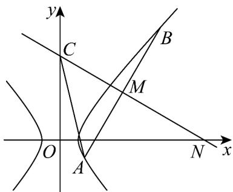

> [!faq]- 《专题3.2 双曲线（高效培优讲义）》官方解析
>
> > [!success]- **【答案】** (1) $\lambda > 0$ ， $\mu < 1$ 且 $\mu \neq 0$ (2) (i) $\lambda=\frac{1}{4}$ ; (ii) $\left(0,\frac{2\pi}{3}\right)$ .
>
> > [!note]- **【解析】**
> > （1）设 $P(x,y)$ ，则 $P$ 到 $x$ 轴的距离力 $\left|y\right|$ ， $\therefore |OP|^2 = x^2 + y^2$ ， $d^2 = y^2$ ， $\because |OP|^2 = \lambda + \mu d^2$ ， $\therefore x^2 + y^2 = \lambda + \mu y^2$ ，即 $x^2 + (1 - \mu)y^2 = \lambda$
> >
> > 若 $(\lambda, \mu)$ 曲线为椭圆，则 $\left\{ \begin{array}{l} \lambda > 0 \\ 1 - \mu > 0 \\ 1 \neq 1 - \mu \end{array} \right.$ ，解得 $\lambda > 0$ ，且 $\mu < 1$ ，且 $\mu \neq 0$ 。
> >
> > (2) (i) 因为曲线 C 为 $\left(1, \frac{4}{3}\right)$ 曲线，所以 $x^{2} + \left(1 - \frac{4}{3}\right)y^{2} = 1$ ，即 $C: x^{2} - \frac{y^{2}}{3} = 1$
> >
> > 设 $A(x_{1},y_{1}),B(x_{2},y_{2}),M(x_{M},y_{M})$
> >
> > 因为 两点在双曲线 上，所以 $\left\{ \begin{array}{l} x_{1}^{2} - \frac{y_{1}^{2}}{3} = 1, \\ x_{2}^{2} - \frac{y_{2}^{2}}{3} = 1, \end{array} \right.$
> >
> > 两式相减得 $x_{1}^{2} - x_{2}^{2} = \frac{y_{1}^{2}}{3} -\frac{y_{2}^{2}}{3}$ ，得 $\left(x_{1} - x_{2}\right)\left(x_{1} + x_{2}\right) = \frac{\left(y_1 - y_2\right)\left(y_1 + y_2\right)}{3}$ 即 $\frac{y_1 - y_2}{x_1 - x_2}\cdot \frac{y_1 + y_2}{x_1 + x_2} = 3$
> >
> > 所以 $k_{OM} \cdot k_{AB} = 3$
> >
> > 因为 l 是 AB 的垂直平分线，有 $k_{l} \cdot k_{AB} = -1$ ，所以 $k_{OM} = -3k_{l}$ ，
> >
> > 即 $\frac{y_M}{x_M} = -3 \times \frac{y_M}{x_M - x_0}$ ，化简得 $x_M = \frac{1}{4} x_0$
> >
> > 因为 $AB$ 的中点 $M$ 的横坐标为 $x$ ，所以 $x = x_{M} = \frac{1}{4} x_{0}$
> >
> > 故 $\lambda = \frac{1}{4}$
> >
> > (ii)
> >
> > 
> >
> > 由于 $x \neq x_{0}$ ，故可知直线 AB 斜率存在，
> >
> > 设直线 $AB$ 的方程为： $y = kx + m$ ，由 $\left\{ \begin{array}{l} y = kx + m \\ 3x^2 - y^2 = 3 \end{array} \right.$ ，
> >
> > 消去 $y$ 并整理得 $\left(3-k^{2}\right)x^{2}-2kmx-m^{2}-3=0$
> >
> > 则 $3 - k^2 \neq 0$ ， $\Delta = (2km)^2 + 4(3 - k^2)(m^2 + 3) = 12(3 + m^2 - k^2) > 0$ ，即 $m^2 + 3 - k^2 > 0$
> >
> > 所以 $x_{1} + x_{2} = \frac{2km}{3 - k^{2}}, x_{1}x_{2} = -\frac{3 + m^{2}}{3 - k^{2}}$
> >
> > 所以 $y_{1} + y_{2} = k(x_{1} + x_{2}) + 2m = k \cdot \frac{2km}{3 - k^{2}} + 2m = \frac{6m}{3 - k^{2}}$
> >
> > 于是点的坐标为 $\left(\frac{km}{3 - k^2},\frac{3m}{3 - k^2}\right)$ ， $k_{MC} = \frac{y_M - y_C}{x_M} = \frac{\frac{3m}{3 - k^2} - 4}{\frac{km}{3 - k^2}} = \frac{3m - 12 + 4k^2}{km}$
> >
> > 易知 $k_{MC} \cdot k_{AB} = -1$ ，所以 $\frac{3m - 12 + 4k^2}{km} = -\frac{1}{k}$ ，解得： $m = 3 - k^2$
> >
> > 代入 $m^2 + 3 - k^2 > 0$ 得 $\left(3 - k^2\right)^2 + \left(3 - k^2\right) = \left(3 - k^2\right)\left(4 - k^2\right) > 0$ ，得 $0 < k^2 < 3$ 或 $k^2 > 4$
> >
> > 由 A, B 在双曲线 E 的右支上得： $x_{1}x_{2}=-\frac{3+m^{2}}{3-k^{2}}>0$ ，得 $3-k^{2}<0$ ，即 $k^{2}>3$ ，
> >
> > 且 $x_{1} + x_{2} = \frac{2km}{3 - k^{2}} = 2k > 0\Rightarrow k > 0$
> >
> > 综上得，k>2，
> >
> > $$
> > \text { 又 } \left| C M \right| = \sqrt {\left(\frac {k m}{3 - k ^ {2}} - 0\right) ^ {2} + \left(\frac {3 m}{3 - k ^ {2}} - 4\right) ^ {2}} = \sqrt {1 + k ^ {2}}
> > $$
> >
> > 所以 $\tan \angle ACM = \frac{|AM|}{|CM|} = \frac{\frac{1}{2}\sqrt{(x_1 + x_2)^2 - 4x_1x_2}\cdot\sqrt{1 + k^2}}{\sqrt{1 + k^2}} = \frac{1}{2}\times \frac{2\sqrt{3m^2 - 3k^2 + 9}}{3 - k^2} = \sqrt{\frac{3m^2 - 3k^2 + 9}{m^2}} = \sqrt{3 + \frac{3}{3 - k^2}}$
> >
> > 因为 $k^2 > 4$ ，所以 $m = 3 - k^2 < -1$ ，故 $-3 < \frac{3}{3 - k^2} < 0$ ，所以 $\sqrt{3 + \frac{3}{3 - k^2}} \in (0, \sqrt{3})$
> >
> > 所以 $\angle ACM\in \left(0,\frac{\pi}{3}\right)$ ，所以 $\angle ACB = 2\angle ACM\in \left(0,\frac{2\pi}{3}\right).$
