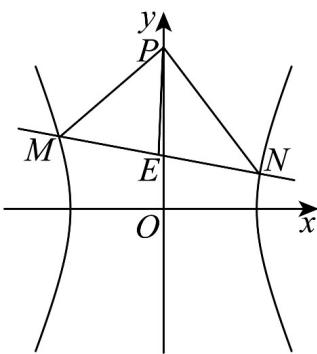

> [!faq]- 《专题3.2 双曲线（高效培优讲义）》官方解析
>
> > [!success]- **【答案】** (1) $x^{2}-\frac{y^{2}}{3}=1$ (2) $\left(-\infty, -\frac{4\sqrt{3}}{3}\right) \cup \left(0, \frac{3\sqrt{3}}{4}\right)$
>
> > [!note]- **【解析】**
> > （1）将 $A(2,3)$ ， $B\left(\frac{2\sqrt{3}}{3},1\right)$ 的坐标代入双曲线 $C$ 的方程，可得 $\begin{cases} \frac{4}{a^2} - \frac{9}{b^2} = 1 \\ \frac{4}{3} - \frac{1}{b^2} = 1 \end{cases}$ ，解得 $\begin{cases} a = 1 \\ b = \sqrt{3} \end{cases}$ ，
> >
> > 所以双曲线 C 的方程为 $x^{2}-\frac{y^{2}}{3}=1$
> >
> > (2) 设 $M(x_{1}, y_{1})$ , $N(x_{2}, y_{2})$ , 线段 MN 的中点 $E(x_{0}, y_{0})$
> >
> > 联立 $\left\{ \begin{array}{l} x^{2} - \frac{y^{2}}{3} = 1 \\ y = kx + m \end{array} \right.$ ，消去 $y$ 整理得 $\left(k^{2} - 3\right)x^{2} + 2kmx + m^{2} + 3 = 0$ ，
> >
> > 所以 $\left\{ \begin{array}{l} k^2 - 3 \neq 0 \\ \Delta = 4k^2m^2 - 4(k^2 - 3)(m^2 + 3) > 0 \end{array} \right.$ ，即 $m^2 - k^2 + 3 > 0$ 且 $k \neq \pm \sqrt{3}$ ①，
> >
> > 所以 $x_{1} + x_{2} = \frac{2km}{3 - k^{2}}$ ， $x_{1}x_{2} = \frac{m^{2} + 3}{k^{2} - 3}$
> >
> > 所以 $x_{0}=\frac{km}{3-k^{2}}$ ， $y_{0}=kx_{0}+m=\frac{3m}{3-k^{2}}$
> >
> > 因为 $\left|PM\right|=\left|PN\right|$ ，所以 $PE \perp MN$ ，
> >
> > 所以 $k_{PE}=\frac{y_{0}-\sqrt{3}}{x_{0}}=\frac{\frac{3m}{3-k^{2}}-\sqrt{3}}{\frac{km}{3-k^{2}}}=-\frac{1}{k}$
> >
> > 所以 $3-k^{2}=\frac{4\sqrt{3}}{3}m$ ②.
> >
> > 又 $k^{2}=3-\frac{4\sqrt{3}}{3}m>0$ ③，
> >
> > 由①②③得 $m < -\frac{4\sqrt{3}}{3}$ 或 $0 < m < \frac{3\sqrt{3}}{4}$
> >
> > 所以实数 $m$ 的取值范围是 $\left(-\infty, -\frac{4\sqrt{3}}{3}\right) \cup \left(0, \frac{3\sqrt{3}}{4}\right)$ .
> >
> > 
