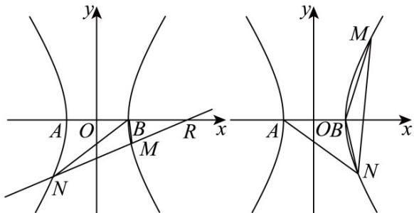

> [!faq]- 《专题3.2 双曲线（高效培优讲义）》官方解析
>
> > [!success]- **【答案】** (1) $x^{2}-\frac{y^{2}}{2}=1,y\neq0$ （或 $x\neq\pm1$ ） (2)是，定点 $(2,0)$ (3)证明见解析
>
> > [!note]- **【解析】**
> > （1）设 $P(x_{0},y_{0})$ ，由题意得 $y_{0}\neq0$ 且 $x_{0}\neq\pm1$ ，
> >
> > $k_{AP} \cdot k_{BP} = \frac{y_0}{x_0 + 1} \cdot \frac{y_0}{x_0 - 1} = 2$ ，整理得 $x_0^2 - \frac{y_0^2}{2} = 1$
> >
> > 因此曲线 C 的方程为： $x^{2}-\frac{y^{2}}{2}=1, y \neq 0$ （或 $x \neq \pm 1$ ）
> >
> > (2) 由题意得 $k_{BN} = -3k_{AM}$ ，又 $\because k_{AM} \cdot k_{BM} = 2$ ， $\therefore k_{BN} \cdot k_{BM} = -6$
> >
> > 设 $M(x_{1},y_{1}),N(x_{2},y_{2})$ ， $y_{1}y_{2}\neq0$
> >
> > 若直线 $MN$ 的斜率不存在，则 $x_{1} = x_{2}, y_{1} = -y_{2}$
> >
> > $$
> > \therefore k _ {B N} \cdot k _ {B M} = \frac {y _ {1} y _ {2}}{(x _ {1} - 1) (x _ {2} - 1)} = \frac {- y _ {1} ^ {2}}{(x _ {1} - 1) ^ {2}} = \frac {2 - 2 x _ {1} ^ {2}}{(x _ {1} - 1) ^ {2}} = \frac {2 (1 + x _ {1})}{1 - x _ {1}} = - 6
> > $$
> >
> > 解得 $x_{1}=2$ ，此时直线 MN:x=2 过 $(2,0)$ ，
> >
> > 若直线 $MN$ 的斜率存在，设 $MN:y = kx + m$
> >
> > 与双曲线联立得 $(2-k^{2})x^{2}-2kmx-(m^{2}+2)=0$ ，
> >
> > 依题意 $2 - k^{2} \neq 0$ 且 $\Delta = 8(m^{2} - k^{2} + 2) > 0$
> >
> > 由韦达定理得 $x_{1} + x_{2} = \frac{2km}{2 - k^{2}}$ ， $x_{1}x_{2} = -\frac{m^{2} + 2}{2 - k^{2}}$
> >
> > $$
> > \therefore y _ {1} y _ {2} = \left(k x _ {1} + m\right) \left(k x _ {2} + m\right) = \frac {2 \left(m ^ {2} - k ^ {2}\right)}{2 - k ^ {2}}
> > $$
> >
> > $$
> > \therefore k _ {B N} \cdot k _ {B M} = \frac {y _ {1} y _ {2}}{\left(x _ {1} - 1\right) \left(x _ {2} - 1\right)} = \frac {2 \left(m ^ {2} - k ^ {2}\right)}{- (m + k) ^ {2}} = - 2 \frac {m - k}{m + k} = - 6
> > $$
> >
> > 整理得 m = -2k ，
> >
> > 此时 $\Delta = 8(3k^{2} + 2) > 0$ 恒成立，MN: y = kx - 2k 过 (2,0)
> >
> > 综上所述，直线MN过定点 $(2,0)$ .
> >
> > (3) 由 (2) 知 $x_{1}x_{2} = -\frac{4k^{2} + 2}{2 - k^{2}}$ ， $y_{1}y_{2} = -6(x_{1} - 1)(x_{2} - 1)$
> > - **①**：当 $k^{2}>2$ 时， $x_{1}x_{2}>0$ ，M,N 均在 C 的右支，
> >
> > 如图2，此时 $BM\cdot BN = (x_{1} - 1)(x_{2} - 1) + y_{1}y_{2} = -5(x_{1} - 1)(x_{2} - 1) <   0$
> >
> > 故 $\angle MBN$ 为钝角·
> > - **②**：当 $k^{2}<2$ 时， $x_{1}x_{2}<0$ ，M,N在C的两支，
> >
> > 如图 $^{1}$ ，不妨设M在C的右支
> >
> > 记 $R(2,0)$ ，此时 $\overline{MB} \cdot \overline{MR} = (x_1 - 1)(x_1 - 2) + y_1^2 = 3x_1^2 - 3x_1 > 0$
> >
> > 故 $\angle BMR$ 为锐角，因此 $\angle BMN$ 为钝角
> >
> > 综上所述，三角形 $BMN$ 为钝角三角形
> >
> > 
> >
> > 图1 图2
