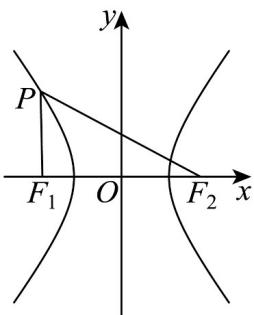

<!-- question-source:start -->
【变式3】已知双曲线 $\frac{x^2}{9} -\frac{y^2}{16} = 1$ 的左、右焦点分别是 $F_{1}$ ， $F_{2}$

(1)若双曲线上一点 $M$ 到它的一个焦点的距离等于 $^{16}$ ，求点 $M$ 到另一个焦点的距离；

(2)如图，若 $P$ 是双曲线左支上的点，且 $\angle F_{1}PF_{2} = 60^{\circ}$ ，求 $\triangle F_{1}PF_{2}$ 的面积
<!-- question-source:end -->

![[高中/课堂同步/题库/人教A版高中数学同步讲义(2026)/03_选择性必修第一册/第三章 圆锥曲线的方程/专题3.2 双曲线（高效培优讲义）/题型03_双曲线中焦点三角形的周长与面积及其他问题/questions/answers/Q00080179A1.md]]
