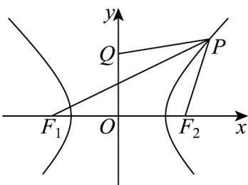

> [!faq]- 《专题3.2 双曲线（高效培优讲义）》官方解析
>
> > [!success]- **【答案】** D
>
> > [!note]- **【解析】**
> > 由题意并结合双曲线的定义可得
> >
> > $$
> > \left| P Q \right| + \left| P F _ {1} \right| = \left| P Q \right| + \left(\left| P F _ {2} \right| + 2 \sqrt {2}\right) = \left| P Q \right| + \left| P F _ {2} \right| + 2 \sqrt {2} \quad \left| Q F _ {2} \right| + 2 \sqrt {2} = 2 \sqrt {2} + 2 \sqrt {2} = 4 \sqrt {2}
> > $$
> >
> > 当且仅当 $Q$ ， $P$ ， $F_{2}$ 三点共线时等号成立·
> >
> > 而直线 $QF_{2}$ 的方程为 $y = -x + 2$ ，由 $\left\{\begin{aligned}y &=-x+2\\ x^{2}-y^{2}&=2\end{aligned}\right.$ 可得 $x=\frac{3}{2}$ ，所以 $y=\frac{1}{2}$
> >
> > 所以点 P 的坐标为 $\left(\frac{3}{2},\frac{1}{2}\right)$ .
> >
> > 所以当且仅当点 $P$ 的坐标为 $\left(\frac{3}{2},\frac{1}{2}\right)$ 时， $|PQ| + |PF_1|$ 的最小值为 $4\sqrt{2}$ .
> >
> > 
> >
> > 故选 **D**.
