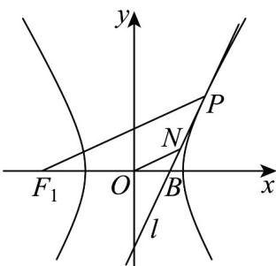

> [!faq]- 《专题3.2 双曲线（高效培优讲义）》官方解析
>
> > [!success]- **【答案】** B
>
> > [!note]- **【解析】**
> > 设 $P(x_0, y_0), x_0 > 0$ ，则双曲线 $C$ 在点 $P$ 处的切线方程为 $\frac{x_0x}{a^2} - y_0y = 1$ ，在 $\frac{x_0x}{a^2} - y_0y = 1$ 中，令 $y = 0$ ，得 $x = \frac{a^2}{x_0}$ ，故 $B\left(\frac{a^2}{x_0}, 0\right)$ ，故 $|OB| = \frac{a^2}{x_0}$ ，又 $|OF_1| = c = \sqrt{a^2 + 1}$ ，故 $|BF_1| = \frac{a^2}{x_0} + \sqrt{a^2 + 1}$ ，其中 $|F_1P| = \sqrt{(x_0 + c)^2 + y_0^2} = \sqrt{(x_0 + \sqrt{a^2 + 1})^2 + y_0^2}$ ，又 $\frac{x_0^2}{a^2} - y_0^2 = 1$ ，故 $|F_1P| = \sqrt{(x_0 + \sqrt{a^2 + 1})^2 + \frac{x_0^2}{a^2} - 1} = \sqrt{\frac{(a^2 + 1)x_0^2}{a^2} + 2\sqrt{a^2 + 1}x_0 + a^2} = \sqrt{\left(\frac{\sqrt{a^2 + 1}x_0}{a} + a\right)^2} = \frac{\sqrt{a^2 + 1}x_0}{a} + a$ ，因为 $ON / / F_1P$ ，所以 $\frac{|ON|}{|F_1P|} = \frac{|OB|}{|BF_1|}$ ，即 $\frac{2}{\frac{\sqrt{a^2 + 1}x_0}{a} + a} = \frac{\frac{a^2}{x_0}}{\frac{a^2}{x_0} + \sqrt{a^2 + 1}}$ ，整理得 $(a - 2)(a^2 + \sqrt{a^2 + 1}x_0) = 0$ ，显然 $a^2 + \sqrt{a^2 + 1}x_0 > 0$ ，所以 $a - 2 = 0$ ，解得 $a = 2$ 。
> >
> > 故选：B.
> >
> > 
> >
> > ## 方法技巧
> >
> > 由双曲线的方程研究几何性质的解题步骤；(1)把双曲线方程化为标准形式是解决此类题的关键；
> >
> > (2)由标准方程确定焦点位置，确定 $a$ ，b的值；(3)由 $c2 = a2 + b2$ 求出c值，从而写出双曲线的几何性质.
