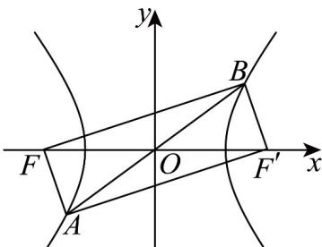

> [!faq]- 《专题3.2 双曲线（高效培优讲义）》官方解析
>
> > [!success]- **【答案】** A. $y = \pm \frac{2\sqrt{2}}{3} x$ B. $y = \pm \frac{\sqrt{2}}{3} x$ C. $y = \pm \frac{3\sqrt{2}x}{4}$ D. $y = \pm \frac{3\sqrt{2}x}{2}$
>
> > [!note]- **【解析】**
> > 设 C 的右焦点为 $F'$ ，由题意知四边形 $FAF'B$ 为平行四边形.
> >
> > 
> >
> > 因为 $FA \cdot FB = 0$ ，所以 $FA \perp FB$ ，故四边形 $FAF'B$ 为矩形，
> >
> > 由双曲线定义得，在直角 $\triangle AFF'$ 中， $\left|AF'\right| = \left|AF\right| + 2a = \frac{8a}{3}$ ，
> >
> > 由 $\left|AF'\right|^{2} + \left|AF\right|^{2} = \left|FF'\right|^{2}$ ，得 $\left(\frac{8a}{3}\right)^{2} + \left(\frac{2a}{3}\right)^{2} = (2c)^{2}$ ，解得 $\frac{c^{2}}{a^{2}} = \frac{17}{9}$ ，
> >
> > 所以 $\frac{b}{a} = \sqrt{\frac{b^2}{a^2}} = \sqrt{\frac{c^2 - a^2}{a^2}} = \sqrt{\frac{17}{9} - 1} = \frac{2\sqrt{2}}{3}$
> >
> > 所以 C 的渐近线方程为 $y = \pm \frac{2\sqrt{2}}{3}x$ .
> >
> > 故选 **A**.
