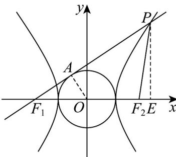

> [!faq]- 《专题3.2 双曲线（高效培优讲义）》官方解析
>
> > [!success]- **【答案】** B
>
> > [!note]- **【解析】**
> > 
> >
> > 设切点为 A ， $\angle AF_{1}O = \theta$ ，连接 OA ，
> >
> > 则 $\sin\theta=\frac{AO}{OF_{1}}=\frac{a}{c}$ ， $\cos\theta=\sqrt{1-\sin^{2}\theta}=\frac{b}{c}$
> >
> > 过点 P 作 $PE \perp x$ 轴于点 E，
> >
> > 则 $S_{\triangle F_1PF_2} = \frac{1}{2}\left|F_1F_2\right|\cdot \left|PE\right| = c\left|PE\right| = 4a^2$ ，故 $\left|PE\right| = \frac{4a^2}{c}$
> >
> > 因为 $\sin \theta = \frac{PE}{PF_1} = \frac{a}{c}$ ，解得 $\left|PF_1\right| = 4a$
> >
> > 由双曲线定义得 $\left|PF_{1}\right|-\left|PF_{2}\right|=2a$ ，所以 $\left|PF_{2}\right|=2a$
> >
> > 在 $\triangle PF_{1}F_{2}$ 中，由余弦定理得 $\cos \theta = \frac{\left|PF_1\right|^2 + \left|F_1F_2\right|^2 - \left|PF_2\right|^2}{2\left|PF_1\right|\cdot\left|F_1F_2\right|} = \frac{16a^2 + 4c^2 - 4a^2}{2\times 4a\cdot 2c} = \frac{b}{c}$
> >
> > 化简得 $3a^{2} + c^{2} = 4ab$
> >
> > 所以 $4a^{2} + b^{2} - 4ab = 0$ ，解得 $\frac{b}{a} = 2$
> >
> > 所以离心率 $e=\sqrt{1+\frac{b^{2}}{a^{2}}}=\sqrt{5}$
> >
> > 故选 **B**
