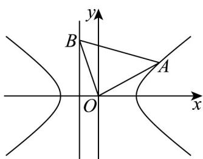

> [!faq]- 《专题3.2 双曲线（高效培优讲义）》官方解析
>
> > [!success]- **【答案】** (1) $y=\pm\frac{3}{4}x$ (2)16 (3)证明见解析， $x^{2}+y^{2}=16$
>
> > [!note]- **【解析】**
> > （1）由题意，双曲线 $C$ 的焦点在 $x$ 轴上， $\therefore$ 不可能经过点 $(0,3)$
> >
> > 将 $\left(4,0\right)$ ， $\left(4\sqrt{2}, - 3\right)$ 代入 $C:\frac{x^2}{a^2} -\frac{y^2}{b^2} = 1$ 得： $\left\{ \begin{array}{l}\frac{16}{a^2} -\frac{0}{b^2} = 1\\ \frac{32}{a^2} -\frac{9}{b^2} = 1 \end{array} \right.$ ，解得 $\left\{ \begin{array}{l}a^{2} = 16\\ b^{2} = 9 \end{array} \right.$
> >
> > $\therefore C:\frac{x^{2}}{16}-\frac{y^{2}}{9}=1$ ， $\therefore C$ 的渐近线方程为 $y=\pm\frac{3}{4}x$
> >
> > (2) 设 $A(x_0, y_0)$ , $B\left(-\frac{12}{5}, t\right)$ , 则 $\frac{x_0^2}{16} - \frac{y_0^2}{9} = 1$
> >
> > 由于 $OA \perp OB$ ，则 $-\frac{12}{5} x_0 + ty_0 = 0$
> >
> > 显然 $y_0 \neq 0$ ，可得 $t = \frac{12x_0}{5y_0}$ ，且 $OA^2 = x_0^2 + y_0^2$ ， $OB^2 = \frac{144}{25} + t^2$
> >
> > $$
> > \therefore S ^ {2} = \frac {1}{4} \left(\frac {1 4 4}{2 5} + t ^ {2}\right) \left(x _ {0} ^ {2} + y _ {0} ^ {2}\right) = \frac {1}{4} \left(\frac {1 4 4}{2 5} + \frac {1 4 4 x _ {0} ^ {2}}{2 5 y _ {0} ^ {2}}\right) \left(x _ {0} ^ {2} + y _ {0} ^ {2}\right)
> > $$
> >
> > $$
> > = \frac {3 6}{2 5} \times \frac {\left(x _ {0} ^ {2} + y _ {0} ^ {2}\right) ^ {2}}{y _ {0} ^ {2}} = \frac {3 6}{2 5} \times \frac {\left(1 6 + \frac {2 5 y _ {0} ^ {2}}{9}\right) ^ {2}}{y _ {0} ^ {2}} = \frac {3 6}{2 5} \times \left(\frac {1 6}{\left| y _ {0} \right|} + \frac {2 5 \left| y _ {0} \right|}{9}\right) ^ {2}
> > $$
> >
> > $$
> > \frac {3 6}{2 5} \left(2 \sqrt {\frac {1 6}{| y _ {0} |} \cdot \frac {2 5 | y _ {0} |}{9}}\right) ^ {2} = \frac {3 6}{2 5} \times 4 \times \frac {1 6 \times 2 5}{9} = 1 6 ^ {2}
> > $$
> >
> > 当且仅当 $\frac{16}{|y_{0}|}=\frac{25|y_{0}|}{9}$ ， $y_{0}=\pm\frac{12}{5}$ 时，等号成立，
> >
> > $\therefore S_{的最小值为16}$ ;
> >
> > 
> >
> > (3) 显然 $x_{0} \neq -\frac{12}{5}$ ，直线 $AB: y - t = \frac{y_{0} - t}{x_{0} + \frac{12}{5}} \left( x + \frac{12}{5} \right)$
> >
> > $$
> > \left(y _ {0} - t\right) x - \left(x _ {0} + \frac {1 2}{5}\right) y + t x _ {0} + \frac {1 2}{5} y _ {0} = 0
> > $$
> >
> > $$
> > t = \frac {1 2 x _ {0}}{5 y _ {0}}, \frac {x _ {0} ^ {2}}{1 6} - \frac {y _ {0} ^ {2}}{9} = 1
> > $$
> >
> > 即 $9x_{0}^{2} = 144 + 16y_{0}^{2}$ ， $9x_{0}^{2} + 9y_{0}^{2} = 144 + 25y_{0}^{2}$
> >
> > 故点 O 到直线 AB 的距离为
> >
> > $$
> > \begin{array}{l} d = \frac {\left| t x _ {0} + \frac {1 2}{5} y _ {0} \right|}{\sqrt {\left(y _ {0} - t\right) ^ {2} + \left(x _ {0} + \frac {1 2}{5}\right) ^ {2}}} = \frac {\frac {1 2 \left(x _ {0} ^ {2} + y _ {0} ^ {2}\right)}{5 \left| y _ {0} \right|}}{\sqrt {\left(y _ {0} - \frac {1 2 x _ {0}}{5 y _ {0}}\right) ^ {2} + \left(x _ {0} + \frac {1 2}{5}\right) ^ {2}}} \\ = \frac {\frac {1 2 \left(x _ {0} ^ {2} + y _ {0} ^ {2}\right)}{5 \left| y _ {0} \right|}}{\sqrt {x _ {0} ^ {2} + y _ {0} ^ {2} + \frac {1 4 4}{2 5} \left(\frac {x _ {0} ^ {2}}{y _ {0} ^ {2}} + 1\right)}} = \frac {\frac {1 2 \left(x _ {0} ^ {2} + y _ {0} ^ {2}\right)}{5 \left| y _ {0} \right|}}{\sqrt {\left(x _ {0} ^ {2} + y _ {0} ^ {2}\right) \times \frac {1 4 4 + 2 5 y _ {0} ^ {2}}{2 5 y _ {0} ^ {2}}}} = \frac {1 2 \left(x _ {0} ^ {2} + y _ {0} ^ {2}\right)}{\sqrt {\left(x _ {0} ^ {2} + y _ {0} ^ {2}\right) \left(1 4 4 + 2 5 y _ {0} ^ {2}\right)}} \\ = \frac {1 2 \left(x _ {0} ^ {2} + y _ {0} ^ {2}\right)}{\sqrt {9 \left(x _ {0} ^ {2} + y _ {0} ^ {2}\right) ^ {2}}} = 4, \end{array}
> > $$
> >
> > $\therefore$ 存在定圆 $x^{2} + y^{2} = 16$ 与直线 AB 相切.
> >
> > ## 方法技巧
> >
> > 1. 判断直线与双曲线的位置关系时，通常是将直线方程与双曲线方程联立方程组，方程组解的个数就是直线与双曲线交点的个数，联立方程消去 $x$ 或 $y$ 中的一个后，得到的形如二次方程的式子中，要注意 $x2$ 项或 $y2$ 项系数是否为零的情况，否则容易漏解。
> >
> > 2．直线 $y = kx + b$ 与双曲线相交所得的弦长 $d = \cdot |x1 - x2| = |y1 - y2|$ .
> >
> > 3. 双曲线中点弦的斜率公式
> >
> > 设 $M(x_0,y_0)$ 为双曲线 $\frac{x^2}{a^2} -\frac{y^2}{b^2} = 1$ 弦 $AB$ （ $AB$ 不平行 $y$ 轴）的中点，则有 $k_{AB}\cdot k_{OM} = \frac{b^2}{a^2}$
