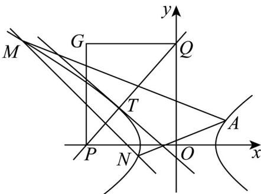

> [!faq]- 《专题3.2 双曲线（高效培优讲义）》官方解析
>
> > [!success]- **【答案】** (1) $\frac{x^2}{2} - y^2 = 1$ (2)存在，k = -1 ，定值 0 . (3)点 G 的轨迹是焦点在 x 轴上，实轴长为 $3\sqrt{2}$ ，虚轴长为 6 的双曲线（去掉两个顶点）.
>
> > [!note]- **【解析】**
> > （1）因为双曲线焦点在 $x$ 轴上，设双曲线方程为 $\frac{x^2}{a^2} -\frac{y^2}{b^2} = 1$
> >
> > 由已知 $\frac{c}{a} = \frac{\sqrt{6}}{2}$ ①，将点 $(2\sqrt{3}, \sqrt{5})$ 代入双曲线方程得 $\frac{12}{a^{2}} - \frac{5}{b^{2}} = 1$ ②，
> >
> > 且 $c^2 = a^2 + b^2$ ③，由①②③得 $a = \sqrt{2}, b = 1$ ，所以双曲线方程为 $\frac{x^2}{2} - y^2 = 1$
> >
> > (2) 设 $l: y = kx + m, M(x_{1}, y_{1}), N(x_{2}, y_{2})$ ,
> >
> > 联立 $\left\{\begin{aligned}y&=kx+m\\ \frac{x^{2}}{2}-y^{2}&=1\end{aligned}\right.$ ，化简后可得 $(1-2k^{2})x^{2}-4mkx-2m^{2}-2=0$ ，
> >
> > $$
> > \Delta = 1 6 m ^ {2} k ^ {2} + 4 (2 m ^ {2} + 2) \left(1 - 2 k ^ {2}\right) > 0 \Rightarrow m ^ {2} + 1 - 2 k ^ {2} > 0,
> > $$
> >
> > 由韦达定理： $x_{1} + x_{2} = -\frac{4mk}{2k^{2} - 1}, x_{1}x_{2} = \frac{2m^{2} + 2}{2k^{2} - 1}$
> >
> > 所以由 $k_{AM} + k_{AN} = \frac{y_{2} - 1}{x_{2} - 2} + \frac{y_{1} - 1}{x_{1} - 2} = \frac{kx_{2} + m - 1}{x_{2} - 2} + \frac{kx_{1} + m - 1}{x_{1} - 2}$
> >
> > $$
> > = \frac {2 k x _ {1} x _ {2} + (m - 2 k - 1) \left(x _ {1} + x _ {2}\right) - 4 (m - 1)}{\left(x _ {2} - 2\right) \left(x _ {1} - 2\right)}
> > $$
> >
> > $$
> > = \frac {2 k (2 m ^ {2} + 2) + (m - 2 k - 1) (- 4 m k) - 4 (m - 1) (2 k ^ {2} - 1)}{(2 k ^ {2} - 1) (x _ {2} - 2) (x _ {1} - 2)}
> > $$
> >
> > $$
> > = \frac {8 k ^ {2} + 4 k - 4 + 4 m (k + 1)}{(2 k ^ {2} - 1) (x _ {2} - 2) (x _ {1} - 2)}
> > $$
> >
> > $= \frac{4(k + 1)(2k - 1 + m)}{(2k^2 - 1)(x_2 - 2)(x_1 - 2)}$ ，所以当 $k = -1$ 时， $k_{AM} + k_{AN}$ 的和为定值0.
> >
> > (3) 将 $l: y = kx + m$ ，代入 $\frac{x^2}{2} - y^2 = 1$
> >
> > 化简可得， $(1 - 2k^{2})x^{2} - 4mkx - 2m^{2} - 2 = 0$
> >
> > 因为 $k \neq \pm \frac{\sqrt{2}}{2}$ ，T 是双曲线 C 与直线 l 唯一的公共点，
> >
> > 所以 $\Delta = 16m^{2}k^{2} + 4(2m^{2} + 2)(1 - 2k^{2}) = 0 \Rightarrow m^{2} = 2k^{2} - 1$
> >
> > 解得 $T$ 的坐标为 $\left(-\frac{2mk}{2k^2 - 1}, -\frac{m}{2k^2 - 1}\right)$ ，即 $\left(-\frac{2k}{m}, -\frac{1}{m}\right)$ ，其中 $km \neq 0$ ，
> >
> > 所以过点 $T$ 且与 $l$ 垂直的直线为 $y + \frac{1}{m} = -\frac{1}{k}\left(x + \frac{2k}{m}\right)$
> >
> > 可得 $P\left(-\frac{3k}{m},0\right)$ ， $Q\left(0,-\frac{3}{m}\right)$ ，所以 $G\left(-\frac{3k}{m},-\frac{3}{m}\right)$ ，即 $x=-\frac{3k}{m}$ ， $y=-\frac{3}{m}$
> >
> > 因此 $x^{2} = \frac{9k^{2}}{m^{2}} = \frac{9}{m^{2}}\left(\frac{m^{2}}{2} +\frac{1}{2}\right) = \frac{9}{2} +\frac{9}{2m^{2}} = \frac{9}{2} +\frac{y^{2}}{2}$ ，即 $\frac{2x^2}{9} -\frac{y^2}{9} = 1(y\neq 0)$
> >
> > 所以点 $G$ 的轨迹是焦点在 $x$ 轴上，实轴长为 $3\sqrt{2}$ ，虚轴长为 $6$ 的双曲线（去掉两个顶点）.
> >
> > 
