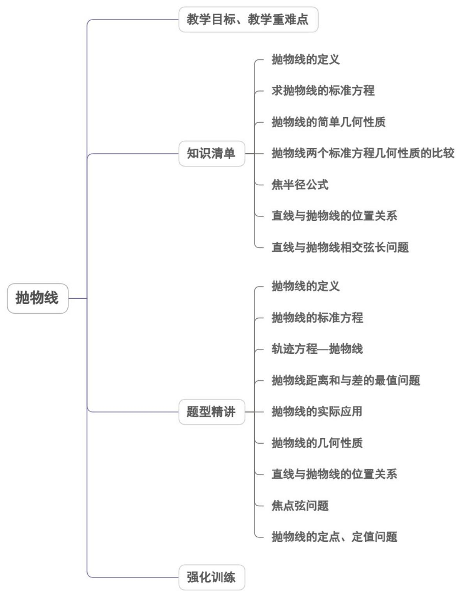
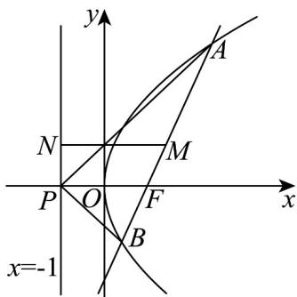
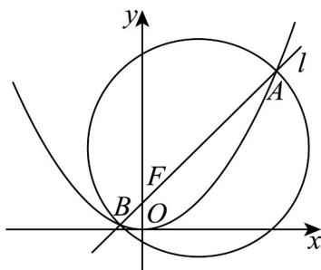
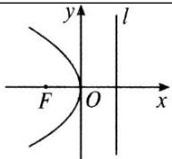
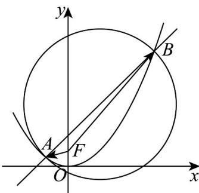
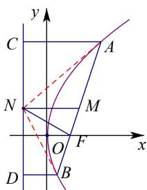
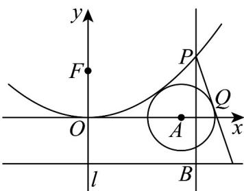
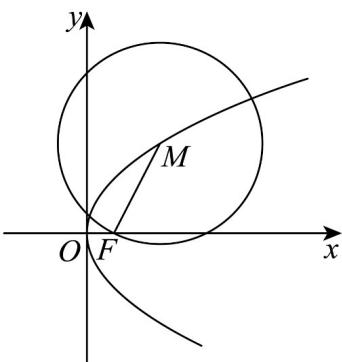

<!-- source-part:1 pages:1-50 -->

专题3.3 抛物线

## 教学目标、教学重难点

<table><tr><td>教学目标</td><td>1.了解抛物线的实际背景,感受抛物线在刻画现实世界和解决实际问题中的作用.2.了解抛物线的定义、几何图形和标准方程.3.了解抛物线的几何图形及简单几何性质.4.通过抛物线方程的学习,进一步体会数形结合的思想,了解抛物线的简单应用.</td></tr><tr><td>教学重难点</td><td>1.重点掌握抛物线中焦点、焦距、顶点坐标、实轴、虚轴及离心率的内容.2.难点掌握抛物线中的定点、定值、最值等问题.</td></tr></table>

## 知识清单

## 知识点 01 抛物线的定义

定义：平面内与一个定点 $F$ 和一条定直线 $l$ （ $l$ 不经过点 $F$ ）的距离相等的点的轨迹叫做抛物线，定点 $F$ 叫做抛物线的焦点，定直线 $l$ 叫做抛物线的准线。

## 【即学即练】

1. 已知等边三角形的一个顶点位于抛物线 $y^{2} = 2x$ 的焦点，另外两个顶点在抛物线上，则这个等边三角形的边长为（）

【答案】

A. $2 - \sqrt{3}$ B. $2 \pm \sqrt{3}$ C. $4 - 2\sqrt{3}$ D. $4 \pm 2\sqrt{3}$

【答案】D

【详解】由题可知：焦点 $\left(\frac{1}{2},0\right)$ ，准线方程为 $x=-\frac{1}{2}$ ，假设等边三角形的边长为a，

所以 $a \cos 30^{\circ} + 1 = a$ 或 $1 - a \cos 30^{\circ} = a$

则 $a = 4 \pm 2\sqrt{3}$ .

故选：D

2．已知 F 是抛物线 $C: y^{2} = 8x$ 的焦点，M 是 C 上一点，FM 的延长线交 y 轴于点 N，若 M 为 FN 的中点，则 $\left|FN\right|=$ \_\_\_\_.

【答案】6

【详解】方法一、抛物线 $y^{2}=8x$ 的焦点为 $F(2,0)$ ，Q N 点在 y 轴上，设 $N(0,y_{N})$ .

又∵ M 为 FN 的中点，∴ $M\left(\frac{2+0}{2}, \frac{0+y_{N}}{2}\right)$ ，即 $M\left(1, \frac{y_{N}}{2}\right)$

又∵ M 点在抛物线 $y^{2}=8x$ 上，∴ $\left(\frac{y_{N}}{2}\right)^{2}=8\Rightarrow y_{N}^{2}=32$

所以 $\left|FN\right|=\sqrt{2^{2}+y_{N}^{2}}=\sqrt{4+32}=6$ .

方法二、依题意，抛物线 $C: y^{2} = 8x$ 的焦点 $F(2,0)$ ，准线 x = -2，

∵ M 是 C 上一点，FM 的延长线交 y 轴于点 N, M 为 FN 的中点，

∴ 点 M 的横坐标为 1，∴ $\left|MF\right|=1-\left(-2\right)=3,\left|FN\right|=2\left|MF\right|=6$

方法三、抛物线 $y^{2}=8x$ 的焦点为 $F(2,0)$ ，准线 x=-2，

如图，设 l 与 x 轴的交点为 A，分别过 N, M 作直线 l 的垂线，垂足分别为 C, B

由 M 为 FN 的中点，易知线段 BM 为梯形 AFNC 的中位线，

$$
\because | C N | = 2, | A F | = 4, \therefore | M B | = 3
$$

又由抛物线的定义得 $\left|MB\right|=\left|MF\right|$ ，且 $\left|MN\right|=\left|MF\right|$

$$
\therefore | N F | = | N M | + | M F | = 2 | M F | = 2 | M B | = 6
$$

故答案为：6.

知识点 02 抛物线的标准方程

如图，以过 $F$ 且垂直于 $l$ 的直线为 $x$ 轴，垂足为 $K$ 。以 $F, K$ 的中点 $O$ 为坐标原点建立直角坐标系 $xOy$

设 $\left|KF\right|=p\quad(p>0)$ ，那么焦点F的坐标为 $\left(\frac{p}{2},0\right)$ ，准线l的方程为 $x=-\frac{p}{2}$

设点 $M(x,y)$ 是抛物线上任意一点，点 $M$ 到 $l$ 的距离为 $d$ 。由抛物线的定义，抛物线就是集合

$$
P = \{M | M F = d \}
$$

$$
\because | M F | = \sqrt {\left(x - \frac {p}{2}\right) ^ {2} + y ^ {2}} \quad d = \left| x + \frac {p}{2} \right| \therefore \sqrt {\left(x - \frac {p}{2}\right) ^ {2} + y ^ {2}} = \left| x + \frac {p}{2} \right|
$$

将上式两边平方并化简，得 $y^{2} = 2px (p > 0)$ 。①

方程①叫抛物线的标准方程，它表示的抛物线的焦点在 $x$ 轴的正半轴上，坐标是 $\frac{(p)}{2}, 0)$ 它的准线方程是 $x = -\frac{p}{2}$ .

抛物线标准方程的四种形式：

根据抛物线焦点所在半轴的不同可得抛物线方程的的四种形式

$$
y ^ {2} = 2 p x, y ^ {2} = - 2 p x, x ^ {2} = 2 p y, x ^ {2} = - 2 p y (p > 0)
$$

## 【即学即练】

1. 设抛物线 $C: y^{2} = 2px (p > 0)$ 的焦点为 $F$ ，过 $C$ 上一点 $A$ 作其准线的垂线，设垂足为 $B$ ，若 $\cos \angle BAF = \frac{3}{5}, |AF| = 10$ ，则 $p = (\quad)$ A. 2    B. 3    C. 4    D. 5

【答案】C

【详解】由题意可知：抛物线 C 的焦点 $F\left(\frac{p}{2},0\right)$ ，准线为 $x=-\frac{p}{2}$ ，且 $\left|AF\right|=\left|AB\right|=10$ ，
因为 $\cos\angle BAF=\frac{3}{5}$ 所以由余弦定理得 $2\left|AF\right|^{2}-2\left|AF\right|^{2}\cos\angle BAF=200\times\left(1-\frac{3}{5}\right)=80=\left|BF\right|^{2}$ 即 $\left|BF\right|=4\sqrt{5}$ ;

由 $\left|AF\right|=x_{A}+\frac{p}{2}=10$ ，所以 $x_{A}=10-\frac{p}{2}$ ， $y_{A}^{2}=2px_{A}=20p-p^{2}$ ；

设 E 为准线与 x 轴的交点， $\left|EF\right|=p$ ，

则 $\left|EF\right|^{2}+y_{A}^{2}=p^{2}+20p-p^{2}=\left|BF\right|^{2}=80$ ，则 p=4。

故选：C.

2. 点 $M(5,3)$ 到抛物线 $y = ax^2$ 的准线的距离为 6，那么该抛物线的标准方程是（）A. $x^2 = 12y$ B. $x^2 = \frac{1}{12} y$ 或 $x^2 = -\frac{1}{36} y$ C. $x^2 = -\frac{1}{36} y$ D. $x^2 = 12y$ 或 $x^2 = -36y$

【答案】D

【详解】将 $y = ax^{2}$ 转化为 $x^{2} = \frac{1}{a}y$ ,

当 $a > 0$ 时，抛物线开口向上，准线方程 $y = -\frac{1}{4a}$ 点 $M(5,3)$ 到准线的距离为 $3 + \frac{1}{4a} = 6$ ，解得 $a = \frac{1}{12}$ 所以抛物线方程为 $y = \frac{1}{12} x^2$ ，即 $x^{2} = 12y$ 当 $a < 0$ 时，抛物线开口向下，准线方程 $y = -\frac{1}{4a}$ 点 $M(5,3)$ 到准线的距离为 $\left|3+\frac{1}{4a}\right|=6$ ，解得 $a=-\frac{1}{36}$ 或 $a=\frac{1}{12}$ （舍去），

所以抛物线方程为 $y = -\frac{1}{36}x^{2}$ ，即 $x^{2} = -36y$ .

所以抛物线的方程为 $x^{2}=12y$ 或 $x^{2}=-36y$

故选：D.

## 知识点 03 抛物线的简单几何性质

抛物线标准方程 $y^{2} = 2px (p > 0)$ 的几何性质: 范围： $\{x | x - 0\}$ ， $\{y | y \in R\}$ ，

抛物线 $y^{2} = 2px$ （ $p > 0$ ）在 $y$ 轴的右侧，开口向右，这条抛物线上的任意一点 $M$ 的坐标 $(x, y)$ 的横坐标满足

不等式 $x = 0$ ；当 $x$ 的值增大时， $|y|$ 也增大，这说明抛物线向右上方和右下方无限延伸。抛物线是无界曲线。

对称性：关于 $\mathbf{x}$ 轴对称

抛物线 $y^{2} = 2px$ （ $p > 0$ ）关于 $x$ 轴对称，我们把抛物线的对称轴叫做抛物线的轴。抛物线只有一条对称轴。

顶点：坐标原点

抛物线 $y^{2} = 2px$ （ $p > 0$ ）和它的轴的交点叫做抛物线的顶点．抛物线的顶点坐标是(0,0)．

离心率： $e = 1$

抛物线 $y^{2} = 2px$ （ $p > 0$ ）上的点 $M$ 到焦点的距离和它到准线的距离的比，叫做抛物线的离心率。用 $e$ 表示， $e = 1$ 。

抛物线的通径

通过抛物线的焦点且垂直于对称轴的直线被抛物线所截得的线段叫做抛物线的通径．
因为通过抛物线 $y^{2}=2px$ （p>0）的焦点而垂直于 x 轴的直线与抛物线两交点的坐标分别为 $\left(\frac{p}{2},p\right)$ ， $\left(\frac{p}{2},-p\right)$ ，所以抛物线的通径长为 $^{2}p$ ．这就是抛物线标准方程中 $^{2}p$ 的一种几何意义．另一方面，由通径的定义我们可以看出，p 刻画了抛物线开口的大小，p 值越大，开口越宽；p 值越小，开口越窄．

【即学即练】

1. 已知抛物线 $y^{2} = 4x$ ，过其焦点 $F$ 的直线与抛物线交于 $A(x_{1},y_{1})$ ， $B(x_{2},y_{2})$ 两点，A 在第一象限，抛物线的准线与 $x$ 轴交于点 $P$ ，则（）

【答案】
A. $x_{1}x_{2} = 1$ B. $|AB| = 6$ 时， $|AF| = 2|BF|$ C. 以 $AB$ 为直径的圆与准线相切 D. $\frac{1}{k_{AP}} + \frac{1}{k_{BP}} = 0$

【答案】 $^{ACD}$ 【详解】 $^{A}$ 选项，设过焦点 $F(1,0)$ 的直线方程为 $x=1+ty$ ，

联立 $\left\{\begin{aligned}x&=ty+1\\ y^{2}&=4x\end{aligned}\right.$ ，可得 $y^{2}-4ty-4=0$ ， $\Delta=(-4t)^{2}+16>0$ ， $y_{1}+y_{2}=4t$ ， $y_{1}y_{2}=-4$ ，则 $x_{1}x_{2}=\frac{(y_{1}y_{2})^{2}}{16}=1$ ，故 A 正确；

B 选项， $x_{1}+x_{2}=2+t(y_{1}+y_{2})=4t^{2}+2$ ，故 $\left|AB\right|=x_{1}+x_{2}+2=4t^{2}+4$ 当 $|AB|=6$ 时， $4t^{2}+4=6$ ，解得 $t^{2}=\frac{1}{2}$ ，

由对称性，不妨设 $t = \frac{\sqrt{2}}{2}$ ，则 $x_{1} + x_{2} = 4$ ， $x_{1}x_{2} = 1$

解得 $x_{1} = 2 + \sqrt{3}$ ， $x_{2} = 2 - \sqrt{3}$ ，此时 $\left|AF\right| = x_1 + 1 = 3 + \sqrt{3}$

$\left|BF\right|=x_{2}+1=3-\sqrt{3}$ ，显然 $\left|AF\right|\neq2\left|BF\right|$ ，故B错误；

C 选项， $\frac{x_{1}+x_{2}}{2}=2t^{2}+1,\quad\frac{y_{1}+y_{2}}{2}=2t$ ，AB 的中点坐标为 $M(2t^{2}+1,2t)$

$M\left(2t^{2} + 1,2t\right)$ 到准线的距离为 $\left|MN\right| = 2t^2 +1 + 1 = 2t^2 +2 = \frac{\left|AB\right|}{2}$

所以，以 AB 为直径的圆与准线相切， $^{C}$ 正确；

D 选项， $P(-1,0)$ ， $k_{AP} + k_{BP} = \frac{y_1 - 0}{x_1 + 1} + \frac{y_2 - 0}{x_2 + 1} = \frac{y_1(x_2 + 1) + y_2(x_1 + 1)}{(x_1 + 1)(x_2 + 1)}$

$$
= \frac {y _ {1} (2 + t y _ {2}) + y _ {2} (2 + t y _ {1})}{x _ {1} x _ {2} + x _ {1} + x _ {2} + 1} = \frac {2 t y _ {1} y _ {2} + 2 (y _ {1} + y _ {2})}{1 + 4 t ^ {2} + 2 + 1} = \frac {- 8 t + 8 t}{4 t ^ {2} + 4} = 0
$$

$\frac{1}{k_{AP}}+\frac{1}{k_{BP}}=\frac{k_{AP}+k_{BP}}{k_{AP}k_{BP}}=0$ ，故D正确.

故选：ACD.

2．已知抛物线 $C: x^{2} = 2py (p > 0)$ 的焦点为 $F(0,1)$ ，倾斜角为 $45^{\circ}$ 的直线 l 过点 F，若 l 与 C 相交于 A，B 两点，

则以 AB 为直径的圆被 y 轴截得的弦长为 \_\_\_\_。

【答案】 $4 \sqrt{3}$

【详解】由抛物线 $C: x^{2} = 2py (p > 0)$ 的焦点为 $F(0,1)$ ，得抛物线 C 的方程为 $x^{2} = 4y$

直线 l 方程为 $y = x + 1$ ，由 $\left\{\begin{aligned}y &= x + 1 \\ x^{2} &= 4y\end{aligned}\right.$ ，消去 y 得 $x^{2} - 4x - 4 = 0$ ，设 $A(x_{1}, y_{1}), B(x_{2}, y_{2})$ ，

则 $x_{1} + x_{2} = 4, y_{1} + y_{2} = x_{1} + 1 + x_{2} + 1 = 6$ ，线段 AB 中点 $(2,3)$

$|AB| = |AF| + |BF| = y_1 + 1 + y_2 + 1 = 8$ ，则以 $AB$ 为直径的圆为 $(x - 2)^2 + (y - 3)^2 = 16$

令 $x = 0$ ，得 $y = 3 \pm 2\sqrt{3}$ ，所以该圆被 $y$ 轴截得的弦长为 $3 + 2\sqrt{3} - (3 - 2\sqrt{3}) = 4\sqrt{3}$

故答案为： $4\sqrt{3}$

## 知识点 04 抛物线标准方程几何性质的对比

<table><tr><td>图形</td><td></td><td></td><td></td><td></td></tr><tr><td>标准方程</td><td> $y^{2} = 2px(p > 0)$ </td><td> $y^{2} = -2px(p > 0)$ </td><td> $x^{2} = 2py(p > 0)$ </td><td> $x^{2} = -2py(p > 0)$ </td></tr><tr><td>顶点</td><td colspan="4">O(0,0)</td></tr><tr><td>范围</td><td> $x\ 0,\ y \in R$ </td><td> $x \leq 0,\ y \in R$ </td><td> $y\ 0,\ x \in R$ </td><td> $y \leq 0,\ x \in R$ </td></tr><tr><td>对称轴</td><td colspan="2">x轴</td><td colspan="2">y轴</td></tr><tr><td>焦点</td><td> $F\left(\frac{p}{2},0\right)$ </td><td> $F\left(-\frac{p}{2},0\right)$ </td><td> $F\left(0,\frac{p}{2}\right)$ </td><td> $F\left(0,-\frac{p}{2}\right)$ </td></tr><tr><td>离心率</td><td colspan="4">e=1</td></tr><tr><td>准线方程</td><td> $x=-\frac{p}{2}$ </td><td> $x=\frac{p}{2}$ </td><td> $y=-\frac{p}{2}$ </td><td> $y=\frac{p}{2}$ </td></tr><tr><td>焦半径</td><td> $|MF|=x_0+\frac{p}{2}$ </td><td> $|MF|=\frac{p}{2}-x_0$ </td><td> $|MF|=y_0+\frac{p}{2}$ </td><td> $|MF|=\frac{p}{2}-y_0$ </td></tr></table>

【即学即练】

1. 已知抛物线 $C: y^2 = 2px (p > 0)$ 的焦点为 $F$ ， $H(m,4)$ 是抛物线 $C$ 上一点，以点 $H$ 为圆心的圆与直线 $x = \frac{p}{2}$ 相切于点 $T$ 。若 $\sin \angle HFT = \frac{3}{5}$ ，则圆 $H$ 的标准方程为（）A. $(x - 4)^2 + (y - 4)^2 = 9$ B. $(x - 4)^2 + (y - 4)^2 = 16$ C. $(x - 2)^2 + (y - 4)^2 = 4$ D. $(x - 3)^2 + (y - 4)^2 = 9$

【答案】A

【详解】过点 $H$ 作 $HM$ 垂直于直线 $x = -\frac{p}{2}$ ，垂足为 $M$ ，则 $\left|HF\right| = \left|HM\right| = m + \frac{p}{2}$ ， $\left|TH\right| = m - \frac{p}{2}$ ，

因为 $\sin\angle HFT=\frac{3}{5}$ ，所以 $\frac{m-\frac{p}{2}}{m+\frac{p}{2}}=\frac{3}{5}$ ，得 m=2p

因为 $H(m,4)$ 是抛物线 $C$ 上一点，

所以 $2pm = 16$ ，得 $p = 2$ ， $m = 4$

则 $|TH|=3$ ， $H(4,4)$

因为圆 $H$ 与直线 $x = \frac{p}{2} = 1$ 相切，故圆 $H$ 的半径为3，

故圆 $H$ 的标准方程为 $\left(x - 4\right)^2 +\left(y - 4\right)^2 = 9$

故选：A.

2. 已知抛物线 $C: 2x^{2} + my = 0$ 恰好经过圆 $M: (x - 1)^{2} + (y + 2)^{2} = 1$ 的圆心，则 $C$ 的准线方程为（）A. $x = \frac{1}{2}$ B. $x = -\frac{1}{2}$ C. $y = \frac{1}{8}$ D. $y = -\frac{1}{8}$

【答案】C

【详解】圆 $M$ 的圆心为 $M(1, - 2)$

将圆心 $M$ 的坐标代入抛物线的方程得 $2 \times 1^{2} - 2m = 0$ ，解得 $m = 1$

故抛物线 $C$ 的方程为 $2x^{2} + y = 0$ ，标准方程为 $x^{2} = -\frac{1}{2} y$

则 $2p = \frac{1}{2}$ ，所以， $\frac{p}{2} = \frac{1}{8}$ ，故抛物线 $C$ 的准线方程为 $y = \frac{1}{8}$

故选：C.

知识点 05 焦半径公式

设抛物线上一点 $P$ 的坐标为 $(x_0, y_0)$ ，焦点为 $F$ 。

1、抛物线 $y^{2} = 2px (p > 0)$ ， $\left|PF\right| = \left|x_{0} + \frac{p}{2}\right| = x_{0} + \frac{p}{2}$ 。2、抛物线 $y^{2} = -2px (p > 0)$ ， $\left|PF\right| = \left|x_{0} - \frac{p}{2}\right| = -x_{0} + \frac{p}{2}$

3、抛物线 $x^{2} = 2py(p > 0)$ ， $\left|PF\right| = \left|y_0 + \frac{p}{2}\right| = y_0 + \frac{p}{2}$ .4、抛物线 $x^{2} = -2py(p > 0)$ ， $\left|PF\right| = \left|y_0 - \frac{p}{2}\right| = -y_0 + \frac{p}{2}$

【即学即练】

1. 抛物线的焦半径公式

已知抛物线的方程为 $y^{2} = 2px(p > 0), P(x_{0}, y_{0})$ ， $F$ 为抛物线的焦点，则 $|PF| =$

【答案】 $x_{0}+\frac{p}{2}$

【详解】如图所示：

由图及抛物线定义可得焦半径为：

$$
\left| P F \right| = \left| P M \right| = x _ {0} + \frac {p}{2}
$$

故答案为： $x_{0}+\frac{p}{2}$

2．已知抛物线 $C: y^{2} = 2px (p > 0)$ ，过焦点 P 的直线交抛物线 C 于 A，B 两点，且线段 $\left|AB\right|$ 的长是焦半径 $\left|AP\right|$

长的 $^{3}$ 倍，则直线AB的斜率为\_\_\_\_。

【答案】 $\pm 2\sqrt{2}$

【详解】设直线 AB 的倾斜角为 $\theta$ ，则 $\theta \in (0^{\circ}, 180^{\circ})$

因为线段 $\left|AB\right|$ 的长是焦半径 $\left|AP\right|$ 长的3倍，所以 $\left|BP\right|=2\left|AP\right|$ ，故 $\theta\neq90^{\circ}$ ，

当 $\theta \in (0^{\circ},90^{\circ})$ 时， $|AP| = \frac{p}{1 + \cos\theta}$ ， $|BP| = \frac{p}{1 - \cos\theta}$ ，

则 $\frac{|BP|}{|AP|}=\frac{1+\cos\theta}{1-\cos\theta}=2$ ，解得 $\cos\theta=\frac{1}{3}$ ，所以直线 AB 的斜率为 $2\sqrt{2}$

同理可得当 $\theta \in (90^{\circ},180^{\circ})$ 时， $\cos \theta = -\frac{1}{3}$ ，所以直线 $AB$ 的斜率为 $-2\sqrt{2}$ 。

综上，直线 $AB$ 的斜率为 $\pm 2\sqrt{2}$

故答案为： $\pm2\sqrt{2}$

## 知识点 06 直线与抛物线的位置关系

1、直线与抛物线的位置关系有三种情况：相交（有两个公共点或一个公共点）；相切（有一个公共点）；相离（没有公共点）.

2、以抛物线 $y^{2} = 2px (p > 0)$ 与直线的位置关系为例：（1）直线的斜率 $k$ 不存在，设直线方程为 $x = a$ ，若 $a > 0$ ，直线与抛物线有两个交点；

若 $a = 0$ ，直线与抛物线有一个交点，且交点既是原点又是切点；

若 $a < 0$ ，直线与抛物线没有交点.

(2) 直线的斜率 $k$ 存在．设直线 $l: y = kx + b$ ，抛物线 $y^{2} = 2px (p > 0)$

直线与抛物线的交点的个数等于方程组 $\left\{ \begin{array}{l} y = kx + b \\ y^2 = 2px \end{array} \right.$ ，的解的个数，

即二次方程 $k^2 x^2 + 2(kb - p)x + b^2 = 0$ （或 $k^2 y^2 - 2py + 2bp = 0$ ）解的个数。

① 若 $k \neq 0$ ，则当 $\Delta > 0$ 时，直线与抛物线相交，有两个公共点；

当 $\Delta = 0$ 时，直线与抛物线相切，有个公共点；当 $\Delta < 0$ 时，直线与抛物线相离，无公共点。

②若 $k = 0$ ，则直线 $y = b$ 与抛物线 $y^{2} = 2px(p > 0)$ 相交，有一个公共点.

【即学即练】

1. 已知抛物线 $C: x^2 = 2py(p > 0)$ 过点 $M(2\sqrt{3}, 3)$ ，焦点为 $F$ 。

(1)求抛物线 $C$ 的标准方程；

(2)过点 $D(0,t)$ 且斜率为1的直线交抛物线 $C$ 于 $A$ 、 $B$ 两点，若 $F$ 在以 $AB$ 为直径的圆内，求实数 $t$ 的取值范围.

【答案】(1) $x^{2} = 4y$

(2) $\left(3 - 2\sqrt{3}, 3 + 2\sqrt{3}\right)$

【详解】（1）因为点 $M(2\sqrt{3}, 3)$ 在抛物线上，所以 $(2\sqrt{3})^2 = 2p \times 3$ ，解得 $p = 2$ ，所以抛物线 $C$ 的方程为 $x^2 = 4y$

(2) 易知抛物线 $C$ 的焦点为 $F(0,1)$ ，且“点”在以 $AB$ 为直径的圆内等价于“ $FA \cdot FB < 0$ ”。

$$
\text {设} A \left(x _ {1}, y _ {1}\right), B \left(x _ {2}, y _ {2}\right) \quad , \text {则} F A \cdot F B = \left(x _ {1}, y _ {1} - 1\right) \cdot \left(x _ {2}, y _ {2} - 1\right) = x _ {1} x _ {2} + y _ {1} y _ {2} - \left(y _ {1} + y _ {2}\right) + 1, \text {记为①}
$$

由题意，过点 $\left(0,t\right)$ 且斜率为 $1$ 的直线方程为 $y = x + t$ 。于是有 $y_{1} = x_{1} + t$ 和 $y_{2} = x_{2} + t$ ，将其代入①式，得 $FA \cdot FB = 2x_{1}x_{2} + (t - 1)(x_{1} + x_{2}) + t^{2} - 2t + 1$ 。记为②

由 $\left\{\begin{aligned}x^{2}&=4y\\ y&=x+t\end{aligned}\right.$ 联立消去 y ，整理得 $x^{2}-4x-4t=0$ 。于是有 $\Delta=16+16t>0$ ，即 t>-1 且 $\left\{\begin{aligned}x_{1}+x_{2}&=4\\ x_{1}x_{2}&=-4t\end{aligned}\right.$ ，记为③

再将③代入②，整理得

$$
F A \cdot F B = - 8 t + 4 (t - 1) + t ^ {2} - 2 t + 1 = t ^ {2} - 6 t - 3
$$

要 $\overline{FA} \cdot \overline{FB} < 0$ 成立，只要 $t^{2} - 6t - 3 = (t - 3)^{2} - 12 < 0$ 在 $t \in (-1, +\infty)$ 上恒成立即可.

解不等式 $\left(t - 3\right)^2 -12 <   0$ 得 $t\in \left(3 - 2\sqrt{3},3 + 2\sqrt{3}\right)$ ，符合题意.

综上可知，实数 $t$ 的取值范围为 $\left(3 - 2\sqrt{3}, 3 + 2\sqrt{3}\right)$

2. 已知曲线 $C_1: x^2 + y = 3$ 和曲线 $C_2: \frac{x^2}{2} + y^2 = 1$ .

(1)若曲线 $C_1$ 上两个不同点 $A$ 、 $B$ 的横坐标分别为 $x_{1}, x_{2}$ ，求证：直线 $AB$ 的方程： $y = -(x_{1} + x_{2})x + x_{1}x_{2} + 3$

(2)若直线 $l:y = kx + m$ 与曲线 $C_2$ 相切，求证： $m^2 = 2k^2 +1$

(3)若曲线 $C_1$ 上任意点 $P$ 向曲线 $C_2$ 引两条切线交 $C_1$ 于另两点为 $Q, R$ ，求证：直线 $QR$ 与曲线 $C_2$ 相切.

【答案】(1)证明见解析

(2)证明见解析

(3)证明见解析

【详解】（1）设 $A(x_{1},y_{1})$ ， $B(x_{2},y_{2})$ ，因为 A, B 在曲线 $C_{1}:x^{2}+y=3$ 上，所以有：

$y_{1}=3-x_{1}^{2},y_{2}=3-x_{2}^{2}$ ，易知 $x_{1}\neq x_{2}$

所以直线 $AB$ 的斜率 $k_{AB} = \frac{y_2 - y_1}{x_2 - x_1} = \frac{\left(3 - x_2^2\right) - \left(3 - x_1^2\right)}{x_2 - x_1} = \frac{x_1^2 - x_2^2}{x_2 - x_1} = -(x_1 + x_2)$ .

根据点斜式方程，直线 AB 过点 $A(x_{1}, y_{1})$ ，则直线 AB 的方程为 $y - y_{1} = -(x_{1} + x_{2})(x - x_{1})$ .

将 $y_{1} = 3 - x_{1}^{2}$ 代入上式得： $y - \left(3 - x_{1}^{2}\right) = -\left(x_{1} + x_{2}\right)\left(x - x_{1}\right)$

展开可得： $y-3+x_{1}^{2}=-\left(x_{1}+x_{2}\right)x+x_{1}\left(x_{1}+x_{2}\right)$

化简得 $y = -\left(x_{1} + x_{2}\right)x + x_{1}^{2} + x_{1}x_{2} + 3 - x_{1}^{2}$

即 $y = -\left(x_{1} + x_{2}\right)x + x_{1}x_{2} + 3$ ，得证·

(2) 将直线： $y = kx + m$ 代入曲线 $C_{2} : \frac{x^{2}}{2} + y^{2} = 1$ ，可得： $\frac{x^{2}}{2} + (kx + m)^{2} = 1$

展开并整理得： $\left(1 + 2k^2\right)x^2 +4kmx + 2m^2 -2 = 0$

因为直线 l 与曲线 $C_{2}$ 相切，所以此一元二次方程的判别式 $\Delta = 0$ .

则 $\Delta = (4km)^2 - 4(1 + 2k^2)(2m^2 - 2) = 0$

展开得： $16k^{2}m^{2}-4\left(2m^{2}-2+4k^{2}m^{2}-4k^{2}\right)=0$

化简可得 $m^{2}=2k^{2}+1$ ，得证·

(3) 设 P, Q, R 三点横坐标分别为 $\left(x_{1}, y_{1}\right)$ , $\left(x_{2}, y_{2}\right)$ , $\left(x_{3}, y_{3}\right)$

结合（1）可知直线 $PQ$ 的方程： $y = -\left(x_{1} + x_{2}\right)x + x_{1}x_{2} + 3$

直线 PQ 与曲线 $C_{2}$ 相切，再结合（2）中 $m^{2}=2k^{2}+1$ 得： $\left(x_{1}x_{2}+3\right)^{2}=2\left(x_{1}+x_{2}\right)^{2}+1$

整理得： $2x_{1}^{2}+2x_{2}^{2}-x_{1}^{2}x_{2}^{2}-2x_{1}x_{2}-8=0\Leftrightarrow2(3-y_{1})+2(3-y_{2})-(3-y_{1})(3-y_{2})-2x_{1}x_{2}-8=0$

再整理： $2x_{1}x_{2}+y_{1}y_{2}-\left(y_{1}+y_{2}\right)+5=0\Rightarrow2x_{1}x_{2}+\left(y_{1}-1\right)y_{2}-y_{1}+5=0$

同理可得 $2x_{1}x_{3} + (y_{1} - 1)y_{3} - y_{1} + 5 = 0$

所以直线 $2x_{1}x + (y_{1} - 1)y - y_{1} + 5 = 0$ 既过点 $Q(x_{2}, y_{2})$ 又过点 $R(x_{3}, y_{3})$

即直线 QR 的方程： $2x_{1}x + (y_{1} - 1)y - y_{1} + 5 = 0$ .

再次结合 $(2)$ 可推算：

$$
2 k ^ {2} - m ^ {2} + 1 = 2 \left(\frac {2 x _ {1}}{y _ {1} - 1}\right) ^ {2} - \left(\frac {y _ {1} - 5}{y _ {1} - 1}\right) ^ {2} + 1 = \frac {8 x _ {1} ^ {2} - (y _ {1} - 5) ^ {2}}{(y _ {1} - 1) ^ {2}} + 1 = \frac {8 (3 - y _ {1}) - (y _ {1} - 5) ^ {2}}{(y _ {1} - 1) ^ {2}} + 1 = \frac {- y _ {1} ^ {2} + 2 y _ {1} - 1}{(y _ {1} - 1) ^ {2}} + 1 = 0,
$$

所以，直线 QR 与曲线 $C_{2}$ 相切.

## 知识点 07 直线与抛物线相交弦长问题

1、弦长:设 AB 为抛物线 $y^{2}=2px(p>0)$ 的弦， $A(x_{1},y_{1})$ ， $B(x_{2},y_{2})$ ，弦 AB 的中点为 $M(x_{0},y_{0})$

(1) 弦长公式： $\left|AB\right|=\sqrt{1+k^{2}}\left|x_{1}-x_{2}\right|=\sqrt{1+\frac{1}{k^{2}}}\left|y_{1}-y_{2}\right|$ （k为直线AB的斜率，且 $k\neq0$ ）.

$k_{AB}=\frac{p}{y_{0}}$ $y-y_{0}=\frac{p}{y_{0}}(x-x_{0})$ (2) 直线 AB 的方程为

2、焦半径；抛物线上的点 $P(x_0,y_0)$ 与焦点 $F$ 的距离称为焦半径，若 $y^{2} = 2px(p > 0)$ ，则焦半径 $\left|PF\right| = x_0 + \frac{p}{2}$

$$
\left| P F \right| _ {\max} = \frac {p}{2}
$$

3、 $p(p > 0)$ 的几何意义： $p$ 为焦点 $F$ 到准线 $l$ 的距离，即焦准距， $p$ 越大，抛物线开口越大.

4、焦点弦;若 AB 为抛物线 $y^{2}=2px(p>0)$ 的焦点弦， $A(x_{1},y_{1})$ ， $B(x_{2},y_{2})$ ，则有以下结论：

(1) $x_{1}x_{2} = \frac{p^{2}}{4}$ . (2) $y_{1}y_{2} = -p^{2}$ . (3) 焦点弦长公式 1: $\left|AB\right| = x_{1} + x_{2} + p$ ， $x_{1} + x_{2} = 2\sqrt{x_{1}x_{2}} = p$ ，当

$x_{1} = x_{2}$ 时，焦点弦取最小值 $^ {2}p$ ，即所有焦点弦中通径最短，其长度为 $^ {2}p$ 。焦点弦长公式2： $\left|AB\right| = \frac{2p}{\sin^2\alpha}$ （

$\alpha$ 为直线 $AB$ 与对称轴的夹角）．（4） $\Delta AOB$ 的面积公式： $S_{\Delta AOB} = \frac{p^2}{2\sin\alpha}$ （ $\alpha$ 为直线 $AB$ 与对称轴的夹角）.

5、抛物线的弦；若 $AB$ 为抛物线 $y^{2} = 2px(p > 0)$ 的任意一条弦， $A(x_{1}, y_{1}), B(x_{2}, y_{2})$ ，弦的中点为

$M(x_0,y_0)(y_0\neq 0)$ ，则（1）弦长公式： $\left|AB\right| = \sqrt{1 + k^2}\left|x_1 - x_2\right| = \sqrt{1 + \frac{1}{k^2}}\left|y_1 - y_2\right|(k_{AB} = k\neq 0)$ （2） $k_{AB} = \frac{p}{y_0}$ （3）

直线 $AB$ 的方程为 $y - y_0 = \frac{p}{y_0} (x - x_0)$ （4）线段 $AB$ 的垂直平分线方程为 $y - y_0 = -\frac{y_0}{p} (x - x_0)$

6、求抛物线标准方程的焦点和准线的快速方法（ $\frac{A}{4}$ 法）：(1) $y^{2} = Ax(A \neq 0)$ 焦点为 $(\frac{A}{4}, 0)$ ，准线为

$$
x = - \frac {A}{4}
$$

(2) $x^{2} = Ay(A \neq 0)$ 焦点为 $(0, \frac{A}{4})$ ，准线为 $y = -\frac{A}{4}$ 如 $y = 4x^{2}$ ，即 $x^{2} = \frac{y}{4}$ ，焦点为 $(0, \frac{1}{16})$ ，准线方程为 $y = -\frac{1}{16}$

7、参数方程; $y^{2}=2px(p>0)$ 的参数方程为 $\left\{\begin{aligned}x&=2pt^{2}\\ y&=2pt\end{aligned}\right.$ （参数 $t\in R$ ）

8、切线方程和切点弦方程:抛物线 $y^{2}=2px(p>0)$ 的切线方程为 $y_{0}y=p(x+x_{0})$ ， $(x_{0},y_{0})$ 为切点

切点弦方程为 $y_0y = p(x + x_0)$ ，点 $(x_0, y_0)$ 在抛物线外。与中点弦平行的直线为 $y_0y = p(x + x_0)$ ，此直线与抛物

线相离，点 $(x_0, y_0)$ （含焦点）是弦 $AB$ 的中点，中点弦 $AB$ 的斜率与这条直线的斜率相等，用点差法也可以

得到同样的结果．

9、抛物线的通径:过焦点且垂直于抛物线对称轴的弦叫做抛物线的通径.

对于抛物线 $y^{2} = 2px(p > 0)$ ，由 $A(\frac{p}{2}, p)$ ， $B(\frac{p}{2}, -p)$ ，可得 $|AB| = 2p$ ，故抛物线的通径长为 $2p$ 。

$$
y _ {0} = \frac {p}{k}
$$

弦的中点坐标与弦所在直线的斜率的关系：

10

11、焦点弦的常考性质；

已知 $A(x_{1},y_{1})$ 、 $B(x_{2},y_{2})$ 是过抛物线 $y^{2} = 2px(p > 0)$ 焦点 $F$ 的弦， $M$ 是 $AB$ 的中点， $l$ 是抛物线的准线， $MN \perp l$ ， $N$ 为垂足．

（1）以 $AB$ 为直径的圆必与准线 $l$ 相切，以 $AF$ （或 $BF$ ）为直径的圆与 $y$ 轴相切；（2） $FN \perp AB$ ， $FC \perp FD$

(3) $x_{1}x_{2} = \frac{p^{2}}{4}$ ; $y_{1}y_{2} = -p^{2}$ (4) 设 $BD \perp l$ , $D$ 为垂足, 则 $A$ 、 $O$ 、 $D$ 三点在一条直线上

【即学即练】

1. 已知抛物线 $C: x^{2} = 4y$ 的准线为 $l$ ，焦点为 $F$ ， $P$ 为抛物线 $C$ 上的动点，过点 $P$ 作 $\odot A: (x - 2)^{2} + y^{2} = \frac{1}{2}$ 的一条切线， $Q$ 为切点，过点 $P$ 作 $l$ 的垂线，垂足为 $B$ ，则（）A.准线 $l$ 与圆A相切B.过点 $F$ ，A的直线与抛物线 $C$ 相交的弦长为5C.当 $P$ ，A， $B$ 三点共线时， $\left|PQ\right| = \frac{\sqrt{3}}{2}$ D.满足 $\left|PA\right| = \left|PB\right|$ 的点 $P$ 有且仅有2个

【答案】BD

【详解】

对于 $\mathsf{A}$ ，抛物线的准线为 $y = -1$ ，圆 $A$ 的圆心在 $x$ 轴上，半径 $r = \frac{\sqrt{2}}{2} < 1$ ，准线 $l$ 与圆 $A$ 相离， $\mathsf{A}$ 错误；

对于 B，直线 FA 的方程为 $y = -\frac{1}{2}x + 1$ ，代入 $x^{2} = 4y$ 得 $y^{2} - 3y + 1 = 0, y_{1} + y_{2} = 3$ ，弦长为 $y_{1} + y_{2} + p = 5$ ，B 正

确；

对于 C．当 x=2 时， $y=1,|PA|=1,|PQ|^{2}=|PA|^{2}-\frac{1}{2}=\frac{1}{2},\therefore|PQ|=\frac{\sqrt{2}}{2}$ ，C 错误；

对于 D，由抛物线的定义得 $\left|PB\right|=\left|PF\right|=\left|PA\right|$ ，直线 FA 的垂直平分线方程为 $y=2x-\frac{3}{2}$ ，代入 $x^{2}=4y$ 得

$x^{2}-8x+6=0,\Delta>0$ ，点P有且仅有 $^{2}$ 个，D正确。

故选：BD.

2．已知抛物线 $C: y^{2} = 2px (p > 0)$ 的焦点为 F，纵坐标为 $\sqrt{2}$ 的点 M 在 C 上．若以 M 为圆心， $|MF|$ 为半径的圆被 y 轴截得的弦长为 $2\sqrt{3}$ ，则 p = （）

【答案】

A. $2\sqrt{2}$ B. 2

C. $\sqrt{3}$ D. $\sqrt{2}$

【答案】A

【详解】根据题意，作图如下：

设点 M 坐标为 $\left(x_{0},\sqrt{2}\right)$ ，因其在抛物线上，故 $2=2px_{0}$ ;

以 $M$ 为圆心， $|MF|$ 为半径圆，其圆心到 $y$ 轴的距离为 $x_0$ ，半径 $\left|MF\right| = x_0 + \frac{p}{2}$

由题可知： $2\sqrt{3}=2\sqrt{\left(x_{0}+\frac{p}{2}\right)^{2}-x_{0}^{2}}$ ，整理得： $3=\frac{p^{2}}{4}+px_{0}=\frac{p^{2}}{4}+1$ ，故 $p^{2}=8$ ， $p=2\sqrt{2}$

故选：A.

## 题型精讲

![[高中/课堂同步/题库/人教A版高中数学同步讲义(2026)/03_选择性必修第一册/第三章 圆锥曲线的方程/专题3.3 抛物线（高效培优讲义）/题型01_抛物线的定义/题型01_抛物线的定义.md]]
![[高中/课堂同步/题库/人教A版高中数学同步讲义(2026)/03_选择性必修第一册/第三章 圆锥曲线的方程/专题3.3 抛物线（高效培优讲义）/题型02_抛物线的标准方程/题型02_抛物线的标准方程.md]]
![[高中/课堂同步/题库/人教A版高中数学同步讲义(2026)/03_选择性必修第一册/第三章 圆锥曲线的方程/专题3.3 抛物线（高效培优讲义）/题型03_轨迹方程_抛物线/题型03_轨迹方程_抛物线.md]]
![[高中/课堂同步/题库/人教A版高中数学同步讲义(2026)/03_选择性必修第一册/第三章 圆锥曲线的方程/专题3.3 抛物线（高效培优讲义）/题型04_抛物线距离和与差的最值问题/题型04_抛物线距离和与差的最值问题.md]]
![[高中/课堂同步/题库/人教A版高中数学同步讲义(2026)/03_选择性必修第一册/第三章 圆锥曲线的方程/专题3.3 抛物线（高效培优讲义）/题型05_抛物线的实际应用/题型05_抛物线的实际应用.md]]
![[高中/课堂同步/题库/人教A版高中数学同步讲义(2026)/03_选择性必修第一册/第三章 圆锥曲线的方程/专题3.3 抛物线（高效培优讲义）/题型06_抛物线的简单几何性质/题型06_抛物线的简单几何性质.md]]
![[高中/课堂同步/题库/人教A版高中数学同步讲义(2026)/03_选择性必修第一册/第三章 圆锥曲线的方程/专题3.3 抛物线（高效培优讲义）/题型07_直线与抛物线的位置关系/题型07_直线与抛物线的位置关系.md]]
![[高中/课堂同步/题库/人教A版高中数学同步讲义(2026)/03_选择性必修第一册/第三章 圆锥曲线的方程/专题3.3 抛物线（高效培优讲义）/题型8_焦点弦问题/题型8_焦点弦问题.md]]
![[高中/课堂同步/题库/人教A版高中数学同步讲义(2026)/03_选择性必修第一册/第三章 圆锥曲线的方程/专题3.3 抛物线（高效培优讲义）/题型9_抛物线的定点_定值问题/题型9_抛物线的定点_定值问题.md]]
![[高中/课堂同步/题库/人教A版高中数学同步讲义(2026)/03_选择性必修第一册/第三章 圆锥曲线的方程/专题3.3 抛物线（高效培优讲义）/强化训练/强化训练.md]]
