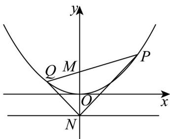

<!-- question-source:start -->
8. 已知点 $M, N$ 的坐标分别为 $(0,1), (0,-1)$ ，点 $P$ 是抛物线 $y = \frac{1}{4} x^2$ 上的一个动点。

(1)求证：以点 $P$ 为圆心， $PM$ 为半径的圆与直线 $y = -1$ 的相切；

(2)设直线 $PM$ 与抛物线 $y = \frac{1}{4} x^2$ 的另一个交点为点 $Q$ ，连接 $NP, NQ$ ，求证： $\angle PNM = \angle QNM$
<!-- question-source:end -->

![[高中/课堂同步/题库/人教A版高中数学同步讲义(2026)/03_选择性必修第一册/第三章 圆锥曲线的方程/专题3.3 抛物线（高效培优讲义）/强化训练/questions/answers/Q00080261A1.md]]
