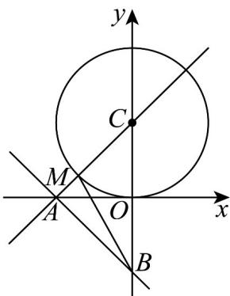

> [!faq]- 《专题3.3 抛物线（高效培优讲义）》官方解析
>
> > [!success]- **【答案】** A. 当 $a + b = 2$ 时，直线 $l$ 与圆 $C$ 不可能有交点 B. 当 $2b = a^2 - 1$ 时，直线 $l$ 与圆 $C$ 相切 C. 当 $a = 1, b = 1$ 时，直线 $l$ 与坐标轴相交于 $A, B$ 两点，则圆 $C$ 上存在点 $M$ ，使得 $\triangle ABM$ 的面积为 $1 - \frac{\sqrt{2}}{2}$ D. 当 $a = 1, b = 1$ 时，与圆 $C$ 外切且与直线 $l$ 相切的动圆圆心的轨迹是一条抛物线
>
> > [!note]- **【解析】**
> > 对于 $\mathsf{A}$ 中，圆 $\mathsf{C}$ 的标准方程为 $x^{2} + (y - 1)^{2} = 1$ ，则圆心为 $(0,1)$ ，半径 $r = 1$
> >
> > 当 $a + b = 2$ 时，圆心 $C$ 到直线 $l$ 的距离 $d = \frac{|b + 1|}{\sqrt{a^2 + b^2}}$
> >
> > 当 $a = 2, b = 0$ 时， $d = \frac{1}{2} < r = 1$ ，所以直线 $l$ 与圆 $C$ 可能相交，所以 $\mathsf{A}$ 错误；
> >
> > 对于 B 中，当 $2b = a^{2} - 1$ 时，可得 $a^{2} = 2b + 1$ ，
> >
> > 圆心 $C$ 到直线 $l$ 的距离 $d = \frac{|b + 1|}{\sqrt{a^2 + b^2}} = \frac{|b + 1|}{\sqrt{b^2 + 2b + 1}} = 1 = r$
> >
> > 所以直线 l 与圆 C 相切，所以 B 正确；
> >
> > 对于 C 中，当 a=1, b=1 时，直线 l 的方程为 $x+y+1=0$ ，
> >
> > 可得直线 l 与坐标轴相交于两点 $A(-1,0)$ , $B(0,-1)$ ,
> >
> > 如图所示，直线 CA 的方程为 $y = x + 1$ ，与直线 l 垂直，
> >
> > 又因为 $CA = \sqrt{2}$ ，CM = 1，可得 $AM = \sqrt{2} - 1$ ，
> >
> > 因为 $AB = \sqrt{2}$ ，可得 $S_{\triangle ABM} = \frac{1}{2} \times \sqrt{2} \times (\sqrt{2} - 1) = 1 - \frac{\sqrt{2}}{2}$ ，满足题意，
> >
> > 所以圆 C 上存在点 M，使得 $\triangle ABM$ 的面积为 $1 - \frac{\sqrt{2}}{2}$ ，所以 C 正确；
> >
> > 
> >
> > 对于 $\mathsf{D}$ 中，当 $a = 1, b = 1$ 时，直线 $l$ 的方程为 $x + y + 1 = 0$
> >
> > 圆心 C 到直线的距离 $d = \frac{2}{\sqrt{2}} = \sqrt{2} > 1$ ，此时直线 l 与圆 C 相离，
> >
> > 由抛物线的定义，可得与圆 $C$ 外切且与直线 $l$ 相切的动圆圆心的轨迹是一条抛物线，所以 ${}^{\mathrm{D}}$ 正确.
> >
> > 故选 **BCD**.
