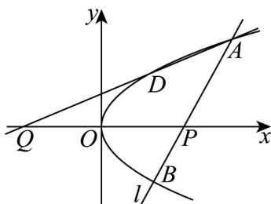

> [!faq]- 《专题3.3 抛物线（高效培优讲义）》官方解析
>
> > [!success]- **【答案】** (1) $y^{2}=3x$ ; (2) $Q(-4,0)$ .
>
> > [!note]- **【解析】**
> > （1）依题意， $\left\{\begin{aligned}m+\frac{p}{2}&=\frac{3}{2}\\ 2pm&=\frac{9}{4}\end{aligned}\right.$ ，解得 $p=\frac{3}{2}$ ，
> >
> > 所以 C 的方程为 $y^{2}=3x$ .
> >
> > (2) 依题意，直线 $l$ 的斜率不为 $0$ ，且过点 $(4,0)$ ，设的直线 $l$ 的方程为 $x = ty + 4(t \neq 0)$
> >
> > 由 $\left\{\begin{aligned}x&=ty+4\\ y^{2}&=3x\end{aligned}\right.$ 消去 x 得 $y^{2}-3ty-12=0$ ， $\Delta=9t^{2}+48>0$ ，
> >
> > 设 $A(x_{1},y_{1}),B(x_{2},y_{2})$ ，则 $D(x_{2}, - y_{2})$ ，不妨设 $y_{1} > 0$ ，则 $y_{1} + y_{2} = 3t,y_{1}y_{2} = -12$
> >
> > 直线 AD 的方程为： $y - y_{1} = \frac{y_{1} + y_{2}}{x_{1} - x_{2}} (x - x_{1})$ ，即 $y - y_{1} = \frac{y_{1} + y_{2}}{t(y_{1} - y_{2})}(x - x_{1})$
> >
> > 即 $y - y_{1} = \frac{3}{y_{1} - y_{2}} (x - x_{1})$ ，令 y = 0，得 $(y_{1} - y_{2}) \cdot (-y_{1}) = 3x - y_{1}^{2}$
> >
> > 因此 $3x=(y_{1}-y_{2})\cdot(-y_{1})+y_{1}^{2}=y_{1}y_{2}=-12$ ，解得 x=-4，
> >
> > 所以 $Q(-4,0)$
> >
> > 
