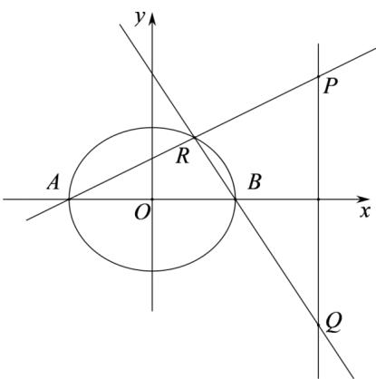
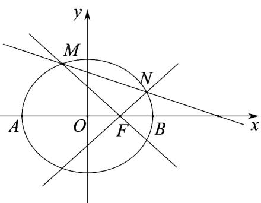

> [!faq]- 《专题3.3 抛物线（高效培优讲义）》官方解析
>
> > [!success]- **【答案】** (1) $C_{1}:y^{2}=4x$ ， $C_{2}$ 的方程为 $\frac{x^{2}}{4}+\frac{y^{2}}{3}=1$ (2)6. (3)证明见解析，定点 $T(4,0)$ .
>
> > [!note]- **【解析】**
> > （1）因为 $D(2,d)$ ，且 $\left|DF\right| = 3$ ，所以 $\left|DF\right| = 2 + \frac{p}{2} = 3$ ，解得 $p = 2$ ，所以抛物线 $C_1: y^2 = 4x$ ， $F(1,0)$ ，设的半焦距为，则由题意得 $\left\{ \begin{array}{l} \frac{1}{a^2} + \frac{9}{4b^2} = 1, \\ c = 1, \\ a^2 - b^2 = c^2, \end{array} \right.$ 解得 $\left\{ \begin{array}{l} a = 2, \\ b = \sqrt{3}, \\ c = 1, \end{array} \right.$ 所以 $C_2$ 的方程为 $\frac{x^2}{4} + \frac{y^2}{3} = 1$ 。
> >
> > (2)
> >
> > 
> >
> > 设 $R(x_0, y_0)(x_0 \neq \pm 2)$ ， $P(4, y_P)$ ， $Q(4, y_Q)$
> >
> > 因为 A, R, P 三点共线，所以 $AR \parallel AP$
> >
> > 又 $AR = (x_0 + 2, y_0)$ ， $AP = (6, y_p)$ ，所以 $(x_0 + 2)y_p = 6y_0$
> >
> > 所以 $y_{P}=\frac{6y_{0}}{x_{0}+2}$ ，同理 $y_{Q}=\frac{2y_{0}}{x_{0}-2}$
> >
> > 所以 $\left|PQ\right|=\left|y_{P}-y_{Q}\right|=\left|\frac{6y_{0}}{x_{0}+2}-\frac{2y_{0}}{x_{0}-2}\right|=\left|\frac{4y_{0}(4-x_{0})}{4-x_{0}^{2}}\right|$
> >
> > 因为点 $R$ 在 $C_2$ ，所以 $\frac{x_0^2}{4} +\frac{y_0^2}{3} = 1$ $4 - x_0^2 = \frac{4}{3} y_0^2$
> >
> > 所以 $\left|PQ\right|=\left|\frac{4y_{0}\left(4-x_{0}\right)}{4-x_{0}^{2}}\right|=3\left|\frac{x_{0}-4}{y_{0}}\right|$
> >
> > 令 $\frac{y_0}{x_0 - 4} = k$ ，则 $y_{0} = k(x_{0} - 4)$
> >
> > 代入 $\frac{x_0^2}{4} +\frac{y_0^2}{3} = 1$ 并整理，得 $\left(3 + 4k^2\right)x_0^2 -32k^2 x_0 + 64k^2 -12 = 0$
> >
> > 所以 $\Delta=\left(-32k^{2}\right)^{2}-4\left(3+4k^{2}\right)\left(64k^{2}-12\right)$ 0
> >
> > 解得 $0 < |k| \leq \frac{1}{2}$ ，所以 $3\left|\frac{x_0 - 4}{y_0}\right| = 6$ ，即 $|PQ|$ 的最小值为 $6$ .
> >
> > (3)
> >
> > 
> >
> > 设 $M(x_{1},y_{1})$ ， $N(x_{2},y_{2})$
> >
> > 联立 $\left\{ \begin{array}{l} x = my + t, \\ 3x^{2} + 4y^{2} = 12\text{消去} x\text{并整理，得}\left(3m^{2} + 4\right)y^{2} + 6mty + 3t^{2} - 12 = 0 \end{array} \right.$
> >
> > 所以 $\Delta = 36m^{2}t^{2} - 4(3m^{2} + 4)(3t^{2} - 12) > 0$ ，化简得 $3m^{2} - t^{2} + 4 > 0$
> >
> > 由韦达定理得 $y_{1} + y_{2} = -\frac{6mt}{3m^{2} + 4}, y_{1}y_{2} = \frac{3t^{2} - 12}{3m^{2} + 4}$
> >
> > $$
> > k _ {1} + k _ {2} = \frac {y _ {1}}{x _ {1} - 1} + \frac {y _ {2}}{x _ {2} - 1} = \frac {y _ {1} (x _ {2} - 1) + y _ {2} (x _ {1} - 1)}{(x _ {1} - 1) (x _ {2} - 1)} = \frac {y _ {1} (m y _ {2} + t - 1) + y _ {2} (m y _ {1} + t - 1)}{(x _ {1} - 1) (x _ {2} - 1)} = 0
> > $$
> >
> > $$
> > \text {此时} y _ {1} \left(m y _ {2} + t - 1\right) + y _ {2} \left(m y _ {1} + t - 1\right) = 0 \quad , \text {即} 2 m y _ {1} y _ {2} + (t - 1) \left(y _ {1} + y _ {2}\right) = 0
> > $$
> >
> > $$
> > y _ {1} + y _ {2} = - \frac {6 m t}{3 m ^ {2} + 4}, y _ {1} y _ {2} = \frac {3 t ^ {2} - 1 2}{3 m ^ {2} + 4}, \text {所以} 2 m \times \frac {3 t ^ {2} - 1 2}{3 m ^ {2} + 4} + (t - 1) \times \frac {- 6 m t}{3 m ^ {2} + 4} = 0
> > $$
> >
> > 所以 $6m(t-4)=0$ ，因为 $m\neq0$ ，所以 t=4，
> >
> > 所以直线 l 过定点 $(4,0)$ .
