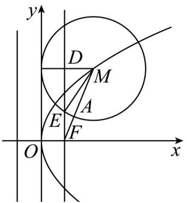

> [!faq]- 《专题3.3 抛物线（高效培优讲义）》官方解析
>
> > [!success]- **【答案】** C
>
> > [!note]- **【解析】**
> > 由题意可知，如图所示，
> >
> > 
> >
> > 在抛物线上，则
> >
> > $$
> > M \left(x _ {0} \sqrt {1 0}\right)
> > $$
> >
> > $$
> > 1 0 = 2 p x _ {0} \Rightarrow p x _ {0} = 5 \textcircled {1}
> > $$
> >
> > 易知， $\left|DM\right|=x_{0}-\frac{p}{2}$ ，由 $\frac{\left|MA\right|}{\left|AF\right|}=2\Rightarrow\left|MA\right|=2\left|AF\right|=\frac{2}{3}\left|MF\right|=\frac{2}{3}\left(x_{0}+\frac{p}{2}\right)$
> >
> > 因为被直线 $x = \frac{b}{2}$ 截得的弦长为 $\sqrt{3}|MA|$ ，则 $\left|DE\right| = \frac{\sqrt{3}}{2}\left|MA\right| = \frac{1}{\sqrt{3}}\left(x_0 + \frac{p}{2}\right)$
> >
> > 由 $\left|MA\right|=\left|ME\right|=r$ ，于是在 Rt△MDE 中，
> >
> > $$
> > \frac {1}{3} (x _ {0} + \frac {p}{2}) ^ {2} + (x _ {0} - \frac {p}{2}) ^ {2} = \frac {4}{9} (x _ {0} + \frac {p}{2}) ^ {2} \Rightarrow x _ {0} = p ②
> > $$
> >
> > 由 ①② 解得： $x_{0}=p=\sqrt{5}$ ，所以 $\left|AF\right|=\frac{1}{3}\left(x_{0}+\frac{p}{2}\right)=\frac{\sqrt{5}}{2}$
> >
> > 故选 **C**.
