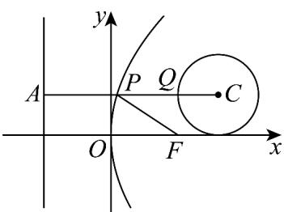

> [!faq]- 《专题3.3 抛物线（高效培优讲义）》官方解析
>
> > [!success]- **【答案】** D
>
> > [!note]- **【解析】**
> > 如图，过点P作准线的垂线，垂足为A，则 $\left|PF\right|=\left|PA\right|$ .
> > 当 CP 垂直于抛物线准线时， $\left|CP\right|+\left|PA\right|$ 最小，
> > 此时记线段 CP 与圆 C 的交点为 Q，因为 $C(8,3)$ ，r=3，准线为 x=-5，
> > 则 $\left|PQ\right|+\left|PF\right|$ 的最小值为 $\left|AQ\right|=\left|AC\right|-3=10$
> >
> > 
> >
> > 故选：D
> >
> > ## 方法技巧
> >
> > 求抛物线上的点到定点与焦点(或准线)之和的最值：利用抛物线的定义将动点（在抛物线上）到焦点与到准
> >
> > 线的距离进行互化；定点所在位置是抛物线的内部还是外部；根据三角形两边之和大于第三边，共线时取得
> >
> > 最值.
