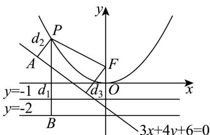

> [!faq]- 《专题3.3 抛物线（高效培优讲义）》官方解析
>
> > [!success]- **【答案】** B
>
> > [!note]- **【解析】**
> > 由题意可得：抛物线 $x^{2} = 4y$ 的焦点 $F(0,1)$ ，准线 $l:y = -1$
> >
> > 设动点 $P$ 直线 $l, l_1, l_2$ 的距离分别为 $d, d_1, d_2$
> >
> > 
> >
> > 点 $F$ 到直线 $l_{1}$ 的距离分别为 $d_{3} = \frac{|3\times 0 + 4\times 1 + 6|}{\sqrt{3^{2} + (-4)^{2}}} = 2$
> >
> > 则 $d_{1} = d + 1 = |PF| + 1$ ，可得 $d_{1} + d_{2} = d_{2} + |PF| + 1\quad d_{3} + 1 = 3$
> >
> > 当且仅当点 $P$ 在点 $F$ 到直线 $l_{1}$ 的垂线上且 $P$ 在 $F$ 与 $l_{1}$ 之间时，等号成立，
> >
> > 动点 P 到直线 $l_{1}$ 直线 $l_{2}$ 的距离之和的最小值是 3.
> >
> > 故选 **B**.
