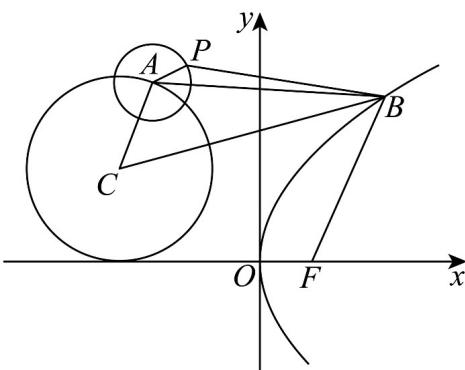

> [!faq]- 《专题3.3 抛物线（高效培优讲义）》官方解析
>
> > [!success]- **【答案】** A. $\sqrt{13} - 2$ B. $\sqrt{13} - 3$ C. $2\sqrt{5} - 3$ D. $2\sqrt{5} - 2$
>
> > [!note]- **【解析】**
> > 由题意得， $C(-3,2),F(1,0)$ ，圆 $C$ 的半径 $r_C = 2$ ，圆A的半径 $r_A = 1$
> >
> > 因为 $\left|BP\right|\quad\left|BA\right|-r_{A}\quad\left|BC\right|-r_{C}-r_{A}=\left|BC\right|-3$ ，当且仅当点A在线段BC上，点P在线段AB上时，等号成立，
> > 所以 $\left|BP\right|+\left|BF\right|\quad\left|BC\right|+\left|BF\right|-3 \quad\left|CF\right|-3=2\sqrt{5}-3$ ，当且仅当点 A,B,C,F,P 共线，且从左到右依次为点
> > C,A,P,B,F
> > 时两等号同时成立．
> >
> > 故选:C.
> >
> > 
