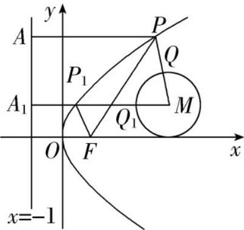

> [!faq]- 《专题3.3 抛物线（高效培优讲义）》官方解析
>
> > [!success]- **【答案】** 4
>
> > [!note]- **【解析】**
> > 曲线 $(x-4)^{2}+(y-1)^{2}=1$ 是以 $M(4,1)$ 为圆心，r=1为半径的圆，抛物线的准线为l:x=-1
> >
> > 过点 $P$ 作 $PA \perp l$ ，垂足为A，过点 $M$ 作 $MA_{1} \perp l$ ，垂足为 $A_{1}$ ，交抛物线于点 $P_{1}$ ，如图，
> >
> > 根据抛物线的定义，得 $\left|PF\right|+\left|PQ\right|\quad\left|PA\right|+\left|PM\right|-1$
> >
> > 当且仅当点 P 与 $P_{1}$ 重合，此时点 A 与 $A_{1}$ 重合，点 Q 与 $Q_{1}$ 重合，
> >
> > 即 $\left|PA\right|+\left|PM\right|\quad\left|P_{1}A_{1}\right|+\left|P_{1}M\right|=5$ ，当且仅当 M,P,Q,A 在一条直线上时等号成立，
> >
> > 所以 $\left|PF\right|+\left|PQ\right|$ 的最小值为 5-1=4
> >
> > 
> >
> > 故答案为：4
