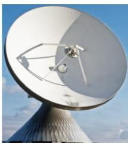
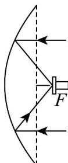

<!-- question-source:start -->
【典例1】某学习小组研究一种如图 $^{1}$ 所示的卫星接收天线，发现其轴截面为如图 $^{2}$ 所示的抛物线，在轴截面

内的卫星信号波束呈近似平行的状态射入，经反射聚焦到焦点 $F$ 处，已知卫星接收天线的口径（直径）为

10m，深度为 3m，则该卫星接收天线轴截面所在的抛物线焦点到顶点的距离为（）

图1

图2

A. $\frac{5}{3}\mathrm{m}$ B. $\frac{25}{12}\mathrm{m}$ C. $\frac{25}{6}\mathrm{m}$ D. $\frac{5}{4}\mathrm{m}$
<!-- question-source:end -->

![[高中/课堂同步/题库/人教A版高中数学同步讲义(2026)/03_选择性必修第一册/第三章 圆锥曲线的方程/专题3.3 抛物线（高效培优讲义）/题型05_抛物线的实际应用/questions/answers/Q00080234A1.md]]
