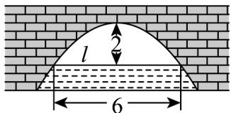

<!-- question-source:start -->
【变式1】图中展示的是一座抛物线形拱桥，当水面在 $l$ 时，拱顶离水面 $2\mathrm{m}$ ，水面宽 $6\mathrm{m}$ ，水面下降 $1\mathrm{m}$ 后，

水面宽度为（）

A. $3\sqrt{3}\mathrm{m}$ B. $3\sqrt{2}\mathrm{m}$ C. $3\sqrt{6}\mathrm{m}$ D. $8\mathrm{m}$
<!-- question-source:end -->

![[高中/课堂同步/题库/人教A版高中数学同步讲义(2026)/03_选择性必修第一册/第三章 圆锥曲线的方程/专题3.3 抛物线（高效培优讲义）/题型05_抛物线的实际应用/questions/answers/Q00080235A1.md]]
