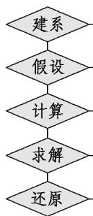

> [!faq]- 《专题3.3 抛物线（高效培优讲义）》官方解析
>
> > [!success]- **【答案】** B
>
> > [!note]- **【解析】**
> > 由题意建立如图所示的平面直角坐标系，
> >
> > 设抛物线的方程为 $y^{2}=2px(p>0)$ .
> >
> > 由题意可得 $A(3,5)$ ，将点A的坐标代入抛物线的方程可得 $25 = 6p$
> >
> > 解得 $p = \frac{25}{6}$ ，所以抛物线的方程为 $y^{2} = \frac{25}{3} x$
> >
> > 焦点的坐标为 $(\frac{p}{2}, 0)$ ，即 $(\frac{25}{12}, 0)$
> >
> > 所以抛物线焦点到顶点的距离为 $\frac{25}{12}\mathrm{m}$
> >
> > 故选：B.
> >
> > 
> >
> > ## 方法技巧
> >
> > 1、涉及拱桥、隧道的问题，通常需建立适当的平面直角坐标系，利用抛物线的标准方程进行求解。
> >
> > 2、求抛物线实际应用的五个步骤
> >
> > 
> >
> > 建立适当的坐标系
> >
> > 设出合适的抛物线标准方程
> >
> > 求出需要求出的量
> >
> > 通过计算求出抛物线的标准方程
> >
> > 还原到实际问题中,从而解决实际问题
