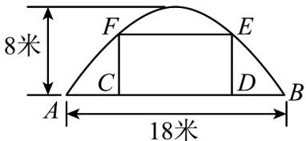
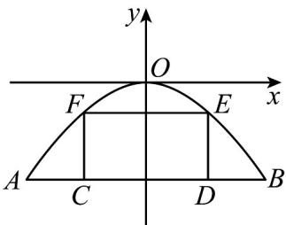

> [!faq]- 《专题3.3 抛物线（高效培优讲义）》官方解析
>
> > [!success]- **【答案】** 一矩形 CDEF. 若 $\left|CD\right|=9$ 米，那么 $\left|DE\right|$ 不超过多少米才能使货船通过拱桥？ 
>
> > [!note]- **【解析】**
> > 如图所示，以点 $O$ 为坐标原点，过点 $O$ 且平行于 $AB$ 的直线为 $x$ 轴，线段 $AB$ 的垂直平分线为 $y$ 轴建
> >
> > 立平面直角坐标系，则 $B(9, -8)$
> >
> > 
> >
> > 设抛物线方程为 $x^{2} = -2py(p > 0)$
> >
> > ∵B点在抛物线上，∴ $81=-2p\cdot(-8)$
> >
> > ∴ $p = \frac{81}{16}$ ，∴抛物线的方程为 $x^{2} = -\frac{81}{8}y$ 。
> >
> > 当 $x = \frac{9}{2}$ 时， $y = -2$ ，即 $\left|DE\right| = 8 - 2 = 6$ 。
> >
> > $\left|DE\right|$ 不超过 $6$ 米才能使货船通过拱桥.
