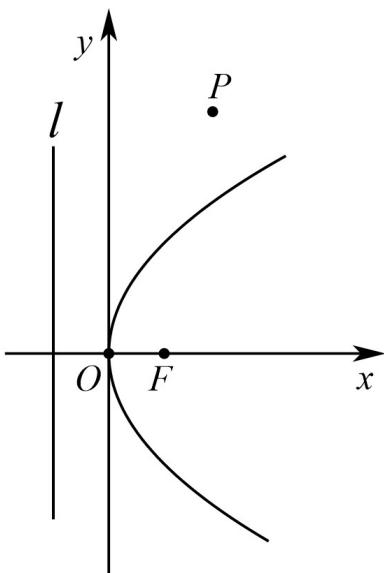

> [!faq]- 《专题3.3 抛物线（高效培优讲义）》官方解析
>
> > [!success]- **【答案】** $0.4\mathrm{km}$ ，城镇 $P$ 位于点 $O$ 的北偏东 $30^{\circ}$ 处， $\left|OP\right| = 10\mathrm{km}$ ，现要在河岸边的某处修建一座码头，并修建两条公路， 一条连接城镇，一条垂直连接公路 $l$ ，以便建立水陆交通网。  (1)建立适当的坐标系，求抛物线 C 的方程； (2)为了降低修路成本，必须使修建的两条公路总长最小，请给出修建方案（作出图形，在图中标出此时码头 $Q$ 的位置），并求公路总长的最小值（结果精确到 $0.001\mathrm{km}$ ）.
>
> > [!note]- **【解析】**
> > （1）如图，建立平面直角坐标系，由题意得， $\frac{p}{2} = 0.4$ ，则抛物线 $C: y^2 = 1.6x$
> >
> > 
> >
> > (2) 如图，设抛物线 C 的焦点为 F，则 $F(0.4,0)$ ，
> >
> > ∵城镇P位于点O的北偏东 $30^{\circ}$ 处， $\left|OP\right|=10km,\therefore P\left(5,5\sqrt{3}\right)$
> >
> > 根据抛物线的定义知，公路总长 $= \left|Q'F\right| + \left|Q'P\right|$ $|PF| = \sqrt{(5 - 0.4)^2 + (5\sqrt{3} - 0)^2}\approx 9.806$
> >
> > 当 $Q'$ 与 $Q$ 重合时（ $Q$ 为线段 $PF$ 与抛物线 $C$ 的交点），公路总长最小，最小值为 $9.806\mathrm{km}$
> >
> > 
