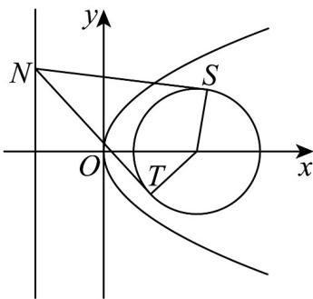
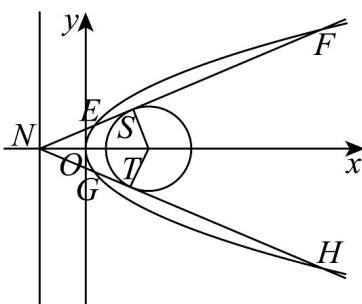

> [!faq]- 《专题3.3 抛物线（高效培优讲义）》官方解析
>
> > [!success]- **【答案】** (1) $y^{2}=16x$ (2) $7\sqrt{6}$ (3)证明见解析
>
> > [!note]- **【解析】**
> > （1）方法一：
> >
> > 由题意，
> >
> > ∵ M 到直线 l: x = -3 的距离比点 M 到点 $C_{2}$ 的距离小 1，
> >
> > $\therefore C_{1}$ 上任意一点 M 到直线 x = -4 的距离等于点 M 到点 $C_{2}$ 的距离，
> >
> > 因此，曲线 $C_1$ 的是以 $(4,0)$ 为焦点，直线 $x = -4$ 为准线的抛物线，
> >
> > 故曲线 $C_1$ 的方程为 $y^{2} = 16x$
> >
> > 方法二：由题意，
> >
> > 设点M的坐标为 $(x,y)$ ，
> >
> > 由题意得 $\left|x+3\right|=\sqrt{(x-4)^{2}+y^{2}}-1$
> >
> > 易知点 $C_{2}$ 位于直线 l: x = -3 的右侧，
> >
> > $$
> > \therefore x + 3 > 0, \therefore \sqrt {(x - 4) ^ {2} + y ^ {2}} = x + 4
> > $$
> >
> > 化简得 $y^{2}=16x$
> >
> > 曲线 $C_{1}$ 的方程为 $y^{2}=16x$
> >
> > (2) 由题意得，
> >
> > $C_{2}$ 的圆心为 $(4,0)$ ，半径 $r=\sqrt{7}$
> >
> > 又∵四边形 $NSC_{2}T$ 的面积 $=NS\cdot SC_{2}=\sqrt{NC_{2}^{2}-SC_{2}^{2}}\cdot SC_{2}=\sqrt{7}\times\sqrt{NC_{2}^{2}-7}$
> >
> > ∴当 $NC_{2}$ 的值最小时，四边形 $NSC_{2}T$ 的面积最小，
> >
> > 又 $NC_{2}$ 的最小值为： $3 + 4 = 7$
> >
> > ∴四边形 $NSC_{2}T$ 面积的最小值 $S = \sqrt{7} \times \sqrt{49 - 7} = 7\sqrt{6}$
> >
> > 
> >
> > (3) 由题意及 (1) (2) 证明如下，
> >
> > 当点 N 在直线 l: x = -3 上运动时，
> >
> > 设点 N 的坐标为 $(-3, y_{0})$ .
> >
> > 又 $y_0 \neq \pm \sqrt{7}$
> >
> > ∴过点 N 且与圆 $C_{2}$ 相切得直线的斜率 k 存在且不为 0，
> >
> > 每条切线都与 $C_{1}$ 有两个交点，
> >
> > 则切线方程为 $y - y_0 = k(x + 3)$
> >
> > 即 $kx - y + y_{0} + 3k = 0$
> >
> > 所以 $\frac{\left|4k+y_{0}+3k\right|}{\sqrt{k^{2}+1}}=\sqrt{7}$ ，整理得 $42k^{2}+14y_{0}k+y_{0}^{2}-7=0$ 。
> > - **①**：设过点 $N$ 所作的两条切线 $NS, NT$ 的斜率分别为 $k_{1}, k_{2}$
> >
> > 则 $k_{1}, k_{2}$ 是方程①的两个实数根，
> >
> > $\therefore k_{1} + k_{2} = -\frac{14y_{0}}{42} = -\frac{y_{0}}{3}$ ②
> >
> > 联立 $\left\{\begin{aligned}k_{1}x-y+y_{0}+3k_{1}&=0,\\ y^{2}&=16x,\end{aligned}\right.$ 得 $k_{1}y^{2}-16y+16(y_{0}+3k_{1})=0$ .③
> >
> > 设点 $E, F, G, H$ 的纵坐标分别为 $y_{1}, y_{2}, y_{3}, y_{4}$ ，则 $y_{1}, y_{2}$ 是方程③的两个实数根，
> >
> > $$
> > \therefore y _ {1} \cdot y _ {2} = \frac {1 6 \left(y _ {0} + 3 k _ {1}\right)}{k _ {1}}. \tag {4}
> > $$
> >
> > 同理可得， $y_{3} \cdot y_{4} = \frac{16(y_{0} + 3k_{2})}{k_{2}}$ . ⑤
> >
> > 联立②，④，⑤三式，得
> >
> > $$
> > y _ {1} y _ {2} y _ {3} y _ {4} = \frac {2 5 6 \left(y _ {0} + 3 k _ {1}\right) \left(y _ {0} + 3 k _ {2}\right)}{k _ {1} k _ {2}} = \frac {2 5 6 \left[ y _ {0} ^ {2} + 3 \left(k _ {1} + k _ {2}\right) y _ {0} + 9 k _ {1} k _ {2} \right]}{k _ {1} k _ {2}}
> > $$
> >
> > $$
> > = \frac {2 5 6 \left[ y _ {0} ^ {2} - y _ {0} ^ {2} + 9 k _ {1} k _ {2} \right]}{k _ {1} k _ {2}} = 2 3 0 4
> > $$
> >
> > ∴当 N 在直线 l:x=-3 上运动时，点 E,F,G,H 的纵坐标之积为定值 2304
> >
> > 
