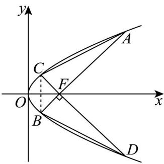

<!-- question-source:start -->
【变式3】已知 $F$ 是抛物线 $y^{2} = 2px(p > 0)$ 的焦点， $AB$ ， $CD$ 是经过点 $F$ 的弦且 $AB \perp CD$ ， $AB$ 的斜率

为 $k$ ，且 $k > 0$ ， $C$ ，A两点在 $x$ 轴上方，则下列结论中成立的是（）

A. $\frac{1}{|AB|} +\frac{1}{|CD|} = \frac{1}{2p}$

B．若 $\left|AF\right|\cdot\left|BF\right|=\frac{4}{3}p^{2}$ ，则 $k=\frac{\sqrt{3}}{3}$

C. $OA \cdot OB = OC \cdot OD$

D．四边形 ACBD 面积的最小值为 $16p^{2}$
<!-- question-source:end -->

![[高中/课堂同步/题库/人教A版高中数学同步讲义(2026)/03_选择性必修第一册/第三章 圆锥曲线的方程/专题3.3 抛物线（高效培优讲义）/题型8_焦点弦问题/questions/answers/Q00080249A1.md]]
