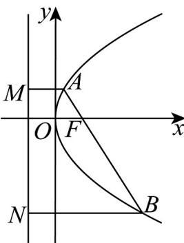
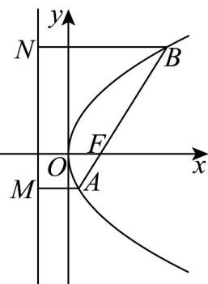

> [!faq]- 《专题3.3 抛物线（高效培优讲义）》官方解析
>
> > [!success]- **【答案】** A. 弦 $AB$ 长度的最小值为 2 B. $\frac{1}{|AF|} + \frac{1}{|BF|} = 1$ C. 点 A, O, N 共线 D. 若 $S_{\triangle ABN} = 2S_{\triangle ABM}$ 则 $k = 2\sqrt{2}$
>
> > [!note]- **【解析】**
> > 抛物线 $y^{2}=4x$ 的焦点为 $F(1,0)$ ，准线方程为 x=-1设直线 AB 的方程为 $y = k(x - 1)$ ,
> >
> > 联立 $\left\{ \begin{array}{l} y^{2} = 4x \\ y = kx - k \end{array} \right.$ ，化简可得 $k^{2}x^{2} - (2k^{2} + 4)x + k^{2} = 0$ ，
> >
> > 由已知 $k \neq 0$ ，
> >
> > 方程 $k^2 x^2 - (2k^2 + 4)x + k^2 = 0$ 的判别式 $\Delta = (2k^2 + 4)^2 - 4k^4 = 16k^2 + 16 > 0$
> >
> > 设 $A(x_{1},y_{1}),B(x_{2},y_{2})$ ，则 $M(-1,y_1)$ ， $N(-1,y_2)$
> >
> > 所以 $x_{1}, x_{2}$ 为方程 $k^{2}x^{2}-\left(2k^{2}+4\right)x+k^{2}=0$ 的两个根，
> >
> > 所以 $x_{1} + x_{2} = \frac{2k^{2} + 4}{k^{2}} = 2 + \frac{4}{k^{2}}$ ， $x_{1}x_{2} = 1$
> >
> > 由抛物线定义可得 $\left|AF\right|=x_{1}+1,\quad\left|BF\right|=x_{2}+1$
> >
> > 所以弦 $AB$ 长度为 $\left|AB\right| = \left|AF\right| + \left|BF\right| = x_1 + 1 + x_2 + 1 = 2 + \frac{4}{k^2} + 2$
> >
> > 故当直线 AB 的斜率存在时，弦 AB 长度的范围为 $(4, +\infty)$ ，A 错误；
> >
> > $$
> > \frac {1}{| A F |} + \frac {1}{| B F |} = \frac {1}{x _ {1} + 1} + \frac {1}{x _ {2} + 1} = \frac {x _ {1} + x _ {2} + 2}{x _ {1} x _ {2} + x _ {1} + x _ {2} + 1} = 1
> > $$
> >
> > 由已知 $OA = (x_{1}, y_{1})$ ， $ON = (-1, y_{2})$
> >
> > 因为 $x_{1}y_{2}-(-1)y_{1}=x_{1}(kx_{2}-k)+kx_{1}-k=0$
> >
> > 所以 $OA \parallel ON$ ，所以点 A，O，N 共线，C 正确；
> >
> > 因为 $S_{\triangle ABN}=2S_{\triangle ABM}$ ， $S_{\triangle ABN}=\frac{1}{2}\left|BN\right|\left|y_{2}-y_{1}\right|$ ， $S_{\triangle ABM}=\frac{1}{2}\left|AM\right|\left|y_{2}-y_{1}\right|$ ，
> >
> > 所以 $\left|BN\right|=2\left|AM\right|$ ，故 $\left|BF\right|=2\left|AF\right|$ ，
> >
> > 所以 $x_{2}+1=2(x_{1}+1)$
> >
> > 易知 $x_{1} \neq 0$ ，所以 $(x_{2} + 1)x_{1} = 2x_{1}(x_{1} + 1)$ ，
> >
> > 因为 $x_{1}x_{2} = 1$ ，所以 $2x_{1}^{2} + x_{1} - 1 = 0$ ，解得 $x_{1} = \frac{1}{2}$ 或 $x_{1} = -1$ （舍去），
> >
> > 所以 $x_{2} = 2$ ，代入 $x_{1} + x_{2} = 2 + \frac{4}{k^{2}}$ ，得 $k = \pm 2\sqrt{2}$
> >
> > 若点A在第一象限，则 $k = -2\sqrt{2}$
> >
> > 
> >
> > 若点A在第四象限，则 $k = 2\sqrt{2}$
> >
> > 
> >
> > D 错误；
> >
> > 故选 **BC**.
