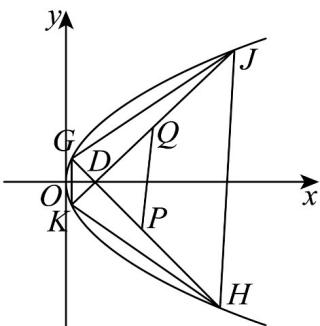

> [!faq]- 《专题3.3 抛物线（高效培优讲义）》官方解析
>
> > [!success]- **【答案】** (1) $y^{2}=4x$ (2)① 32；②直线 PQ 过定点，定点坐标为 (3,0)
>
> > [!note]- **【解析】**
> > （1）根据题意，圆心坐标为 $\left(\frac{x - 4}{2},0\right)$
> >
> > 又因为该圆经过点 $A(-4,0)$ 和 $C(0,y)$ ，所以 $\sqrt{\left(\frac{x - 4}{2} - 0\right)^2 + (0 - y)^2} = \left|\frac{x - 4}{2} + 4\right|$ ，
> >
> > 化简得 $y^{2} = 4x$ ，所以点 $M(x, y)$ 的轨迹 $E$ 的方程为 $y^{2} = 4x$
> >
> > (2) ①因为直线 $l_{1}, l_{2}$ 的斜率一定存在且不为0，
> >
> > 
> >
> > 故设 $l_{1}:y = k(x - 1),l_{2}:y = -\frac{1}{k} (x - 1),G(x_{1},y_{1}),H(x_{2},y_{2})$ ， $J(x_{3},y_{3}),K(x_{4},y_{4})$
> >
> > 联立方程 $\left\{\begin{aligned}y&=k(x-1),\\ y^{2}&=4x,\end{aligned}\right.$ 消 x 得 $ky^{2}-4y-4k=0$
> >
> > 则 $\Delta = 16(k^{2} + 1) > 0, y_{1} + y_{2} = \frac{4}{k}, y_{1}y_{2} = -4$
> >
> > 所以 $\left|GH\right|=\sqrt{1+\frac{1}{k^{2}}}\cdot\left|y_{1}-y_{2}\right|=\sqrt{1+\frac{1}{k^{2}}}\cdot\sqrt{\left(y_{1}+y_{2}\right)^{2}-4y_{1}y_{2}}$
> >
> > $$
> > = \sqrt {1 + \frac {1}{k ^ {2}}} \cdot \sqrt {\left(\frac {4}{k}\right) ^ {2} - 4 \times (- 4)} = 4 \left(1 + \frac {1}{k ^ {2}}\right)
> > $$
> >
> > 同理 $\left|JK\right| = 4\left(k^2 +1\right)$
> >
> > 所以 $S_{四边形GJHK}=\frac{1}{2}\left|GH\right|\cdot\left|JK\right|=8\left(k^{2}+\frac{1}{k^{2}}+2\right)$ $8\left(2\sqrt{k^{2}\cdot\frac{1}{k^{2}}}+2\right)=32$
> >
> > 当且仅当 $k = \pm 1$ 时，四边形 GJHK 的面积最小，最小值为 32.
> > - **②**：易知当直线 PQ 斜率不存在时，直线 $l_{1}, l_{2}$ 关于 x 轴对称，
> >
> > 此时①中 $k^{2}=1$ ，得直线 PQ:x=3；
> >
> > 当直线 PQ 斜率存在时，设直线 $l_{PQ}: y = mx + n$ ，
> >
> > 联立方程 $\left\{ \begin{array}{l} y = mx + n, \\ y = k(x - 1), \end{array} \right.$ 得 $y_{P} = \frac{km + kn}{k - m}$
> >
> > 又 $y_{P}=\frac{y_{1}+y_{2}}{2}=\frac{2}{k}$ ，得 $(m+n)k^{2}-2k+2m=0$ ，
> >
> > 同理可得 $(m + n)\left(-\frac{1}{k}\right)^2 - 2\left(-\frac{1}{k}\right) + 2m = 0$
> >
> > 所以 $k$ ， $-\frac{1}{k}$ 是方程 $(m + n)x^{2} - 2x + 2m = 0$ 的两根，
> >
> > 所以 $\frac{2m}{m + n} = -1$ ，即 $3m + n = 0$ ，则 $l_{PQ}:y = m(x - 3)$ ，所以直线 $PQ$ 过定点 $(3,0)$ ：
> >
> > 综上，直线 PQ 过定点 $(3,0)$ .
