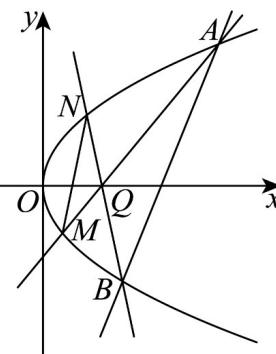

> [!faq]- 《专题3.3 抛物线（高效培优讲义）》官方解析
>
> > [!success]- **【答案】** (1) $y^{2}=4x$ ； (2)证明见解析；定点 $(4,0)$ ； (3) $\frac{S_{1}}{S_{2}}$ 为定值，定值为4.
>
> > [!note]- **【解析】**
> > （1）由题设 $\left|AF\right|=x_{1}+1=x_{1}+\frac{p}{2}\Rightarrow p=2\Rightarrow y^{2}=4x$
> >
> > (2) 设直线 l 方程为 $x = my + t$ ，且 $A(x_{1}, y_{1})$ ， $B(x_{2}, y_{2})$
> >
> > 联立直线 $l$ 与抛物线 $\left\{ \begin{array}{l}x = my + t\\ y^2 = 4x \end{array} \right.$ ，消去 $x$ ，得 $y^{2} - 4my - 4t = 0$ ，故 $y_{1}y_{2} = -4t$
> >
> > 因为 $OA \perp OB \Rightarrow x_1x_2 + y_1y_2 = 0$ ，且 $x_1 = \frac{y_1^2}{4}$ ， $x_2 = \frac{y_2^2}{4} \Rightarrow \frac{(y_1y_2)^2}{16} + y_1y_2 = 0$
> >
> > 所以 $y_{1}y_{2} = -16 \Rightarrow -4t \Rightarrow t = 4$ ，则直线 l 方程为 $x = my + 4$ ，过定点 $(4,0)$ ;
> >
> > 
> >
> > (3) 由题设 $Q(2,0)$ ， $Q$ 在直线 $AM$ 上，
> >
> > 设直线 $AM$ 的方程为 $x = ny + 2$ ，与抛物线方程联立为 $y^{2} - 4ny - 8 = 0$
> >
> > 设 $C(x_{3},y_{3})$ ，所以 $y_{1}y_{3} = -8$ ，即 $y_{3} = \frac{-8}{y_{1}}$
> >
> > 设 $D(x_{4},y_{4})$ ，同理得 $y_{2}y_{4}=-8$ ，即 $y_{4}=\frac{-8}{y_{2}}$ ，
> >
> > $\frac{S_{1}}{S_{2}}=\frac{\frac{1}{2}\cdot\left|AQ\right|\cdot\left|BQ\right|\cdot\sin\angle AQB}{\frac{1}{2}\cdot\left|MQ\right|\cdot\left|NQ\right|\cdot\sin\angle MQN}$ ，因为 $\angle AQB=\angle MQN$ ，所以 $\sin\angle AQB=\sin\angle MQN$ ，
> >
> > 因为 $\frac{|AQ|}{|MQ|} = \left|\frac{y_1}{y_3}\right|$ ， $\frac{|BQ|}{|NQ|} = \left|\frac{y_2}{y_4}\right|$ ，所以 $\frac{S_1}{S_2} = \left|\frac{y_1}{y_3} \right| \cdot \left|\frac{y_2}{y_4}\right| = \left|\frac{y_1 y_2}{y_3 y_4}\right|$ ，而 $y_3 = \frac{-8}{y_1}$ ， $y_4 = \frac{-8}{y_2}$ ， $y_1 y_2 = -16$ ，
> >
> > 所以 $\frac{S_{1}}{S_{2}}=\left|\frac{y_{1}y_{2}}{y_{3}y_{4}}\right|=\left|\frac{y_{1}y_{2}}{(-8)\cdot(-8)}\right|=\left|\frac{\left(y_{1}y_{2}\right)^{2}}{64}\right|=\frac{\left(-16\right)^{2}}{64}=4$
> >
> > 因此 $\frac{S_1}{S_2}$ 为定值，定值为4.
